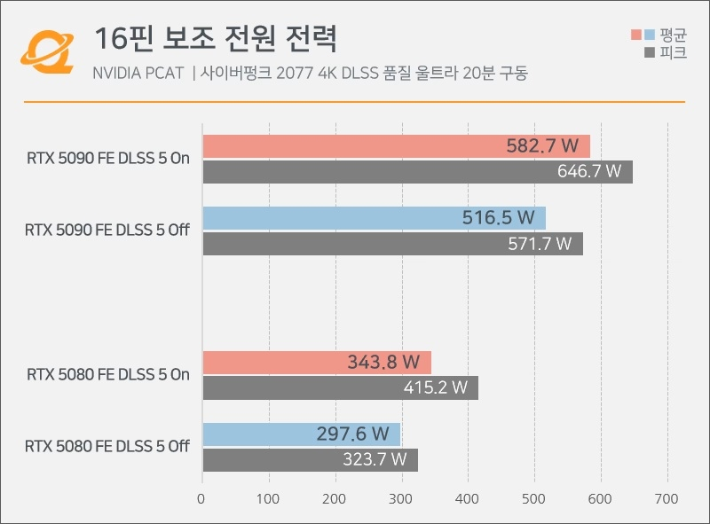
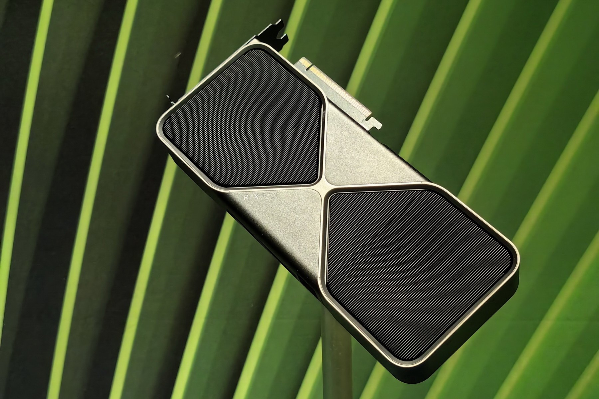

La RTX 5090 vuelve a estar en el centro del debate sobre el conector de 16 pines: unas pruebas con DLSS 5 activado elevan la temperatura del conector hasta los 91,7 ºC y sitúan la corriente por pin a un paso del límite de diseño. El aviso llega justo cuando muchos jugadores están probando las versiones modificadas de DLSS 5 en sus equipos.

Según la información publicada por MyDrivers a partir de las mediciones del medio coreano QuasarZone, el problema no es tanto el software como el margen físico del conector cuando una tarjeta de gama alta trabaja al límite de su potencia.

## Qué midieron las pruebas con la RTX 5090

El laboratorio comparó la RTX 5080 y la RTX 5090 con DLSS 5 activado y desactivado, con atención al conector de alimentación y al consumo total del equipo.

En la RTX 5080, la temperatura del conector apenas varía y se mantiene en valores contenidos, con un consumo máximo registrado de 415,2 W. En la RTX 5090, en cambio, la temperatura de la interfaz de alimentación pasa de 80,9 ºC a 91,7 ºC al activar DLSS 5, una diferencia mucho mayor que en su hermana menor.

En potencia, el sensor interno de la RTX 5090 marcó 582,7 W con DLSS 5, mientras que la instrumentación externa sobre el cable registró un pico de 646,7 W. Es decir, el reescalado añade del orden de cien vatios extra justo en la tarjeta que ya partía más cerca del techo eléctrico.

## Por qué el conector de la RTX 5090 queda al límite

Cada pin del conector tiene un umbral de diseño de unos 9,2 A, y las mediciones citadas llegan ya a 8,51 A por pin en la RTX 5090. Con cables de distintos fabricantes y con el desgaste propio del uso, ese margen escaso explica los casos de conectores quemados que han aparecido en foros y servicios técnicos.

El propio análisis recuerda que el fenómeno no se limita a un modelo concreto: también se han notificado incidentes con la RTX 5080, aunque sus registros quedan más lejos del umbral. El patrón encaja con [el caso reciente de una RTX 5090 cuyo conector acabó dañado tras una sesión de juego](/noticias/rtx-5090-connector-melted-indie-game/), donde el punto débil volvió a ser la interfaz de alimentación.

La lectura de fondo es que DLSS 5 actúa como detonante, no como causa raíz: la tarjeta lleva casi dos años en el mercado y su especificación eléctrica no se diseñó pensando en esta carga adicional sostenida. El interés por [el impacto real de DLSS 5 en la RTX 5090](/noticias/rtx-5090-last-of-us-2-dlss-5/) confirma que el aumento de consumo ya se había observado en juegos exigentes.

## Qué cambia para quien juega en PC en España

Para el lector español, la conclusión práctica es de prudencia: si tienes una RTX 5090, evita exprimir DLSS 5 modificado con límites de potencia al máximo sin vigilar temperaturas, usa el cable nativo de la fuente o el adaptador original en buen estado, con el conector bien asentado y sin dobleces forzados, y considera limitar el consumo máximo desde el programa de la tarjeta mientras se aclara el alcance del problema.

De cara al futuro, el análisis apunta a la próxima generación GeForce RTX 60, que no llegaría hasta alrededor de 2028, como la oportunidad para que NVIDIA revise la gestión de potencia y el diseño del conector. Hasta entonces, el conector de 16 pines seguirá siendo el eslabón más vigilado de los equipos de gama alta.
