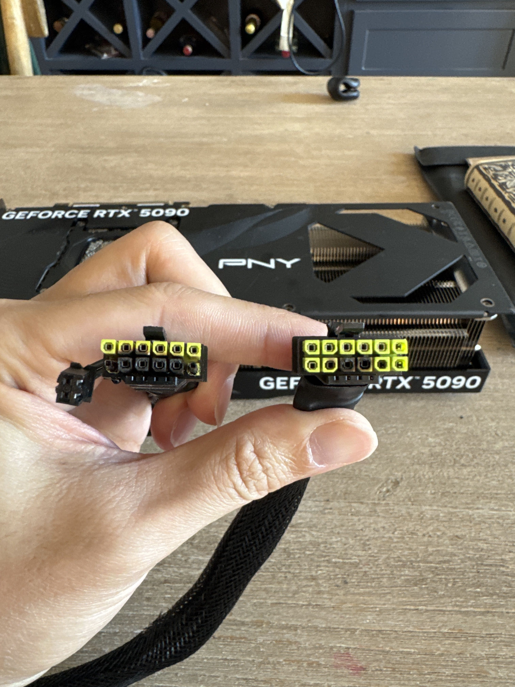
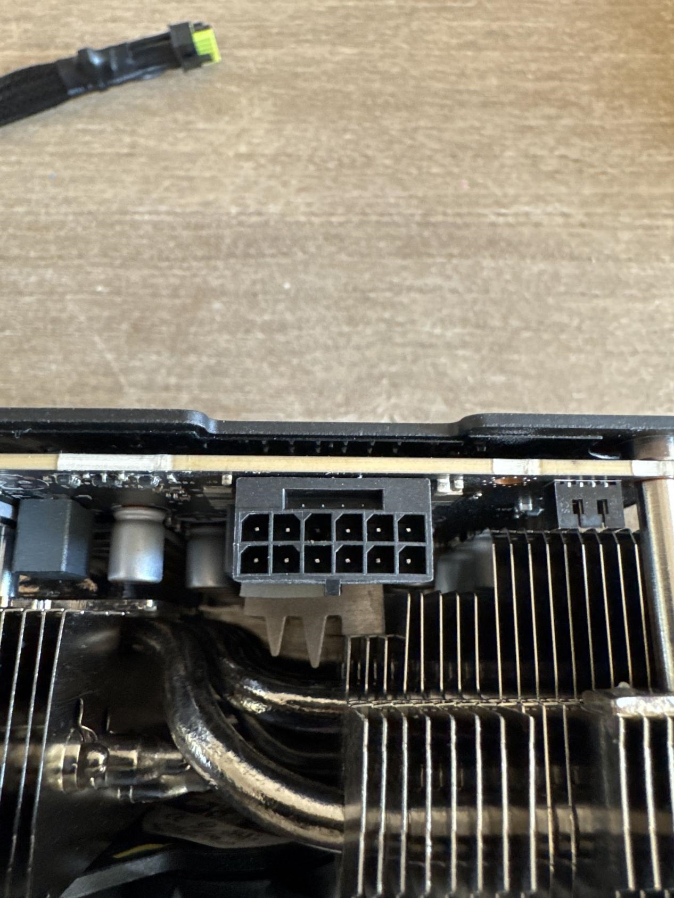
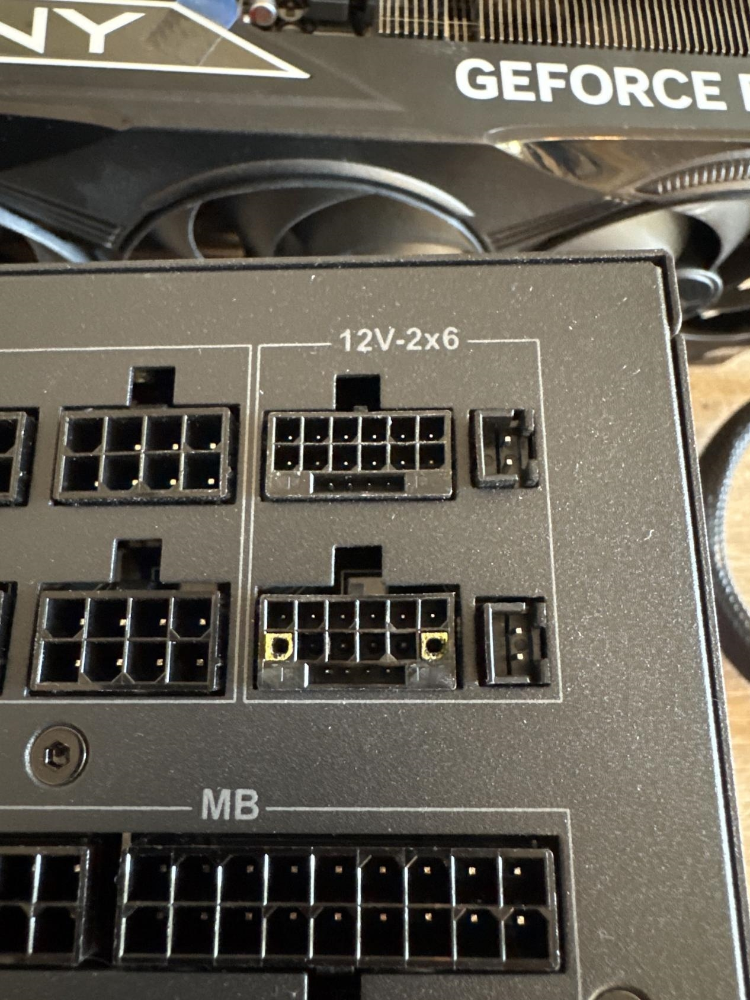

Una PNY GeForce RTX 5090 se quemó mientras el equipo estaba en reposo, y el fabricante ha denegado la reparación en garantía. El motivo que alega PNY es que el usuario no empleó el cable incluido con la tarjeta, aunque utilizó el cable nativo 12V-2x6 de una fuente compatible con ATX 3.1. El caso lo ha dado a conocer el medio chino MyDrivers a partir del testimonio del afectado.

## Una RTX 5090 fundida en reposo, sin overclock

Según el relato del usuario, publicado con el alias Melodic_Initial_1767, la tarjeta dejó de ser reconocida por el PC tras fundirse el cable de alimentación en ambos extremos, el del lado de la gráfica y el del lado de la fuente. Lo llamativo es que el equipo no estaba jugando ni renderizando: la RTX 5090 estaba en reposo cuando se produjo el daño.

El afectado asegura que su fuente es una ASRock PG-1600G, un modelo conforme al estándar ATX 3.1, y que empleó el cable 12V-2x6 que venía en la caja de la propia fuente, sin adaptadores ni divisores de terceros. Añade además que la tarjeta conservaba su VBIOS de fábrica, que nunca le practicó overclock y que el límite de consumo estaba configurado incluso por debajo del valor predeterminado.

## PNY deniega la garantía por el cable, pero el motivo no está en sus condiciones

La respuesta de PNY, citada por MyDrivers, sostiene que todas sus tarjetas con alimentación de 16 pines incluyen en la caja un cable o un adaptador aprobado por la marca, y que solo el uso de ese accesorio mantiene la cobertura. Cualquier daño —fusión, quemadura, sobrecalentamiento o deformación del conector— derivado del empleo de un cable de terceros o del cable de la fuente quedaría, según ese correo, fuera de la garantía. En la práctica, la única opción aceptada sería el adaptador propio de 4 conectores de 8 pines de PNY, y conectar directamente el cable 12V-2x6 nativo de una fuente ATX 3.1 invalidaría la cobertura.

El problema es que esa exigencia no aparece en la documentación de garantía de la compañía. El usuario revisó la revisión de las condiciones fechada el 28 de febrero de 2025 y buscó términos como cable, adaptador, conector, fuente o 12V sin encontrar ninguna mención. Las condiciones se limitan a exigir que la tarjeta se instale siguiendo la guía incluida, y esa guía ni siquiera menciona el conector de 16 pines: sus diagramas solo muestran conectores de 6 y 8 pines. La única indicación sobre la fuente dice que hay que localizar un conector libre y enchufarlo en el conector correspondiente de la tarjeta, que es exactamente lo que hizo.

El afectado pidió dos veces por escrito que PNY indicara en qué cláusula se basaba la denegación y no obtuvo respuesta concreta: la segunda contestación, atribuida a un técnico senior, llegó unos veinte minutos después de la consulta, declaró la decisión definitiva y cerró el expediente.

## Qué significa para quien tenga una RTX 5090 en España

Es el segundo caso de este tipo que salpica a PNY en el mismo mes: a principios de septiembre, otra RTX 5090 acabó con [un agujero que fusionó dos puertos del conector](/noticias/rtx-5090-connector-melted-indie-game/) tras una sesión de juego, y la marca también denegó la garantía —aquel usuario tuvo que pagar unos 180 dólares por la reparación—. Que dos denegaciones idénticas se produzcan con semanas de diferencia apunta a un criterio sistemático, no a un error aislado de un agente de soporte.

Para el lector español, la lección práctica es doble. Primero, conviene conservar el adaptador que incluye la caja de la tarjeta y documentar la instalación con fotos, porque en una reclamación de garantía el accesorio empleado puede acabar siendo el argumento decisivo. Segundo, ante un equipo de más de 2.000 euros, cualquier anomalía —olor a quemado, plásticos deformados o desconexiones intermitentes— justifica apagar el sistema de inmediato y reclamar por escrito, exigiendo que cada denegación cite la cláusula exacta de las condiciones. En la Unión Europea, además, la garantía legal de conformidad protege al consumidor frente a defectos de diseño con independencia de las limitaciones que un fabricante añada por correo electrónico.
