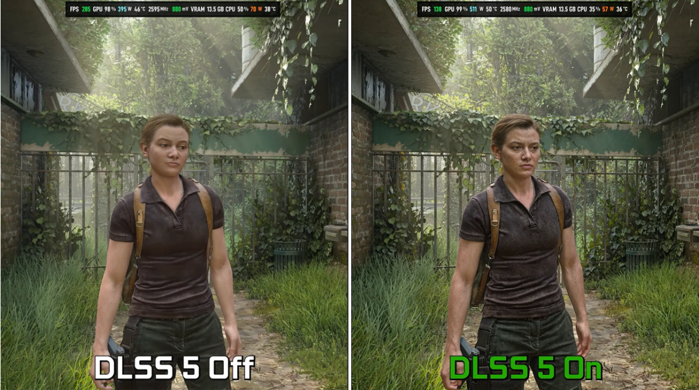

Una prueba independiente con **The Last of Us Part II** en PC ha puesto cifras al coste de **DLSS 5**, el modo de renderizado neuronal que NVIDIA mantiene en fase experimental. El YouTuber **Frozburn** ejecutó el juego a **4K y calidad máxima** sobre una **GeForce RTX 5090** y registró el precio exacto de activarlo: el rendimiento cae de **285 a 138 fps**, una pérdida de **147 fotogramas por segundo**. La contrapartida es una imagen notablemente más detallada, según recoge la prueba publicada por MyDrivers.

## DLSS 5 recorta el rendimiento: de 285 a 138 fps

Los datos dejan poco margen a la interpretación: activar DLSS 5 recorta el rendimiento casi a la mitad. La medición forma parte de la misma escena del juego en ambos casos, de modo que la diferencia responde únicamente al cambio de modo de renderizado y no a una carga distinta.

A cambio, la reconstrucción mediante red neuronal profunda reduce de forma visible los defectos típicos del renderizado a resolución nativa. En la comparativa, el rostro de **Abby** muestra la textura de la piel, los poros e incluso cada cabello con una definición que no aparece en la versión sin DLSS 5, y la vegetación densa del fondo deja atrás el parpadeo subpíxel y los dientes de sierra que sí se aprecian en la imagen de referencia.

## Más consumo y más calor, con la VRAM intacta

El sobrecoste no se limita a los fotogramas. Según la monitorización recogida, el consumo de la tarjeta completa sube de **395 W a 511 W**, un incremento absoluto de **116 W** solo por cambiar de modo. La carga del núcleo gráfico se mantiene en el **99 %**, lo que confirma que la GPU trabaja a pleno rendimiento durante todo el test.

La temperatura del chip pasa de **46 °C a 50 °C**, una subida moderada que no llega a comprometer la refrigeración. El dato más revelador es otro: la memoria de vídeo se mantiene estable en **13,5 GB** en ambos escenarios. Esto indica que el coste de DLSS 5 es de cómputo, no de capacidad de almacenamiento, y que el modo no demanda más VRAM de la que ya reserva el juego.

## La carga se desplaza de la CPU a la GPU

El experimento también midió el comportamiento del procesador. Con DLSS 5 activado, la carga de la CPU baja del **50 % al 35 %** y su consumo cae de **70 W a 57 W**. La lectura que da la fuente es coherente con el resto de cifras: parte del trabajo que antes asumía el procesador pasa al motor de inteligencia artificial integrado en la tarjeta gráfica.

La plataforma utilizada para las pruebas fue un **AMD Ryzen 7 9800X3D** acompañado de una placa **ASRock X870E Nova WiFi** y memoria **DDR5-6600 con latencias CL26**.

## Qué significa para quien tenga una RTX 50

Aunque el titular sea una caída de 147 fps, conviene mirar la cifra final: **138 fps** siguen siendo un margen amplio para cualquier monitor de alta tasa de refresco actual. Para quien busque la máxima fidelidad de imagen, el coste es real pero no impide jugar con fluidez; para quien priorice los fotogramas, DLSS 5 no es una mejora gratuita, sino un ajuste de calidad que se paga con rendimiento y con vatios.

La comparación con otros títulos ayuda a ponerlo en contexto. En [la prueba de Control Resonant sobre la RTX 5090](/noticias/control-resonance-rtx-5090-4k/) el límite llegaba del trazado de rayos a resolución nativa, con 48 fps como techo. Aquí la situación es distinta: el juego ya parte de una tasa muy alta y es la propia reconstrucción neuronal la que se lleva buena parte de ese margen. Son dos formas de gastar el mismo silicio, y conviene no confundirlas al valorar una actualización de hardware.
