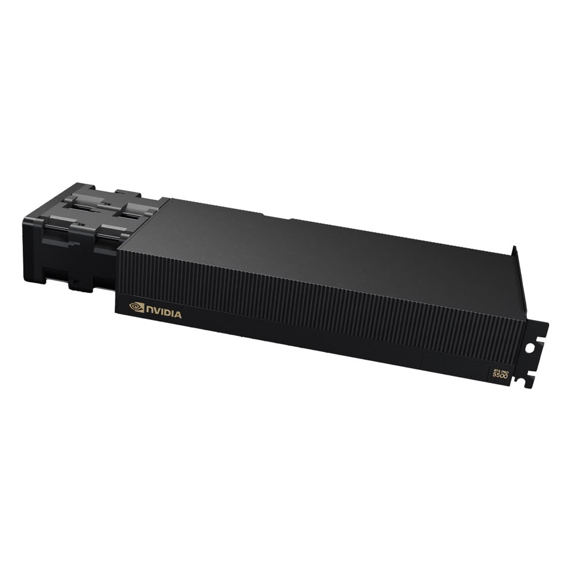
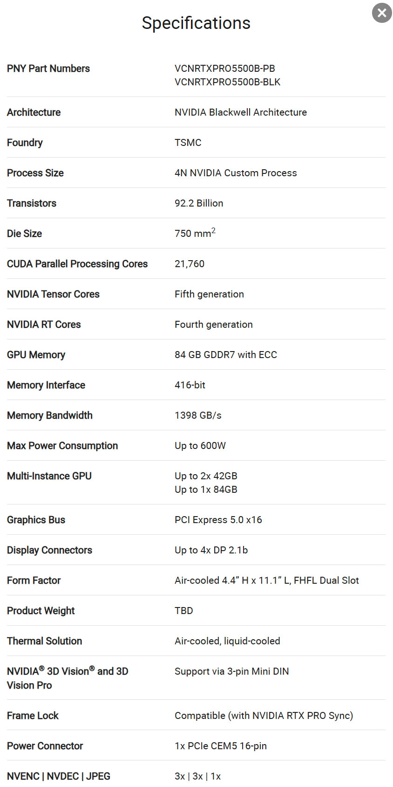

NVIDIA ha ampliado su catálogo de gráficas profesionales con la RTX PRO 5500
«Blackwell», una tarjeta pensada para estaciones de trabajo y despliegues en
rack. El movimiento se anunció sin grandes aspavientos: la compañía publicó la
ficha del producto en su web oficial, y TechPowerUp fue el medio que dio cuenta
de la novedad.

El dato que más llama la atención es su memoria: **84 GB de GDDR7**, una
cantidad inédita para una tarjeta de esta categoría. Para lograrla, NVIDIA monta
28 módulos de memoria distribuidos a ambos lados de la placa, con 14 chips en la
cara frontal, junto al die, y otros 14 en la trasera.

## El mismo chip que la RTX 5090, pero orientado al trabajo profesional

El corazón de la RTX PRO 5500 es el die **GB202**, el mismo que da vida a la
GeForce RTX 5090 de consumo. Mantiene los **21.760 núcleos CUDA** de aquella,
pero ahora llega certificado para cargas profesionales y con una capacidad de
memoria muy superior.

La GDDR7 se conecta al GB202 mediante un bus de **416 bits** que entrega un ancho
de banda de unos **1.398 GB/s**. Eso sitúa cada módulo de memoria en torno a
26 Gbps por pin, una velocidad estándar dentro de la GDDR7, pero no la más alta
que existe hoy en el mercado.

Dentro de la gama RTX PRO, la nueva tarjeta se coloca justo por debajo de la
buque insignia, la **RTX PRO 6000**, que ofrece 24.064 núcleos CUDA y 96 GB de
memoria. A la vez, deja atrás con claridad a la **RTX PRO 5000**, que se queda
en 14.080 núcleos y hasta 72 GB. En la práctica, la 5500 está mucho más cerca de
la 6000 que de la 5000, con apenas un recorte de núcleos y de capacidad.

## 600 W de consumo y opciones de aire o líquido

NVIDIA anuncia la GPU con un TDP de **600 W** y la diseña como objetivo de
despliegue en estaciones de trabajo montadas en rack. Estará disponible en
versiones con refrigeración por aire o por líquido; las imágenes oficiales la
muestran con ventiladores de servidor de alto régimen acoplados directamente a
un disipador de gran tamaño, una solución típica de los sistemas pasivos de aire.

La tarjeta también es compatible con la división **multi-instancia (MIG)**: un
único despliegue puede aprovechar los 84 GB completos en una instancia o
repartirlos en dos instancias de 42 GB cada una. Es una ventaja pensada para que
los equipos de render y de IA compartan recursos de forma flexible en entornos
compartidos.

NVIDIA no ha revelado todavía el precio ni la fecha de disponibilidad, aunque
todo apunta a que no será un producto económico.
