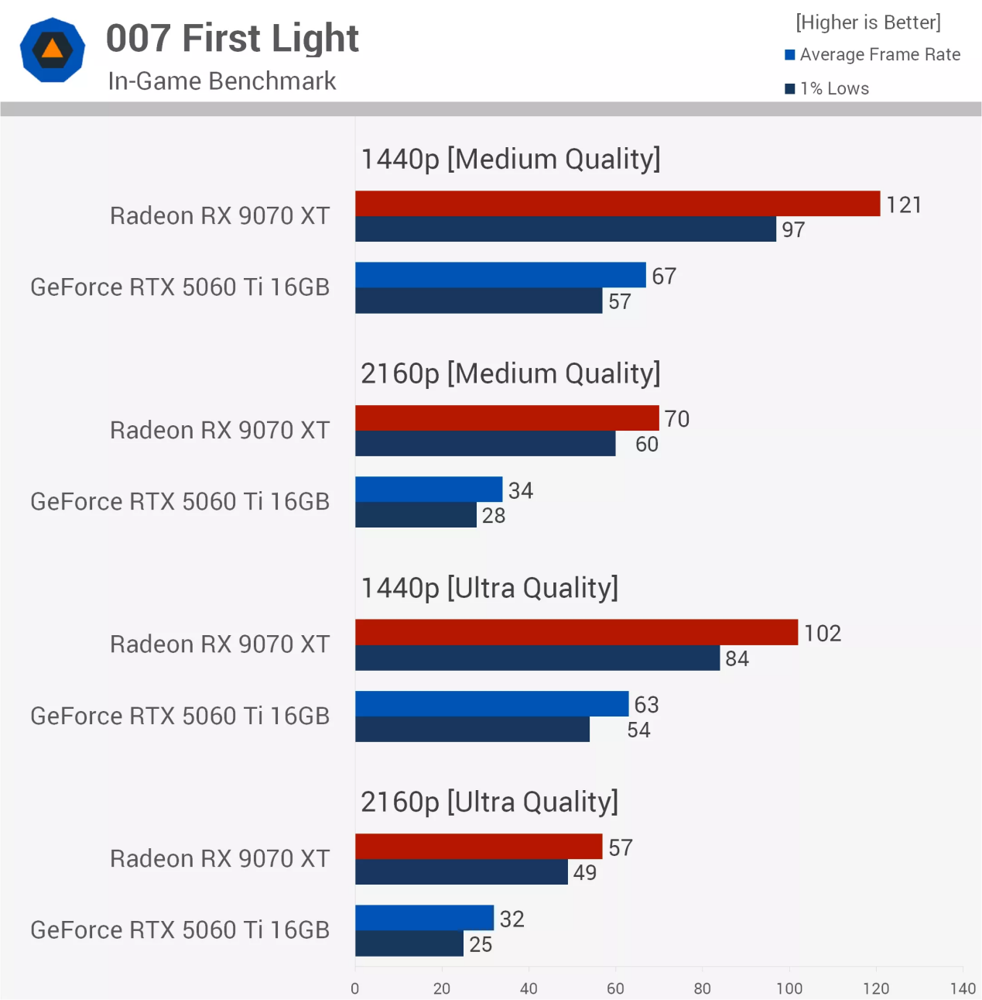
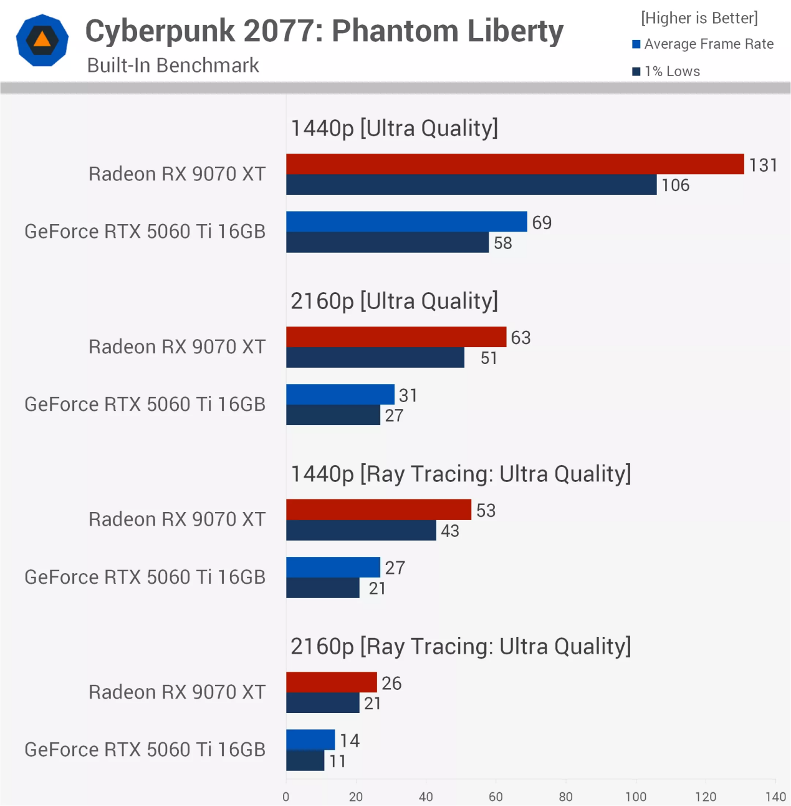
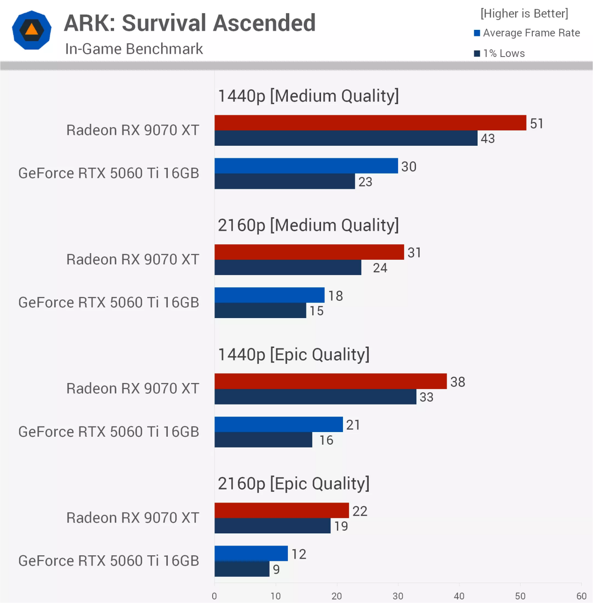
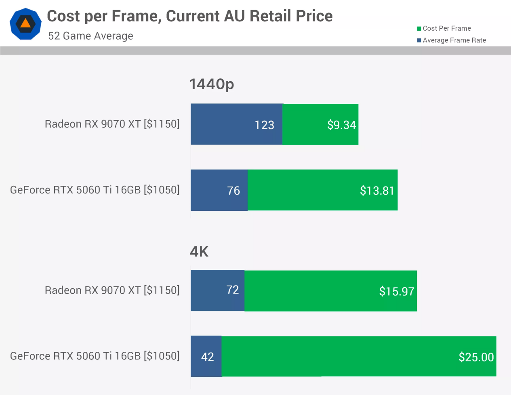

La escasez de memoria ha distorsionado el mercado gráfico hasta un punto insólito: la GeForce RTX 5060 Ti de 16 GB se vende ya en torno a los 850 dólares, el mismo nivel de precio que la Radeon RX 9070 XT, una tarjeta de un escalón superior. Ante ese escenario, el medio TechSpot ha comparado ambas tarjetas en 52 juegos para comprobar qué recibe realmente quien paga ese dinero, con una plataforma común basada en un Ryzen 7 9800X3D, placa X870E, memoria DDR5-6000 CL30 y los controladores Adrenalin 26.8.1 y GeForce 610.88.

## La RX 9070 XT domina juego por juego, incluso con trazado de rayos

Los resultados parciales muestran una superioridad sistemática de la Radeon. En 007 First Light, la RX 9070 XT alcanza 121 fps frente a 67 fps en 1440p con calidad media (un 81 % más) y amplía la brecha al 106 % en 4K (70 frente a 34 fps). En Marvel's Spider-Man 2 con calidad muy alta, la ventaja es del 60 % en 1440p (130 frente a 81 fps) y se mantiene por encima del 50 % incluso con el modo de trazado de rayos definitivo activado.

Ni siquiera Cyberpunk 2077: Phantom Liberty, territorio tradicional de NVIDIA, ofrece refugio a la GeForce: en 1440p con calidad ultra, la Radeon logra 131 fps frente a 69 fps (un 90 % más), y en 4K la diferencia crece hasta el 103 %. Con trazado de rayos ultra, la RX 9070 XT llega a ser un 96 % más rápida en 1440p. En Forza Horizon 6 con trazado de rayos, la ventaja es del 79 % tanto en 1440p como en 4K.

## Ark y Unreal Engine 5 dejan a la RTX 5060 Ti fuera de juego

El caso más extremo llega con los juegos basados en Unreal Engine 5. En Ark: Survival Ascended con calidad épica en 4K, la RTX 5060 Ti se queda en 12 fps de media con mínimos del 1 % de un solo dígito, un 83 % por detrás de la Radeon; según la prueba, ni siquiera el modo de máximo rendimiento de DLSS lograría salvar esos registros. En Fortnite con ajustes competitivos ligeros la GeForce firma su resultado más digno (solo un 14 % por detrás en 1440p), pero en cuanto se activa la calidad épica con trazado de rayos, la RX 9070 XT vuelve a escaparse un 54 %. El margen más estrecho de toda la comparativa aparece en Arc Raiders, donde la Radeon gana de todos modos entre un 24 % y un 38 % según la configuración.

## El promedio de 52 juegos y el coste por fotograma

El resumen global no deja lugar a dudas: en el promedio de los 52 juegos, la RX 9070 XT rinde 123 fps frente a 76 fps en 1440p (un 62 % más), y sus mínimos del 1 % (97 fps) superan incluso la media de la GeForce. En 4K, la ventaja sube al 71 % (72 frente a 42 fps). Dicho de otro modo: con el mismo dinero, una tarjeta ofrece juego fluido en 4K y la otra queda confinada a 1440p.

El coste por fotograma remata la comparación. En Australia, donde la RTX 5060 Ti se vende unos 100 dólares australianos más barata, cada fotograma sale aun así un 48 % más caro en 1440p y un 57 % más caro en 4K. En la tienda estadounidense Newegg, donde la Radeon llega a ser incluso más barata en términos absolutos, la diferencia se dispara al 71 % y al 81 % respectivamente.

## Por qué ocurre esto y qué significa para quien vaya a comprar

TechSpot atribuye la distorsión a la escasez de memoria en toda la industria: la RX 9070 XT se vende al menos un 23 % por encima de su precio recomendado, pero la RTX 5060 Ti supera el suyo en más de un 80 %, en parte por el encarecimiento de los conjuntos de GPU y memoria que NVIDIA ha trasladado a sus socios. A ello se suma la demanda de usuarios que montan equipos para IA local, donde el ecosistema CUDA mantiene a la GeForce como apuesta segura pese al sobreprecio.

Para el lector español, la lección es directa: a igualdad de presupuesto, la Radeon es hoy la opción sensata para jugar con más de 8 GB de memoria, y conviene desconfiar de la inercia de marca cuando los precios dejan de reflejar el rendimiento real. No es la primera vez que la gama media de NVIDIA queda en entredicho esta generación: el lanzamiento de ediciones especiales como la [Palit RTX 5060 Ti RiTONA](/noticias/rtx-5060-ti-ritona/) ya mostraba a los ensambladores buscando diferenciar un producto cuyo valor está bajo presión.
