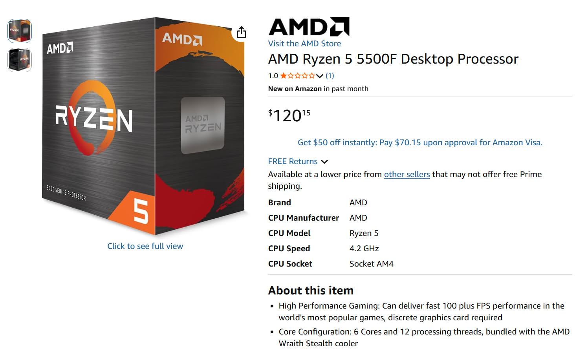
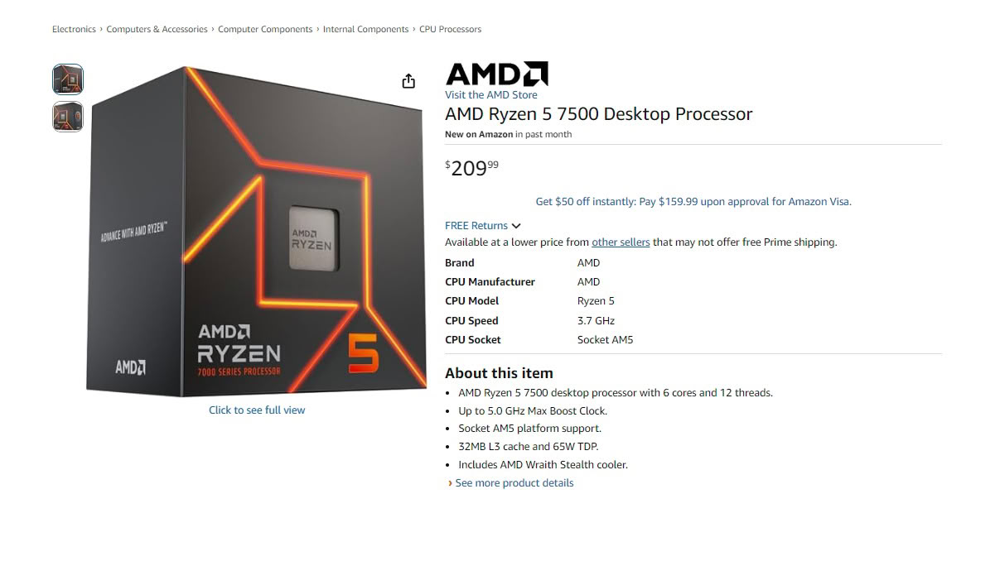

AMD ya vende en Estados Unidos sus dos procesadores de gama de entrada, el
**Ryzen 5 5500F** y el **Ryzen 5 7500**, pero la puesta de largo llega con un
matiz que no encaja con el anuncio: cuestan más de lo previsto. En Amazon, el
5500F aparece a **120,15 dólares** y el 7500 a **209,99 dólares**, alrededor de
20 dólares por encima del [precio recomendado que AMD confirmó](/noticias/ryzen-5-7500-5500f-pricing/),
de 99 y 189 dólares. Lo llamativo
no es solo el sobreprecio, sino quién lo aplica: ambos listados los vende
directamente Amazon, no revendedores externos.

## Cuánto cuestan los Ryzen 5 5500F y 7500 y quién los vende

Los dos chips llegaron al catálogo estadounidense casi dos semanas después de su
presentación, el 10 de septiembre, y lo hicieron sin rastro en otras tiendas del
país: Micro Center y Newegg todavía no muestran listados. Es decir, Amazon es de
momento el único canal que los tiene, lo que ayuda a explicar que el precio de
salida no sea el recomendado.

| Procesador | Precio recomendado | Precio en Amazon |
| --- | --- | --- |
| Ryzen 5 5500F | 99 dólares | 120,15 dólares |
| Ryzen 5 7500 | 189 dólares | 209,99 dólares |

El 5500F se ha dejado ver en una horquilla que va de los 118 a los 125 dólares,
así que su precio no es fijo. TechPowerUp señala que el 7500 se mantiene más
estable en torno a los 210, y Tom's Hardware, que cubre el mismo hallazgo, apunta
que cuando otros minoristas empiecen a listar los procesadores lo previsible es
que los precios bajen.

## Un sobreprecio con precedente

No es la primera vez que un lanzamiento de AMD arranca caro en Amazon. A
principios de año, el **Ryzen 9 9950X3D2** se puso a la venta en la tienda con un
precio de 1.000 dólares, unos 100 por encima del recomendado de 899. La situación
se corrigió por sí sola cuando el resto de comercios recibieron unidades y el
listado volvió a los 900 dólares.

Ese es el precedente que conviene tener en cuenta aquí: mientras Amazon sea el
único vendedor, el precio se mueve con bastante libertad. A medida que Micro
Center, Newegg y el resto de cadenas publiquen sus propias ofertas, la
competencia debería devolver a ambos chips a la franja que AMD comunicó.

Cabe recordar que el **Ryzen 5 5500F** es un chip de seis núcleos y doce hilos
con arquitectura Zen 3 y silicio Vermeer, pensado para seguir exprimiendo la
plataforma **AM4**: ofrece PCIe 4.0 y un impulso de 4,4 GHz, frente a los 4,2 GHz
del Ryzen 5 5500. El **Ryzen 5 7500**, por su parte, es un 7500F con gráfica
integrada: seis núcleos Zen 4, soporte de DDR5 y PCIe 5.0, impulso de 5,0 GHz y
un TDP de 65 W.

## Qué cambia para quien compra

Para el comprador que sigue un equipo AM4 con DDR4, el 5500F mantiene su
atractivo de acceso: unos 20 dólares de más no cambian la lógica de reutilizar
placa y memoria en un contexto de precios de memoria al alza. En AM5 el
sobreprecio pesa algo más, porque el 7500 es un chip que ya parte de la idea de
contención de coste y cualquier desvío aleja la compra del presupuesto previsto.

Conviene aclarar que estos precios son del mercado estadounidense y no anticipan
lo que costarán en España: la disponibilidad europea y los precios locales
todavía no están confirmados. Quien no tenga prisa hará bien en esperar a que se
sumen más tiendas antes de comprar, que es cuando el sobreprecio de salida suele
desaparecer.
