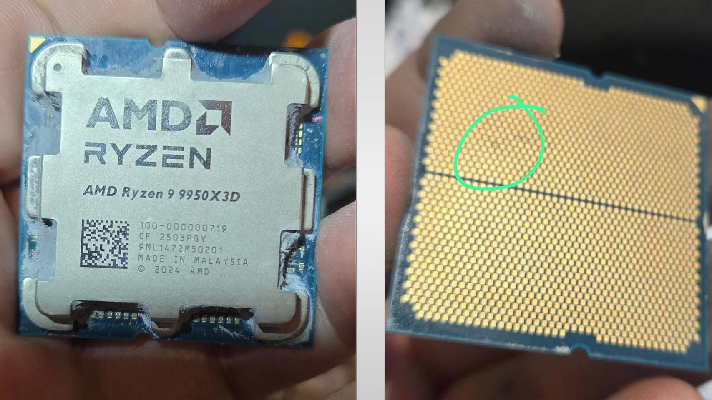
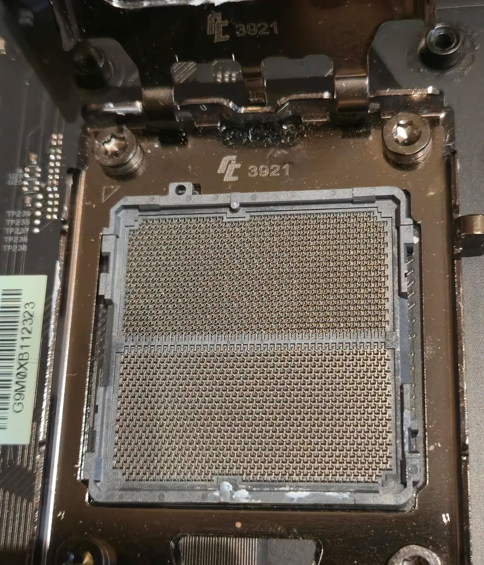

Un procesador AMD Ryzen 9 9950X3D habría dejado de funcionar apenas una hora después de ser trasladado a una placa base ASUS ROG Crosshair X670E Hero. El caso lo relata el usuario de Reddit SpecialistConcept423 en el subforo r/GamersNexus, recogido por TechPowerUp, y apunta a una combinación de placa, BIOS y preset de memoria como posible detonante.

Según el relato, el chip funcionó sin problemas durante aproximadamente un año y medio en una ASRock X670E Taichi Carrara antes del cambio. En la nueva placa no se aplicó overclocking manual ni ajustes de voltaje: solo se activó uno de los perfiles de memoria integrados de la placa para un kit SK hynix a 6200 MHz. Al guardar la configuración y reiniciar, la placa mostró el código Q «00» y se negó a arrancar. Al extraer la CPU, el usuario encontró dos marcas marrones en los contactos.

El episodio se complica cuando el usuario recurre a un Ryzen 5 8500G que antes funcionaba sin fallos en la misma placa: ese chip también lanza ahora el código «4D». Es decir, el problema no se limita a la CPU y apunta directamente a la placa base. Por el momento no hay confirmación sobre la causa —una BIOS defectuosa, un lote problemático de placas u otra circunstancia—, y ASUS no se ha pronunciado sobre este caso concreto. Conviene señalar que la placa ASUS no era nueva: había pasado por reparaciones relacionadas con USB y por una reescritura de BIOS. El usuario ya contactó con AMD en Brasil para tramitar la garantía (RMA), pero no ha compartido novedades.

## Un patrón que se repite en AM5

No es la primera vez que se documenta una avería ligada a esta placa. TechPowerUp cubrió hace apenas unos días un Ryzen 7 7800X3D que se hinchó y se quemó en el mismo modelo ROG Crosshair X670E Hero. El año pasado, además, ASRock reconoció que unos límites de corriente de PBO demasiado agresivos habían quemado una tanda de chips Ryzen 9000 en sus propias placas, y ofreció reemplazos en garantía.

La comunidad técnica apunta a los voltajes auxiliares de memoria —VDDIO y VDDQ— y a los perfiles automáticos que aplican algunos fabricantes de placas. Estos presets, pensados para simplificar el ajuste de la memoria, pueden empujar el SoC y las líneas de alimentación por encima de lo necesario. La cuestión de fondo es si las protecciones de hardware de AGESA están reaccionando como deberían cuando esos perfiles entran en juego.

## Qué significa para el usuario

Más allá del caso aislado, la historia deja una lección práctica para quien monta o actualiza un equipo AM5. Activar un preset de memoria no es lo mismo que dejar todo en valores de fábrica: aunque el sistema arranque, esos perfiles pueden aplicar voltajes más altos de lo recomendado, y conviene revisarlos a mano antes de darlos por buenos.

También hay un aviso sobre el hardware de segunda mano. La placa implicada no era nueva y acumulaba reparaciones previas, un factor que añade incertidumbre a cualquier diagnóstico. En un ecosistema donde el soporte de garantía puede tardar semanas, extremar la cautela con componentes reacondicionados y con los ajustes automáticos de BIOS es, hoy, la mejor defensa.
