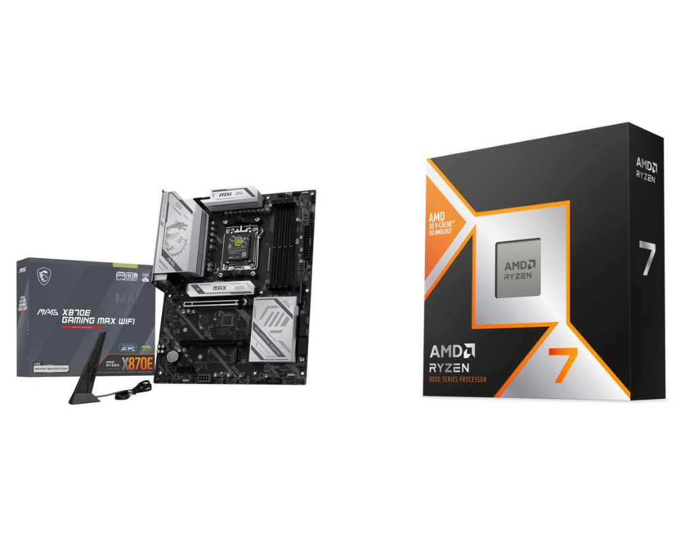

Newegg, la tienda estadounidense de componentes, ha puesto en marcha un combo de dos
productos pensado para quien quiere entrar o dar el salto a la plataforma AM5 de AMD.
El paquete cruza el procesador Ryzen 7 9800X3D con la placa base MSI MAG X870E Gaming
Max Wifi por 578,99 dólares, frente a un precio de referencia de 727,99 dólares. El
ahorro declarado es de 149 dólares, cerca de un 20 %, y la tienda lo señala como
mínimo histórico.

## Qué incluye el combo

El protagonista es el Ryzen 7 9800X3D, un procesador de arquitectura Zen 5 con 8
núcleos y 16 hilos, reloj base de 4,6 GHz y una frecuencia máxima de 5,2 GHz. Su
apuesta fuerte es la caché L3 de 96 MB que aporta la tecnología 3D V-Cache, un
diseño orientado sobre todo a videojuegos que lo sitúa entre los procesadores más
rápidos para jugar. Su consumo declarado es de 120 W.

La segunda pieza es la MSI MAG X870E Gaming Max Wifi, una placa de gama media
refrescada con lo último del chipset X870E. Incluye Wi-Fi 7 de 160 MHz y red
cableada de 5 GbE, soporte para memoria DDR5 de hasta 8200 MT/s, tres ranuras M.2
(una de ellas PCIe 5.0) y cuatro puertos SATA. En el panel trasero ofrece diez
puertos USB, entre ellos un Type-C de 40 Gbps. La placa combina PCB negro con
disipadores plateados.

A la compra se suman dos extras: un sistema de refrigeración líquida Cooler Master
Elite Liquid 240 AIO, valorado en 80 dólares, y un lote de juegos de AMD. Con esos
adicionales, el precio efectivo que el medio atribuye al procesador dentro del
paquete baja hasta unos 320 dólares.

## Por qué importa

El 9800X3D es uno de los procesadores más demandados para armar un equipo de juegos,
y su precio suele mantenerse firme. El atractivo de esta promoción no está solo en
el descuento sobre el conjunto, sino en que el coste implícito de la CPU queda muy
por debajo de su tarifa habitual y además se acompaña de una placa de gama media
bien equipada. Para quien tenga ya decidido montar sobre AM5, el paquete cubre dos
de las piezas más caras del presupuesto en un solo movimiento.

Tom's Hardware advierte, eso sí, que los combos de Newegg son cada vez menos
frecuentes: donde antes aparecían varias ofertas interesantes por semana, ahora
quedan una o dos que realmente merezcan la pena. El medio considera este caso uno
de ellos y recuerda que se trata de un precio de mínimos que puede expirar.

## Disponibilidad regional y qué cambia para el lector

Conviene ser claro: se trata de una promoción puntual de un comercio de Estados
Unidos, con precios en dólares y condiciones de envío propias de ese mercado. No es
una oferta necesariamente replicable en España ni en el resto de Europa, y esta
redacción no puede garantizar disponibilidad, stock ni un precio equivalente en
euros.

Por eso, el dato de los 320 dólares hay que leerlo como lo que es: el coste
implícito del procesador dentro de un paquete estadounidense, no como una tarifa de
referencia para el mercado español. Quien esté interesado en una configuración
similar hará bien en comparar el precio del 9800X3D y de las placas X870E en
tiendas europeas, tener en cuenta el IVA y los gastos de importación si compra
fuera de la Unión Europea, y verificar que la garantía y el servicio técnico
cubran su país. La oferta puede cambiar o agotarse sin aviso.
