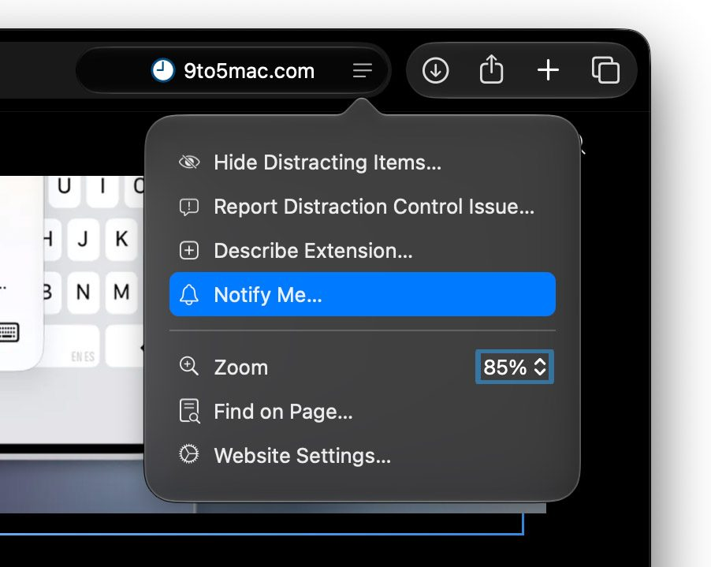
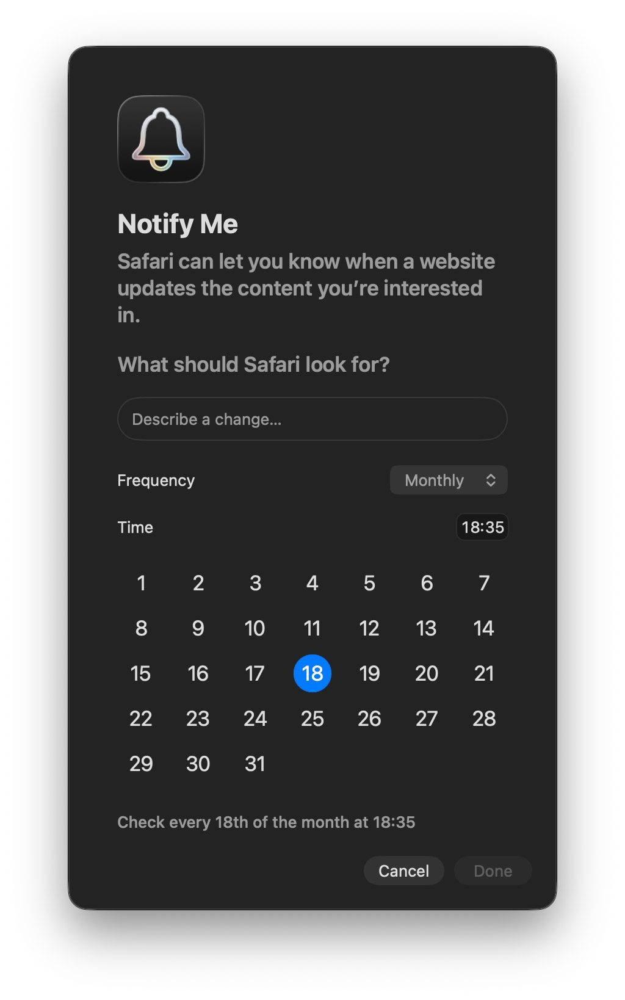

Safari incluye en macOS 27 Golden Gate una función llamada **Notify Me**, que permite
pedirle al navegador que vigile una página web y que te avise cuando detecte un cambio
en ella. La guía está pensada para cualquier usuario de Mac que siga una página sin
querer recargarla a mano: una bajada de precio, la vuelta de un producto a la venta,
un cambio en las condiciones de un servicio o la apertura de inscripciones.

Notify Me es una de las incorporaciones de Apple Intelligence a macOS 27: el modelo
interpreta la descripción de lo que quieres vigilar y analiza el contenido de la página
para determinar si puede atender la petición.

## Requisitos previos

- Un Mac con macOS 27 Golden Gate instalado.
- Safari como navegador.
- Apple Intelligence disponible en el idioma y la región del equipo. Al depender de esa
  tecnología, la función puede no aparecer en todos los entornos (ver «Limitaciones»).

## Pasos para configurar Notify Me en Safari

1. Abre Safari y ve a la página web que quieres tener bajo vigilancia.
2. Haz clic en el botón del menú de página (`Page menu`), situado a la derecha del campo
   de búsqueda inteligente (`Smart Search field`).
3. Selecciona `Notify Me` en el menú emergente.

4. En el campo `What should Safari look for?`, describe lo que quieres que se
   detecte. Apple Intelligence analiza entonces el contenido de la página para decidir si
   puede responder a tu petición.
5. De forma opcional, indica con qué frecuencia y cuándo debe Safari comprobar si hay
   cambios. Las opciones `Hourly` y `Daily` dejan elegir una hora concreta, mientras que
   `Weekly` y `Monthly` permiten además seleccionar días concretos de la semana o del
   mes.

6. Haz clic en `Done`. Como alternativa, Safari puede mostrar un botón `Next`; en ese
   caso, macOS pedirá permiso para enviar notificaciones de Safari. Los permisos de
   notificación se gestionan desde `Settings > Notifications > Safari`.

## Qué cambios puede detectar

Una vez configurada la alerta, Safari revisa la página según el calendario elegido y te
notifica cuando encuentra el cambio solicitado. Entre las situaciones que puede cubrir
están:

- Una bajada de precio.
- Un producto que vuelve a estar disponible.
- Cambios en las políticas de un sitio.
- La apertura de inscripciones o registros.
- Información nueva añadida a la página.

## Cómo verificar que la alerta funciona

Después de guardar la configuración, comprueba dos cosas. Primero, que macOS haya dado
a Safari permiso para enviar notificaciones: entrando en `Settings > Notifications > Safari`
puedes revisar y cambiar ese permiso. Segundo, que la revisión se dispara según
la frecuencia que elegiste: cuando Safari detecte el cambio, aparecerá la notificación
correspondiente en el Mac.

## Limitaciones

- La función depende de Apple Intelligence, por lo que puede no estar disponible en todos
  los idiomas y regiones. Apple mantiene un listado actualizado de disponibilidad en su
  [documentación de Safari sobre avisos de cambios en páginas](https://support.apple.com/guide/safari/get-notified-when-a-website-changes-ak35p2kk9h5r/27.0/mac/27).
- Notify Me se apoya en Apple Intelligence: si buscas cómo controlar esa tecnología en
  el iPhone, dejamos [una guía para limitar o desactivar Apple Intelligence en iOS
  27](/noticias/disable-apple-intelligence-ios-27/).
- La función se configura página por página: la alerta creada se aplica a la web que
  elegiste en el primer paso.
