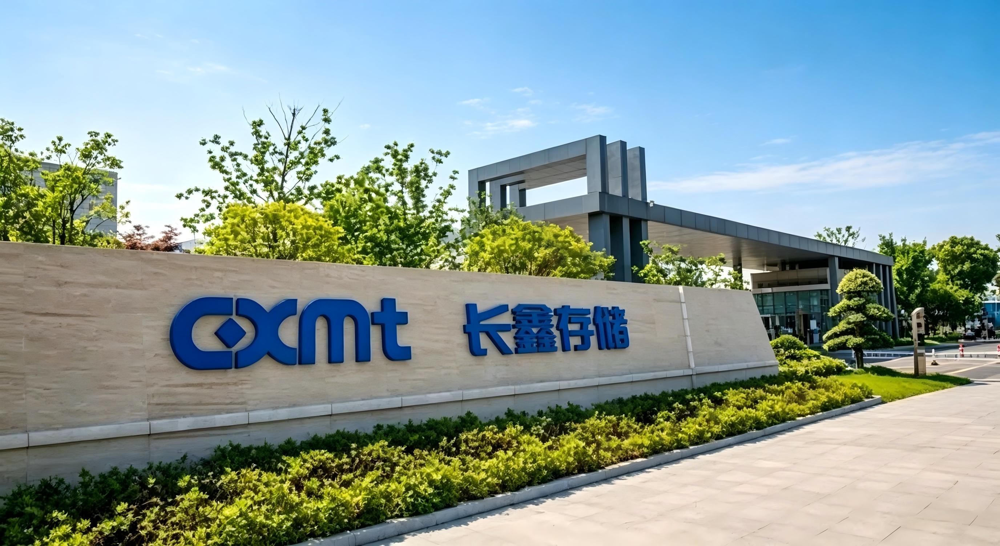

La decisión de Samsung de no ampliar por su cuenta la producción de DRAM de uso general está dejando un hueco de oferta que CXMT (ChangXin Memory Technologies) está aprovechando a gran velocidad. Según los datos de TrendForce que recoge el medio chino MyDrivers, la facturación DRAM de la compañía china alcanzó los 14.624 millones de dólares en el segundo trimestre de 2026, un 99,3 % más que en el trimestre anterior, y su cuota mundial pasó del 7,6 % al 9,5 %.

## Samsung reserva su capacidad para la HBM

Samsung no abandona la DRAM de uso general, pero sí ha dejado de ampliar su capacidad propia para ella. El movimiento, adelantado por la prensa industrial surcoreana y recogido ahora por MyDrivers, pasa por encargar a socios externos todo el crecimiento de capacidad de módulos DDR5 y de unidades SSD, mientras las plantas de encapsulado de Cheonan y Onyang se reorientan hacia el encapsulado avanzado de HBM y otros productos de mayor valor.

El matiz importa para no leer la noticia como una retirada. Samsung seguirá fabricando DDR5 y SSD en sus líneas actuales; lo que cambia es que las ampliaciones se canalizarán a través de terceros, tal y como ya se detalló cuando se conoció el plan de [externalizar la producción adicional de módulos DDR5 y SSD](/noticias/samsung-outsourcing-ddr5-ssd/). El efecto inmediato es que el crecimiento de la oferta de DRAM convencional ya no depende de la propia Samsung, sino de la capacidad de sus socios de ensamblado y test.

## El hueco de oferta que CXMT convierte en facturación

Con los grandes fabricantes concentrados en la memoria de alto ancho de banda que demanda la inteligencia artificial, la DRAM convencional —la de equipos de sobremesa, portátiles y móviles— se ha ido tensionando. Ahí es donde entra CXMT. TrendForce sitúa su facturación DRAM del segundo trimestre en 14.624 millones de dólares, un 99,3 % más que entre enero y marzo, y su cuota mundial en el 9,5 % frente al 7,6 % del trimestre anterior, lo que la coloca en cuarta posición del ranking mundial.

Para poner la cifra en contexto, la facturación agregada de la industria DRAM creció un 59,5 % en el mismo periodo, de modo que el avance de CXMT —el mayor entre los principales fabricantes— va muy por delante del mercado. El crecimiento se explica por dos palancas: el encarecimiento del LPDDR4X y el LPDDR5X para móviles, donde la empresa concentra buena parte de su catálogo, y el hueco de oferta que dejan Samsung y sus competidores al desviar capacidad hacia la HBM.

## G5, capacidad y el techo de la escalada

El respaldo técnico de esta escalada es la plataforma G5, ya en producción en masa, con un semipaso del área activa de 11,95 nanómetros y al menos un 50 % más de dados por oblea que la generación anterior. Sobre esa base, CXMT fabrica dos módulos LPDDR5X de 24 Gb, según recogió el [anuncio de producción en masa de la plataforma G5](/noticias/cxmt-5th-gen-dram-mass-production/).

El otro factor es la capacidad. Según los datos de Guojin Securities que cita la información, CXMT producía entre 280.000 y 290.000 obleas al mes a finales de 2025; SemiAnalysis proyecta unas 350.000 a finales de 2026 y hasta 500.000 en 2028. La pregunta abierta es si ese ritmo basta para consolidar la cuota: como señala el propio análisis, dependerá de la velocidad de rampa de la producción y de cuánto tarden en validarse sus productos de gama alta.

## Qué cambia para el lector

El interés de este pulso no es académico. Cuando el líder del mercado deja de ampliar la DRAM convencional, la oferta no crece al ritmo de la demanda y los precios se resienten en toda la cadena, desde el [precio de la gama iPhone](/noticias/apple-iphone-dram-price-hike/) hasta el coste de ampliar la memoria de un PC. Que CXMT gane cuota añade un proveedor alternativo que, a medio plazo, puede equilibrar algo ese mercado.

Conviene, aun así, no precipitarse. CXMT sigue siendo un actor de menor escala que Samsung, SK Hynix y Micron, y su cuota del 9,5 % no le permite marcar el precio por sí sola. La lectura realista es de tendencia: Samsung se concentra en la HBM, CXMT crece en lo convencional y el comprador lo notará menos en mejores precios que en una oferta más diversificada y menos dependiente de un puñado de fabricantes. Ya hay señales de que el ecosistema la trata como memoria de primera, como las [BIOS de ASUS para AM5 optimizadas para la DDR5 de CXMT](/noticias/asus-am5-bios-cxmt-memory/).
