El Samsung Galaxy Z Flip8 ya está a la venta en España desde 1.299 euros, y Xataka ha publicado su análisis tras más de una semana de uso. El veredicto del medio puede resumirse en una idea incómoda para la firma coreana: ser un buen móvil plegable ha dejado de ser suficiente. El terminal mejora la fórmula de su antecesor sin arriesgar demasiado, pero arrastra los mismos puntos débiles que ya arrastraba la generación anterior.

La primera impresión del analista al sacarlo de la caja fue la familiaridad. Sobre el papel, el Flip8 y el Flip7 comparten una ficha técnica muy parecida y los cambios se cuentan con los dedos de una mano. El análisis sostiene que eso no es necesariamente malo, porque el modelo del año pasado ya era un buen teléfono, pero tampoco es un salto generacional.

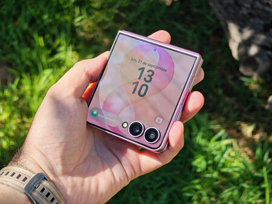

## Qué cambia en el Galaxy Z Flip8 y qué se queda igual

Los dos cambios físicos más relevantes son el grosor y el peso. El Flip8 es más delgado y ligero que su antecesor: plegado pasa de 13,7 a 13,1 milímetros, mientras que desplegado la diferencia es de apenas 0,4 milímetros y se queda en 6,1 milímetros. El conjunto pesa 180 gramos. La mejora se percibe sobre todo con el teléfono cerrado, donde se siente menos macizo.

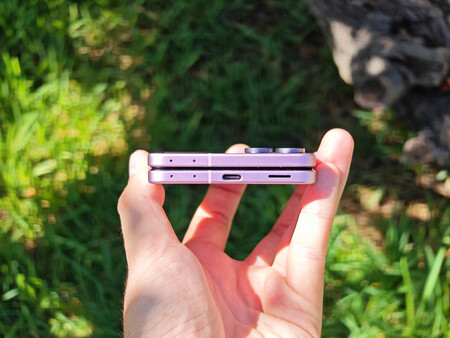

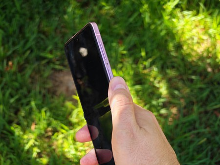

La construcción sale bien parada: el análisis la describe como excelente y muy bien rematada, lejos de la sensación de fragilidad de los primeros plegables. La bisagra Flex Titanium introduce una mejora en el tacto del pliegue que se nota, aunque menos que en el Flip7 y bastante menos que en el Flip6. La arruga central sigue ahí, pero el analista admite que en el uso diario llegó a olvidarse de ella y que tuvo que ir a buscarla a propósito.

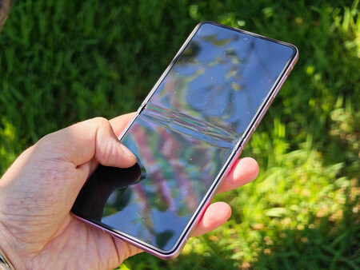

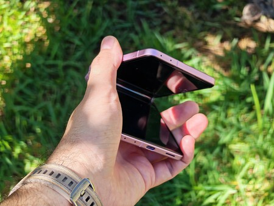

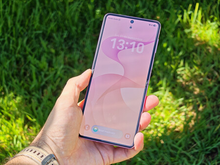

En pantallas, el terminal mantiene la misma configuración que su antecesor: un panel interno Dynamic AMOLED 2X de 6,9 pulgadas con resolución FullHD+, tasa de refresco de 1 a 120 Hz y 400 píxeles por pulgada. La única novedad reseñable es el brillo pico, que sube hasta los 3.000 nits. La pantalla externa, un Super AMOLED de 4,1 pulgadas con refresco de 60 o 120 Hz, es idéntica a la del año pasado. El cambio de software más útil es que Samsung parece haber preinstalado el módulo MultiStar por defecto, lo que permite ejecutar aplicaciones como YouTube, Google Maps o WhatsApp en la pantalla exterior.

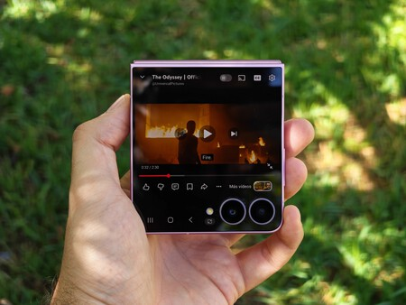

El análisis también señala lo que no cambia. El formato 21:9 y la posición de los botones se mantienen, así que alcanzar la parte superior de la pantalla con una sola mano sigue siendo complicado, y el sensor de huellas queda demasiado arriba. Tampoco es posible desplegar el teléfono con una sola mano, un detalle que el analista considera importante en un dispositivo que se abre varias veces al día. Se conserva la resistencia IP48. El sonido cumple para llamadas y vídeo, pero a volumen alto muestra sus límites.

## Rendimiento y software: suficiente, con matices

Samsung reserva sus mejores plataformas para la familia Fold, de modo que solo los Galaxy Z Fold8 y Fold8 Ultra montan el Snapdragon 8 Elite Gen 5 for Galaxy. El Flip8 que llega a España se queda con el Exynos 2600, un chip desarrollado internamente por Samsung con diez núcleos: uno principal a 3,8 GHz, tres a 3,25 GHz y seis a 2,75 GHz. Lo acompañan 12 GB de memoria RAM LPDDR5x y 256 o 512 GB de almacenamiento UFS 4.0.

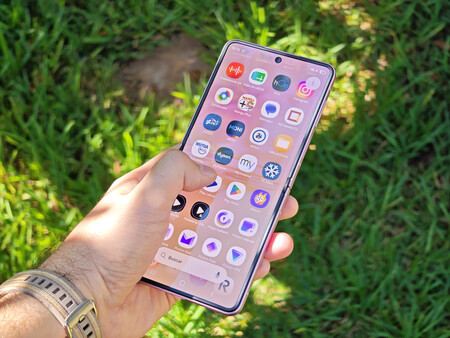

Sobre el papel, Samsung promete una mejora del 39 % en la CPU respecto a la generación anterior, una GPU Xclipse 960 bastante más capaz y una NPU el doble de rápida. Los números de las pruebas independientes acompañan: en Geekbench 6 el Flip8 registra 2.459 puntos en un solo núcleo y 8.790 en varios, frente a los 1.775 y 6.820 del Flip7. En 3DMark Wild Life Unlimited alcanza 26.422 puntos, muy por encima de los 14.258 del modelo anterior.

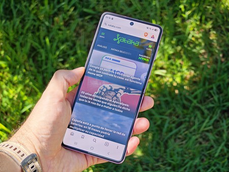

El problema, según el análisis, no es el chip sino el continente. El formato plegable, el grosor y el aumento de temperatura limitan el rendimiento sostenido, que se recorta muy rápido. En juegos exigentes la caída de rendimiento con la GPU a pleno rendimiento es de las más acusadas que el analista recuerda haber visto. El teléfono se sigue calentando, menos que antes, pero de forma evidente sobre todo en la parte superior, donde está el procesador y la pantalla secundaria. El análisis también vuelve a detectar un módem poco estable en red móvil y Wi-Fi, algo que ya notó en el Flip7.

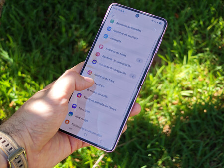

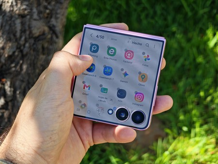

En software, el Flip8 sale al mercado con Android 17 y One UI 9. No hay grandes novedades en inteligencia artificial, pero las funciones esperadas responden bien. Se mantiene Samsung DeX, que permite usar el teléfono como un escritorio, y la interfaz funciona sin tirones. El bloatware sigue presente en forma de aplicaciones de Microsoft, Netflix o Facebook, aunque todas son desinstalables o desactivables. El punto más valorado es la promesa de siete años de actualizaciones mayores de Android, una garantía a largo plazo que el análisis considera uno de los mayores argumentos a favor de la gama alta de Samsung.

## Batería y cámaras: las asignaturas pendientes

### Batería

El único cambio respecto a la generación anterior en materia de autonomía es la eficiencia del Exynos 2600, que en la práctica se nota poco. El Flip8 monta una batería de 4.300 mAh, esta vez con tecnología de silicio-carbono, junto a carga rápida de 25 W, carga inalámbrica de 15 W y carga inalámbrica inversa PowerShare.

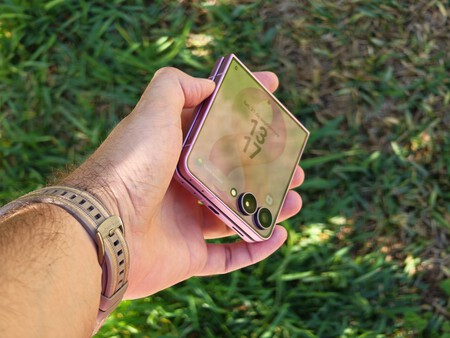

En autonomía bruta, con un uso normal de multimedia, mensajería, navegación y redes, es relativamente fácil alcanzar entre seis y siete horas de pantalla activa repartidas en dos días, es decir, llegar hasta la tarde del día siguiente. Con un uso más intensivo, con GPS o juegos, habrá que pasar por el cargador por la noche.

El reproche del análisis no es tanto la autonomía como la potencia de carga. Samsung mantiene los 25 W, una cifra baja para esta gama y este precio. El teléfono se carga en poco menos de hora y media, pero no porque la carga sea rápida, sino porque la batería tiene poca capacidad. El analista apunta que el silicio-carbono admite dos enfoques —conservar el grosor y ganar capacidad, o reducir el grosor y mantenerla— y se decanta por el primero: habría preferido un Flip8 algo más grueso con una batería de 5.000 mAh o más.

### Cámaras: sin cambios y con una tarea pendiente

El apartado fotográfico es idéntico al del año pasado. El Flip8 vuelve a quedarse con el lote más sencillo de cámaras de Samsung: un sensor principal de 50 megapíxeles con apertura f/1.8, Dual Pixel AF y estabilización óptica; un gran angular de 12 megapíxeles con apertura f/2.2 y campo de visión de 123 grados; y una cámara frontal de 10 megapíxeles con apertura f/2.2. No hay teleobjetivo de ningún tipo, así que el zoom recae en un recorte digital.

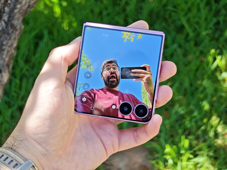

El sensor principal cumple con lo esperable: fotos bien trabajadas, con colores relativamente fieles y sin una saturación excesiva. El análisis lo describe como lo mínimo exigible en un terminal de 1.299 euros. El gran angular también es solvente, aunque conviene evitar ampliar porque se nota la falta de nitidez.

### Muestras de día

El zoom digital ofrece dos, cuatro y diez aumentos por defecto. El resultado a 2x es aceptable, hasta el punto de dar el pego como si fuera óptico, pero a partir de ahí el recorte se hace evidente: la imagen se difumina, los elementos se empastan y aparece un efecto acuarela en textos y texturas. También cambia ligeramente la colorimetría, algo que no ocurriría con una lente dedicada.

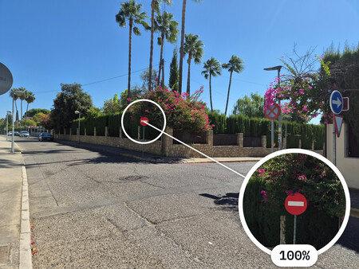

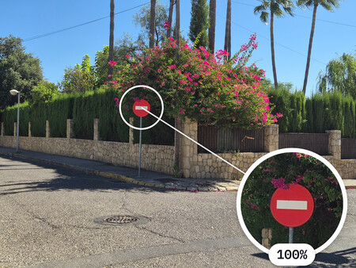

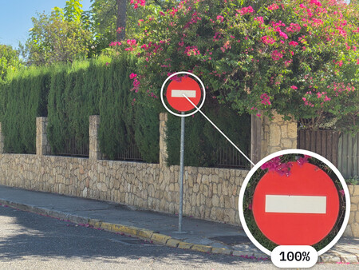

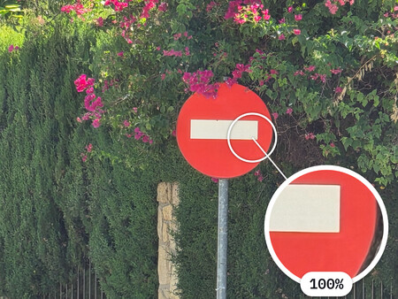

El modo de 50 megapíxeles permite ganar nitidez sin alterar el HDR, los colores ni la iluminación respecto al modo de 12 megapíxeles. El analista no lo usaría por defecto, pero sí lo recomienda cuando se vaya a ampliar la imagen en edición.

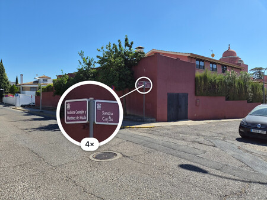

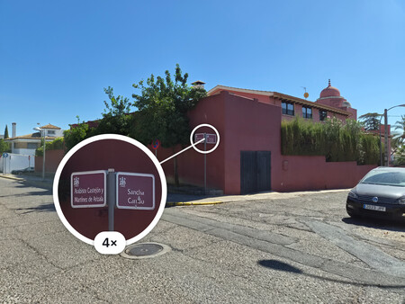

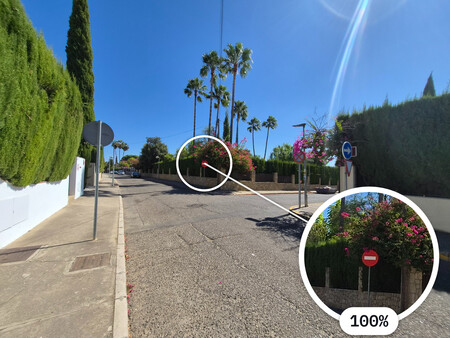

### Selfies y modo Flex

La cámara frontal del panel plegable cumple de sobra, con modos individual y grupal. Aun así, el análisis recuerda que la ventaja del formato es usar la pantalla externa para controlar las cámaras traseras y obtener selfies de calidad muy superior.

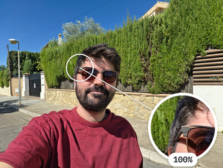

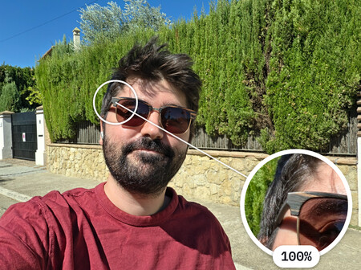

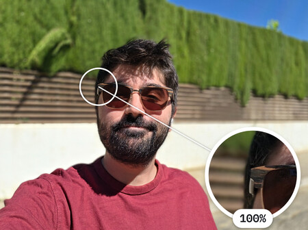

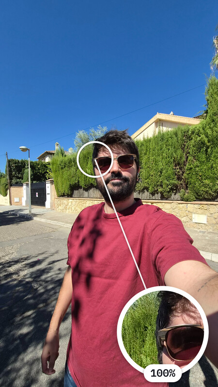

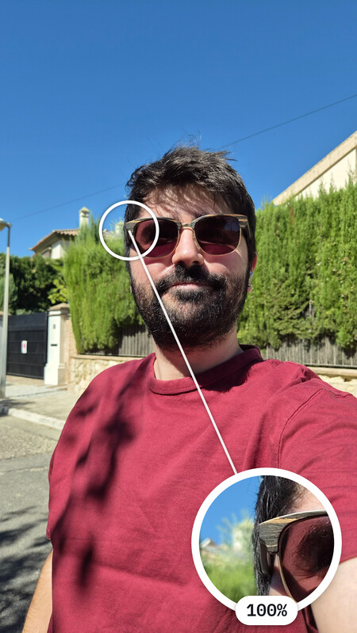

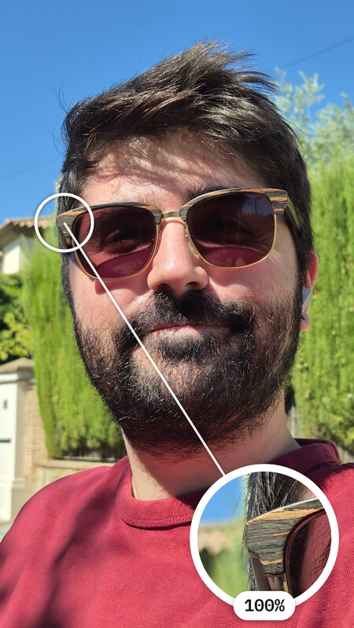

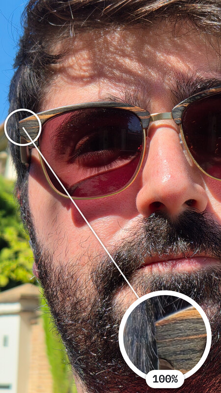

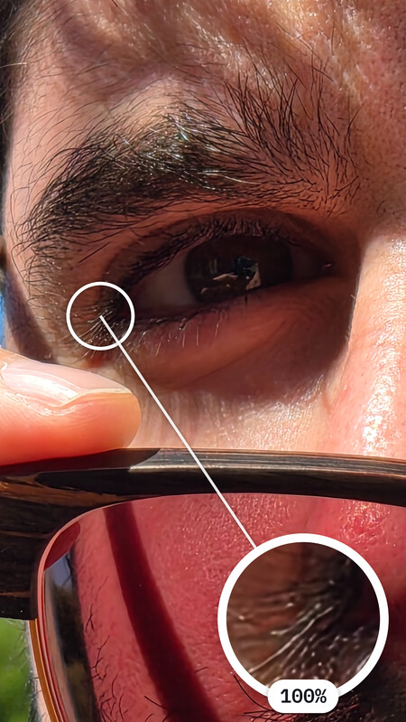

### Muestras de noche

Al caer la noche la cámara da un pequeño paso atrás, sobre todo al ampliar: la imagen sale demasiado lavada y el procesado tiene más dificultades. Sin zoom el resultado se mantiene correcto. El análisis recomienda dejar activado el modo noche, porque mejora de forma considerable la claridad y la utilidad de la foto aunque las luces queden más exageradas.

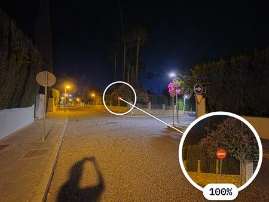

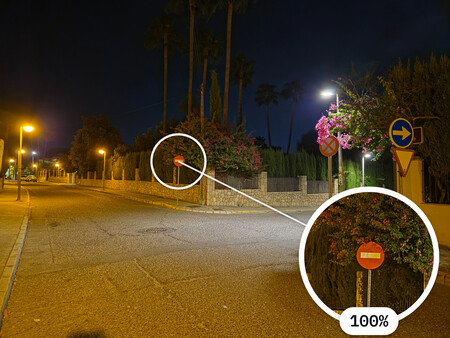

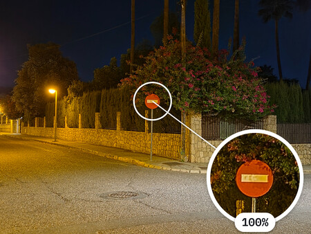

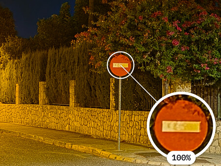

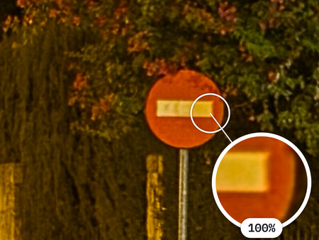

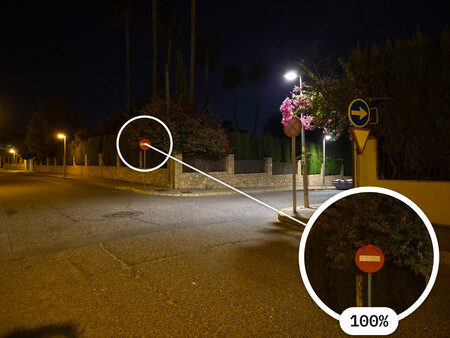

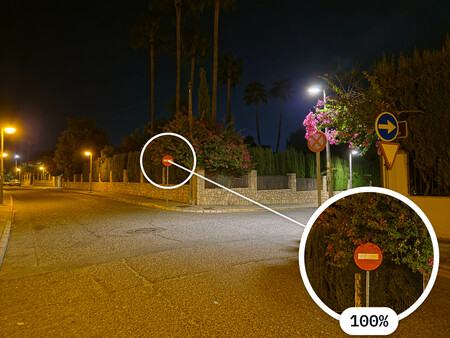

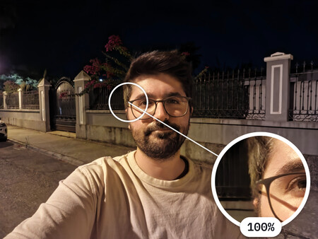

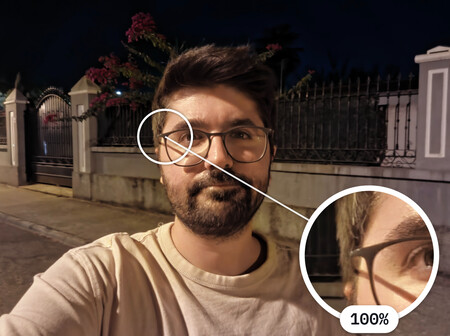

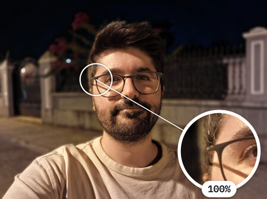

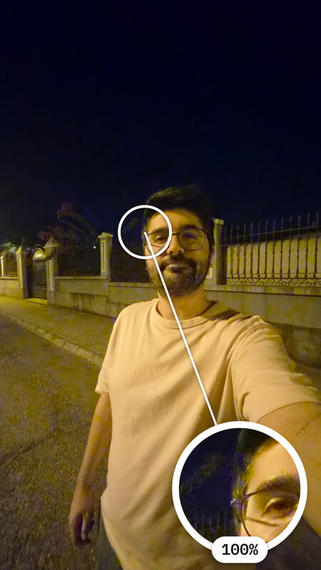

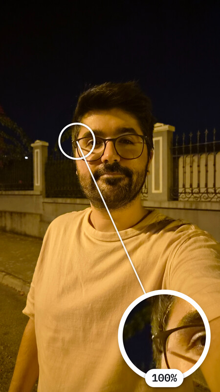

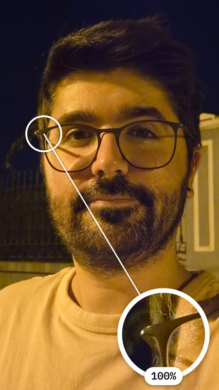

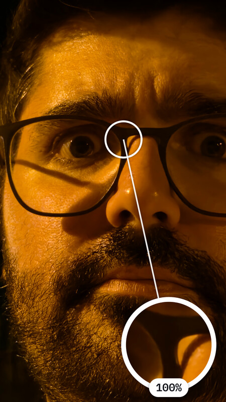

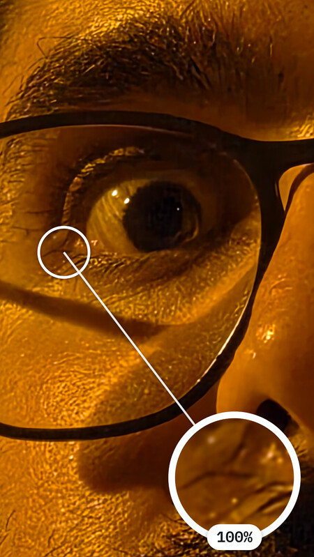

En vídeo, Samsung ha corregido el problema con el HDR que el analista detectó el año pasado. El resultado general está bien trabajado, con buena estabilización, buenos colores y buenas luces, suficiente para grabar contenido para redes sociales. La noche, en cambio, sigue siendo un punto flojo: la falta de luz provoca saltos, vibraciones y un color muy lavado, impropios de la gama alta.

## Qué significa para el comprador

El análisis cierra con la misma conclusión que el del modelo anterior: Samsung sabe hacer plegables y lo demuestra, pero el formato Flip sigue pidiendo más. El Flip8 cuesta 1.299 euros, cien euros más que el Flip7, y por ese precio existen alternativas no plegables mejores en todos los apartados. Eso no significa que sea un mal terminal: quien busca un móvil compacto, con siete años de soporte y aprovecha la pantalla exterior no echará de menos más potencia bruta, mejor gestión térmica o un vídeo nocturno superior.

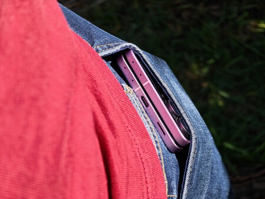

La valoración global de Xataka es de 8,7 sobre 10, con la pantalla y el software como apartados más destacados y la cámara y la batería como los más flojos. El análisis considera que el gran protagonista del año en la gama plegable de Samsung ha sido el Z Fold8, y que al Flip le toca dar un salto real en autonomía, velocidad de carga y fotografía para justificar su precio. Como recuerda el propio análisis, el formato plegable también tiene usos poco habituales: un truco permite usar DeX en la pantalla interior del [Galaxy Z Fold 8](/noticias/galaxy-z-fold-8-dex-inner-screen/), y la competencia también se mueve, con propuestas como la [animación de plegado del iPhone Duo](/noticias/iphone-duo-fold-animation/).
