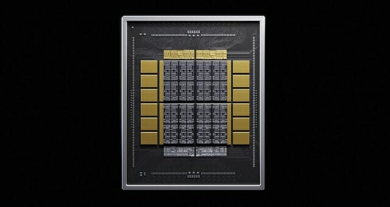

La división de memoria de Samsung Electronics prepara un cambio relevante en el suministro de uno de los componentes clave de su memoria de alto ancho de banda (HBM): el base die, el chip que conecta las capas de DRAM apiladas con el procesador. Según recoge ZDNet Korea citando a fuentes del sector, la compañía adoptará una estrategia de doble vía en la que, además de su propia fundición, recurrirá a TSMC para fabricar parte de estos troqueles.

## Un componente que gana peso con cada generación

La HBM se construye apilando verticalmente varias capas de DRAM (el core die) sobre un base die, encargado de enlazar la memoria con el chip del sistema y de mover los datos a alta velocidad. Su importancia no ha dejado de crecer: desde la HBM4, cuya producción en masa arrancó este año, tanto Samsung como SK Hynix fabrican el base die con un proceso de fundición en lugar del proceso de DRAM habitual. Ese cambio permite integrar más funciones en el troquel y mejorar el rendimiento y la eficiencia energética.

## La HBM a medida y el papel de NVIDIA

El siguiente paso es la HBM personalizada (cHBM), que traslada al base die funciones de lógica solicitadas por cada cliente. El ejemplo más citado es NVHBM, la estructura de memoria a medida que NVIDIA presentó el mes pasado: mueve el controlador de memoria del acelerador de IA al base die de la HBM y se aplicará a partir de la HBM4E. Frente a una HBM4E estándar, promete hasta un 30 % más de ancho de banda de memoria con un consumo hasta un 15 % menor. Según la fuente, el primer cliente de NVHBM sería Amazon, a través de su división de semiconductores Annapurna Labs, que ya trabaja en el diseño del acelerador Trainium4 con esta tecnología.

## Una doble vía para no quedarse aislada

Hasta ahora, Samsung se autoabastecía de base die mediante sus divisiones de System LSI (diseño) y de fundición (fabricación). Con la llegada de la HBM a medida, la compañía planea combinar su propio core die de HBM con base die fabricados tanto por Samsung como por TSMC, en función de lo que pida cada cliente. Cuando el troquel lo produzca TSMC, el diseño y la optimización correrán a cargo de la división de memoria de Samsung, que ya ha incorporado a parte del personal de System LSI para esta tarea; la división de System LSI seguirá diseñando únicamente los productos destinados a la fundición interna.

Según una fuente cercana al asunto, ya hay clientes que están diseñando sus productos con el core die de HBM de Samsung y un base die fabricado con el proceso de TSMC, aunque la adopción final y el reparto entre ambas fundiciones dependerán de la demanda de cada cliente. La lectura de fondo es estratégica: TSMC ha tejido una red sólida con los grandes clientes de IA gracias a su fundición y su empaquetado, y aferrarse en exclusiva al modelo integrado de Samsung arriesgaba dejar fuera parte de esa demanda personalizada.
