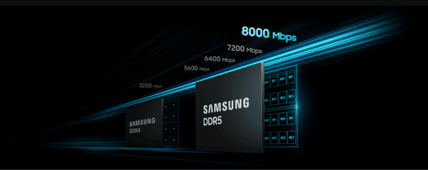
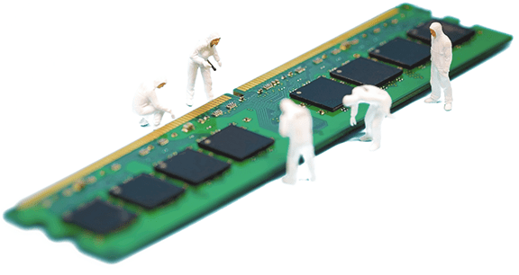

Samsung Electronics estaría reorientando su producción de memoria convencional hacia
fabricantes externos. Según fuentes industriales citadas por el medio surcoreano
The Elec —información que TechRadar ha recogido después—, la compañía planea encargar a
socios de ensamblado y test (OSAT) todo el crecimiento de capacidad de módulos DDR5 y
unidades SSD, mientras reserva sus propias líneas para productos de mayor valor añadido
como la memoria de alto ancho de banda (HBM).

Conviene subrayar el grado de confirmación: no existe un anuncio oficial de Samsung. La
información procede de personas conocedoras de la operación y del sector, por lo que debe
leerse como un plan en marcha reportado por la industria y no como una decisión
confirmada por la empresa.

## Externalizar el crecimiento, no la producción actual

El matiz importa. El plan no implica que Samsung deje de fabricar DDR5 o SSD en sus
plantas, sino que las ampliaciones de capacidad para esos productos convencionales se
canalizarán a través de terceros en lugar de construir líneas nuevas propias. La empresa
habría pedido a sus socios que aceleren incluso inversiones que ya tenían previstas.

El motivo es de espacio y de prioridades. La DDR5 se ensambla montando chips DRAM y NAND
ya encapsulados sobre placas de circuito impreso mediante tecnología de montaje
superficial (SMT), un proceso bastante menos complejo que el encapsulado avanzado que
requiere la HBM. Esa sencillez relativa permite que los socios asuman el volumen sin
grandes dificultades técnicas.

## La HBM se come el espacio en Cheonan y Onyang

El cuello de botella está en la fase final de fabricación. Las plantas de encapsulado de
Cheonan y Onyang se están reasignando a líneas de encapsulado avanzado, incluida la HBM,
para atender la demanda de semiconductores de inteligencia artificial. Según las fuentes
consultadas, Samsung carece de espacio para expandir sus líneas actuales de proceso
final, así que la vía más rápida es trasladar el crecimiento convencional a los socios.

A esto se suman dos obras en curso. La compañía prevé iniciar este mes la construcción de
una nueva planta de HBM en su campus de Onyang, valorada en 6 billones de wones, que
tardará varios años en completarse. En paralelo, una planta de proceso final de 1.500
millones de dólares se levanta en la provincia vietnamita de Thai Nguyen y se dedicará a
probar memorias más antiguas, como DDR4, LPDDR4 de bajo consumo, NAND flash y
almacenamiento UFS. Con ese panorama, queda poco margen interno para ampliar módulos
convencionales.

## Dreamtech, Hanyang Digitech y SFA Semicon amplían líneas

Los socios ya están respondiendo. Dreamtech, que comenzó a producir módulos DDR5 en India
en noviembre del año pasado, aprobó en junio una inversión en equipos para convertir su
planta 1 de Noida —antes dedicada al ensamblado de placas para teléfonos— en una línea de
módulos de memoria a gran escala. La ampliación se completaría este mes y la instalación
aspira a superar los 50 millones de unidades anuales.

Hanyang Digitech trabaja en mejorar la productividad de su planta de módulos en Vietnam,
con más de 31.500 millones de wones invertidos en el primer semestre para incorporar
maquinaria y automatizar procesos. Por su parte, SFA Semicon está trasladando equipos de
test y ensamblado de DDR5 desde el campus de Onyang a su planta en Filipinas: la primera
fase arrancaría en noviembre y la segunda llegaría en el segundo trimestre del próximo
año.

## El precedente de Micron y la incógnita de SanDisk

Micron ya recorrió un camino similar: externalizó parte de su producción de memoria
convencional para concentrar sus recursos internos en productos de mayor margen. La
pregunta que deja abierta el informe es si SanDisk seguirá el mismo rumbo, algo que las
fuentes no dan por seguro porque cada compañía tiene una huella de fabricación y una
combinación de productos muy distintas.

Para el lector hispanohablante, el movimiento encaja en un contexto de precios de memoria
al alza y de una demanda de HBM que absorbe la capacidad de los grandes fabricantes. Si
Samsung traslada a terceros el crecimiento en DDR5 y SSD, el resultado a medio plazo
podría ser más oferta de módulos y unidades, pero también una mayor dependencia de una
red de socios externos para productos que afectan directamente al precio de ampliar un PC
o comprar un portátil.
