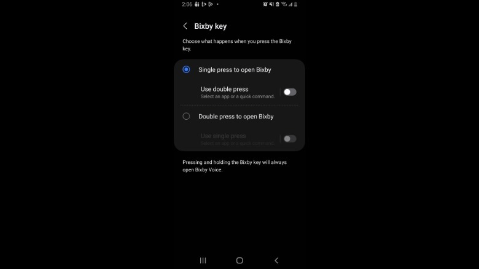
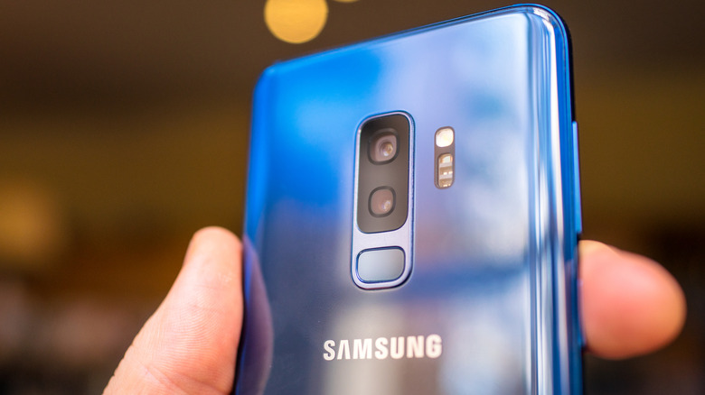

Samsung dejó de fabricar móviles con botón de encendido tradicional en 2019. Ese botón que está justo debajo del control de volumen es en realidad un **botón lateral** multifunción y configurable. Si has usado un Galaxy de la era S8 a S10, quizá recuerdes el cuarto botón físico que llevaban en el costado: el famoso botón de Bixby. No desapareció, sino que se fusionó con el botón de encendido en la serie Note 10 y en los modelos posteriores.

De fábrica, una pulsación corta enciende y apaga la pantalla, una pulsación larga activa el asistente Bixby, y una doble pulsación abre la cámara. Además, mantener pulsado el botón lateral junto con el de bajar volumen abre el menú de apagado, y una pulsación corta de esa misma combinación hace una captura de pantalla. La buena noticia es que Samsung permite reasignar casi todas las acciones ligadas al botón lateral, de modo que un teléfono que invoca a Bixby por accidente puede abrir en su lugar una aplicación concreta. Esto también vale para los equipos con botón de Bixby dedicado de la era S8 a S10, y todo se hace desde los propios ajustes del teléfono, sin menús secretos ni códigos.

Esta guía está pensada para cualquier usuario de un Samsung Galaxy que quiera exprimir ese botón. En el caso de los Galaxy Z Flip, conviene tener en cuenta que el comportamiento del botón lateral puede cambiar según si el dispositivo está abierto o cerrado.

## Requisitos previos

- Un teléfono Samsung Galaxy con One UI. No hace falta root, ni aplicaciones de terceros, ni activar opciones de desarrollador.
- Tener claro qué acción quieres asignar, porque algunas opciones dependen del modelo, como se explica más abajo.

## Cómo personalizar el botón lateral en un Samsung Galaxy

El procedimiento es directo. Toda la configuración vive en un único menú de ajustes:

1. Abre **Ajustes > Funciones avanzadas > Botón lateral**.
2. Configura la doble pulsación. Puedes asignarla a Cámara, Linterna, Lupa, Grabadora de voz, Samsung Notes, Modos y rutinas, Samsung Capture o una aplicación concreta de tu elección.
3. Configura la pulsación larga. Esta opción está limitada a aplicaciones de asistente como Bixby, Google Gemini y otros asistentes de IA, incluidos ChatGPT y Claude. Si no quieres un asistente en esa pulsación, puedes hacer que despliegue el menú de apagado.

## Dispositivos con botón de Bixby físico

En los Samsung con un botón de Bixby físico independiente (las series Galaxy S10, S9 y S8, además del Note 8 y el Note 9) hay reglas distintas:

- La pulsación larga siempre abre Bixby Voice y no se puede reasignar.
- Sí se pueden personalizar las funciones de doble pulsación y de pulsación simple, pero no a la vez: una de las dos tiene que abrir Bixby Home.
- Para reasignar el botón, entra en **Ajustes > Funciones avanzadas > Tecla Bixby**. Desde ahí puedes configurarlo para que abra cualquier aplicación que elijas o para que ejecute un comando.

## Usos prácticos: Modos y rutinas y Grabadora de voz

Modos y rutinas es una de las mejores formas de sacarle partido al botón lateral. Por ejemplo, si pasas mucho tiempo conduciendo, puedes configurar el botón para que active el modo de conducción. Ese modo puede desencadenar acciones como llamadas manos libres, abrir los mapas, leer los mensajes en voz alta y responder automáticamente a los mensajes de texto. Las combinaciones posibles al emparejar Modos y rutinas con el botón lateral son muchísimas.

Si sueles anotar ideas rápidas o quieres capturar el inicio de una reunión antes de tener un cuaderno a mano, el botón también sirve para empezar a grabar. Puedes asignar Grabadora de voz para que comience a registrar con una simple doble pulsación del botón lateral, sin necesidad de desbloquear el teléfono ni buscar la aplicación.

## Cómo verificar que funcionó

Vuelve a la pantalla de inicio y prueba la acción que hayas asignado: una doble pulsación debe abrir la opción elegida y una pulsación larga debe lanzar el asistente o el menú de apagado que hayas seleccionado. Si la acción no se dispara, revisa que hayas guardado el cambio en **Ajustes > Funciones avanzadas > Botón lateral** y que la opción elegida no esté restringida en tu modelo.

## Advertencias y limitaciones

- La pulsación larga no admite aplicaciones cualesquiera: queda limitada a asistentes de IA o al menú de apagado.
- En los modelos con botón de Bixby físico, la pulsación larga siempre pertenece a Bixby Voice y no se puede cambiar; además, la doble pulsación y la pulsación simple no se pueden personalizar al mismo tiempo.
- En los Galaxy Z Flip, la función del botón lateral puede variar entre el estado abierto y el cerrado. Samsung ya ha demostrado que adapta sus funciones de software al formato del dispositivo, como en el caso de [DeX sobre la pantalla interior del Galaxy Z Fold 8](/noticias/galaxy-z-fold-8-dex-inner-screen/).
- Las opciones exactas disponibles dependen del modelo y de la versión de One UI, así que tu menú puede mostrar una lista algo distinta a la de esta guía.
