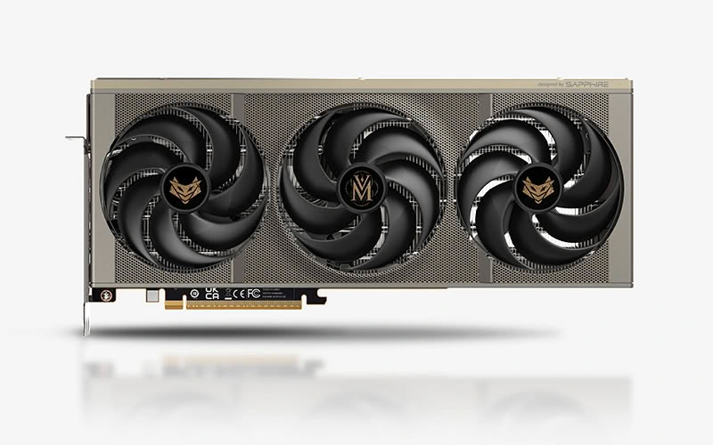
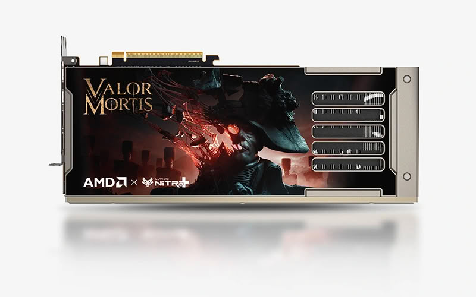

Sapphire prepara una nueva edición temática de su tarjeta **Nitro+ Radeon RX 9070 XT OC**, bautizada esta vez como **Valor Mortis**. La variante se ha creado en colaboración con el estudio **One More Level** y la editora **Lyrical Games**, y está pensada para acompañar el lanzamiento de su próximo juego de acción, previsto para el **13 de octubre de 2026**.

Conviene subrayar que **no se trata de un anuncio oficial de Sapphire**. La información trasciende a través del medio especializado TechPowerUp, que a su vez la atribuye a la filtración del sitio chino IT Home y a publicaciones de la propia Sapphire en redes sociales. Es decir, estamos ante una filtración razonablemente sólida, pero no ante una ficha de producto confirmada por el fabricante.

## Una edición para coleccionistas, no una nueva GPU

La Valor Mortis sigue el mismo camino que la **Nitro+ RX 9070 XT OC Crimson Desert**, la anterior colaboración temática de Sapphire. Los cambios se concentran en el acabado: un logotipo personalizado en los ventiladores y una **placa trasera magnética** decorada con arte del juego.

Eso significa que el atractivo del modelo es estético y de colección, no de rendimiento. Quien ya tenga una Nitro+ RX 9070 XT estándar no encontrará aquí una GPU distinta por dentro.

## Especificaciones heredadas y un juego incluido

Al no haber anuncio oficial, tampoco hay especificaciones confirmadas. TechPowerUp señala que, con toda probabilidad, el hardware **se mantendrá idéntico al de la edición Crimson Desert**: hasta **3060 MHz de reloj de impulso** y **2520 MHz de reloj de juego**, junto con **16 GB de GDDR6 a 20 Gbps** en un bus de **256 bits**.

Lo que sí se da por hecho es que la tarjeta incluirá **una copia del juego**. Sapphire no ha concretado de qué edición se trata, si la estándar o la deluxe, ni ha avanzado un **precio** o una **fecha de lanzamiento exacta**.

## Disponibilidad y el 25.º aniversario de Sapphire

Dado que el juego llega el 13 de octubre de 2026, la estimación que maneja el medio es que la tarjeta aparezca **en esas mismas fechas o poco después**. Es una previsión, no un dato oficial, así que la fecha real podría moverse.

El contexto del fabricante añade un aliciente: Sapphire celebra este año su **25.º aniversario**. Su fundador y consejero delegado, **KD Au**, afirmó que el hito "pertenece a nuestros clientes, a nuestros socios de AMD y a cada miembro del equipo de SAPPHIRE", y recordó que la compañía nació con la ambición de construir las mejores tarjetas gráficas del mundo.

## Qué significa para quien quiere comprarla

Para el comprador hispanohablante, una edición de este tipo implica dos cosas. La primera es que, salvo sorpresa, **no aportará más rendimiento** que una Nitro+ RX 9070 XT convencional, ya que los relojes y la memoria se heredan de la versión Crimson Desert. La segunda es que las ediciones temáticas suelen venderse con **precio de coleccionista y en unidades limitadas**, aunque todavía no se conozca la cifra.

Si el interés está en tener una tarjeta de la serie RX 9070 XT con acabado exclusivo y una copia del juego, merece la pena seguir los canales oficiales de Sapphire en las próximas semanas, a medida que se acerque el 13 de octubre. Si lo que se busca es la mejor relación rendimiento-precio, la versión estándar de la Nitro+ seguirá siendo la opción sensata mientras no haya confirmación de precios.

> Toda la información de hardware recogida aquí procede de la filtración publicada por TechPowerUp, que a su vez cita a IT Home y a Sapphire, y no de un anuncio oficial del fabricante.
