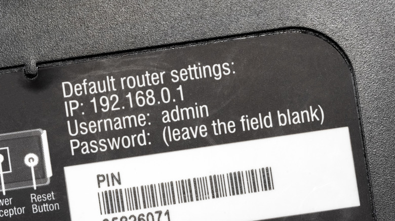
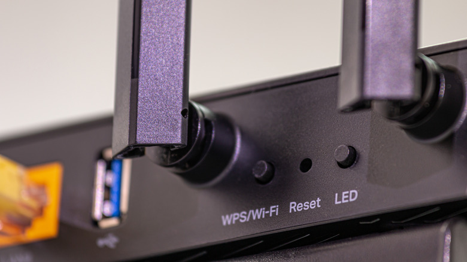
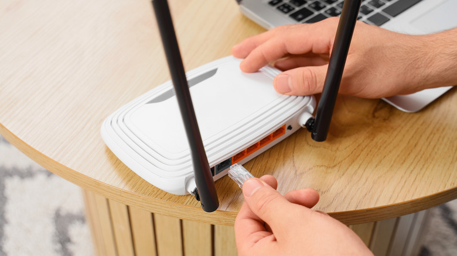

El router es la puerta entre los dispositivos del hogar e internet, pero la mayoría se queda con los ajustes que traía de fábrica. Esta guía sirve para cualquier usuario doméstico que quiera reforzar la seguridad de su red inalámbrica en unos diez minutos, sin conocimientos técnicos avanzados. Los ejemplos de menús corresponden a un router ASUS; en otros fabricantes los nombres pueden variar ligeramente.

## Requisitos previos

- Un ordenador conectado a la red doméstica (por cable o por Wi-Fi).
- La dirección IP del router y las credenciales del panel de administración. Si nunca se cambiaron, suelen figurar en una pegatina en la parte trasera o inferior del equipo.
- Tener a mano el manual del fabricante por si algún nombre de menú difiere.

## Paso 1: Entra en el panel de administración del router

Escribe la dirección IP del router en la barra del navegador. Lo habitual es `192.168.1.1` o `192.168.0.1`, aunque puede variar según el fabricante o la operadora.

Si no conoces la dirección:

- En Windows, escribe `cmd` en el menú Inicio para abrir el símbolo del sistema, ejecuta `ipconfig` y busca la sección **Ethernet** o **Wireless LAN** según el tipo de conexión. La dirección junto a **Default Gateway** es la IP del router.
- En Mac, mantén pulsada la tecla **Option** y haz clic en el icono **Wi-Fi** de la parte superior derecha. Junto a **Router**, bajo el nombre de la red, aparece la dirección necesaria.

Ten en cuenta que estas credenciales de administración no son las mismas que se usan para conectar dispositivos al Wi-Fi.

## Paso 2: Cambia las credenciales y la contraseña del Wi-Fi

El primer ajuste consiste en sustituir el usuario y la contraseña de acceso al panel, sobre todo si el usuario sigue siendo el genérico `admin`: es la primera opción que probará cualquier atacante. Conviene cambiar también el nombre de la red (SSID) y su contraseña, porque muchos equipos usan el modelo como SSID y eso da pistas sobre posibles vulnerabilidades. Además, cualquiera que lea la pegatina del router obtendría acceso de administrador si no se cambian.

En un router ASUS, los datos de acceso al panel están en **Administration > System**, dentro del apartado **Router Account**. Si permite cambiar el nombre de usuario, hazlo. Después, cambia las opciones inalámbricas en **Wireless > General**: la contraseña aparece como **WPA Pre-Shared Key**.

Aprovecha para comprobar el estándar de cifrado (**Authentication Method** en ASUS): selecciona el más robusto disponible, actualmente **WPA3-Personal**. Algunos dispositivos antiguos no funcionan con WPA3; lo más seguro es mantenerlo activado y prescindir de ellos, pero si no es viable, el modo mixto **WPA2/WPA3 Personal** aplica a cada equipo el estándar más alto que soporte.

## Paso 3: Activa la red de invitados para visitas y domótica

La mayoría de los routers permite crear una segunda red para invitados, una gran herramienta de seguridad: por defecto, sus dispositivos solo tienen acceso a internet y no pueden comunicarse entre sí ni con los recursos de la red principal. Es ideal para aislar los dispositivos de hogar inteligente, que han dado problemas de seguridad y privacidad en el pasado, y permite ver qué equipos están conectados y expulsarlos si hace falta.

Según el modelo, es posible limitar el ancho de banda de esta red para dar prioridad a los dispositivos propios, restringir sus horas de actividad en el caso de los menores o generar accesos puntuales de duración limitada. Como tiene su propia contraseña, puede ser más fácil de recordar mientras la principal se mantiene más compleja.

Los routers ASUS (en **Guest Network Pro**) admiten incluso varias redes de invitados a la vez: una para visitas, otra para menores y otra para domótica, cada una con su propio protocolo de seguridad. Eso permite, por ejemplo, mantener aislados los aparatos que solo soportan WPA2.

## Paso 4: Desactiva WPS

WPS (Wi-Fi Protected Setup) sirve para conectar dispositivos sin escribir la contraseña, pero debilita mucho la seguridad. Ofrece dos métodos: un PIN de ocho dígitos que se introduce en lugar de la contraseña, o un botón que se pulsa en ambos aparatos en un intervalo corto. En los ASUS, la opción está en **Wireless > WPS > Enable WPS**.

El problema grave está en el PIN: en lugar de comportarse como un número de ocho cifras, se calcula como dos bloques separados de cuatro, lo que reduce drásticamente las combinaciones posibles y lo hace fácil de descifrar, sobre todo si el router no limita los intentos. El método del botón exige acceso físico y es menos problemático, aunque los móviles modernos ya no lo soportan y algunos routers mantienen el PIN activo aunque solo se use el botón.

Hoy WPS rara vez es necesario: al conectar aparatos donde teclear una contraseña larga resulta incómodo (como reproductores multimedia), muchas veces se puede usar la aplicación del móvil para darles acceso, y tanto iOS como Android permiten compartir el Wi-Fi con contactos cercanos, incluso con un código QR, sin escribir la clave.

## Paso 5: Desactiva la gestión remota

Muchos routers permiten administrar la red desde fuera de casa introduciendo la IP pública en el navegador seguida de un puerto, o mediante la aplicación móvil del fabricante. Resulta cómodo, pero exponer la página de acceso del router a todo internet multiplica la superficie de ataque más allá de los dispositivos cercanos, y el riesgo no compensa.

En un ASUS, estos controles están en **Administration > System**: pon **Enable Telnet**, **Enable SSH** y **Enable Web Access from WAN** en **No**. Si necesitas acceso remoto, hay dos vías más seguras. La primera es **Enable Access Restrictions** (en la misma página), que limita qué dispositivos pueden abrir el panel, tanto en local como en remoto; añade varios equipos, incluido el que estés usando, para no quedarte fuera. La segunda es el servicio **Instant Guard** de ASUS (en **VPN > Instant Guard**), que crea un túnel VPN entre la red doméstica y los móviles con la aplicación instalada; configúralo en casa y podrás gestionar el router desde fuera además de sumar privacidad en redes abiertas.

## Paso 6: Mantén el firmware actualizado

Como cualquier dispositivo, el router necesita las últimas actualizaciones para estar protegido frente a vulnerabilidades conocidas. En ASUS se gestiona en **Administration > Firmware Upgrade**: activa **Auto Firmware Upgrade** y **Security Upgrade** para no depender de revisiones manuales. Si el modelo no ofrece esa opción, habrá que instalar las actualizaciones a mano siguiendo las instrucciones del fabricante.

## Cómo verificar que funcionó

Revisa cada apartado del panel tras aplicar los cambios: el usuario `admin` ya no debe existir, el cifrado debe mostrar WPA3-Personal (o el modo mixto si hay dispositivos antiguos), WPS debe aparecer desactivado y los tres interruptores de acceso remoto en **No**. Conéctate con el móvil a la red de invitados y comprueba que no ves los equipos de la red principal: si solo tienes internet, el aislamiento funciona.

## Advertencias

Reiniciar el router cada cierto tiempo ayuda a mantenerlo en forma y puede cortar accesos maliciosos temporales, pero no sustituye a las actualizaciones. Si el modelo llegó al fin de su soporte, una vía avanzada (que lleva más de diez minutos) es instalar un firmware alternativo como DD-WRT o FreshTomato en lugar de comprar un equipo nuevo. Y si usas el router de la operadora y echas en falta alguna de estas opciones, cambiar a un router propio suele dar mucho más control sobre la seguridad. Guía adaptada de la publicada por Engadget.
