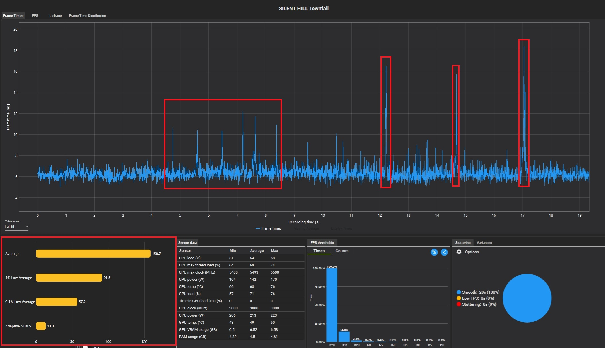
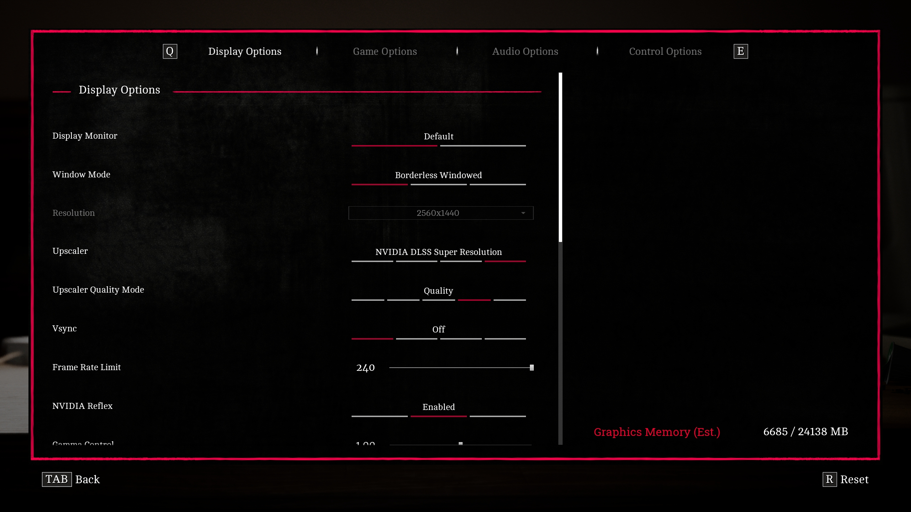
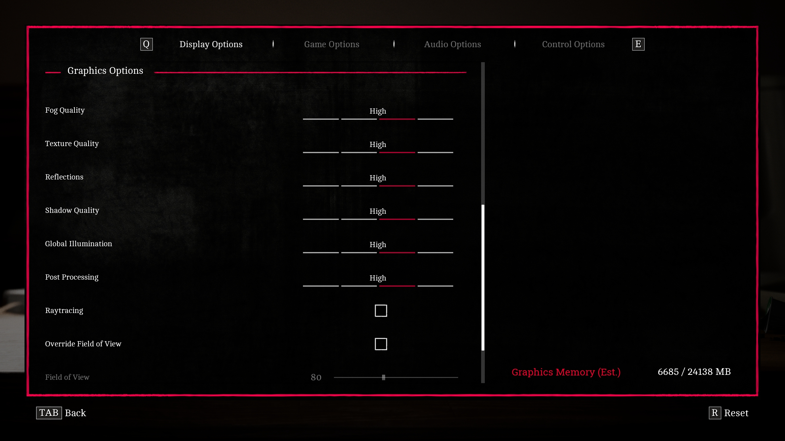
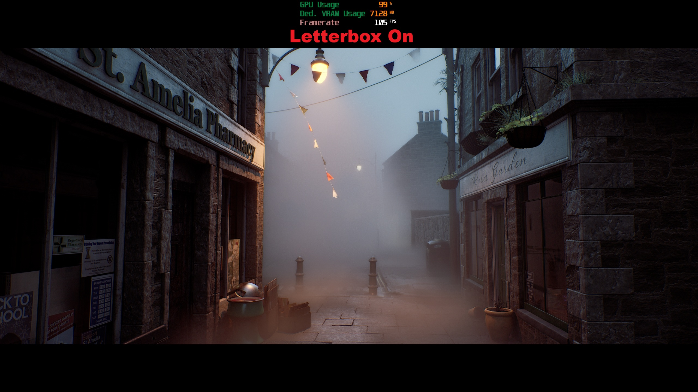
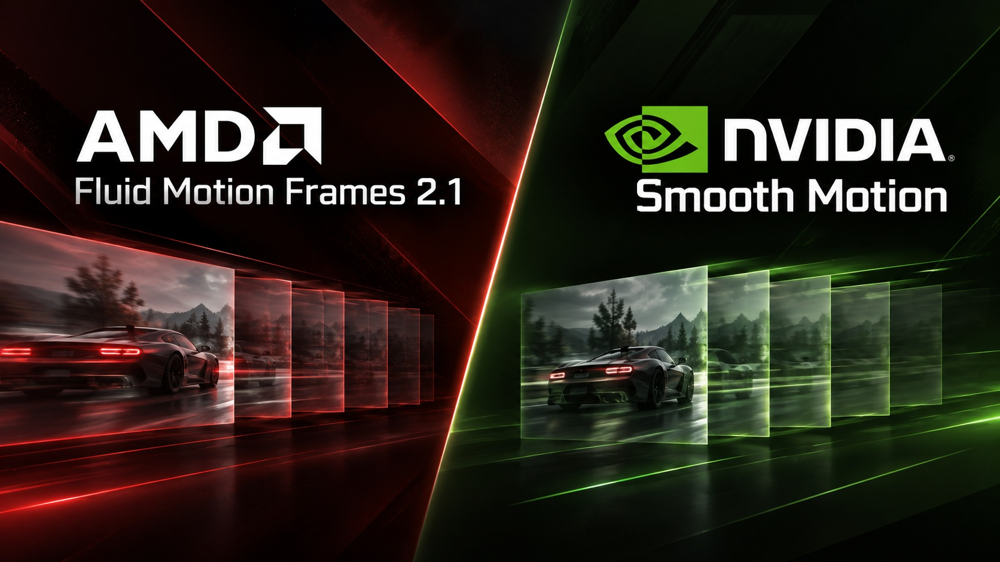

*SILENT HILL Townfall* llega a PC como una entrega construida sobre Unreal Engine 5 con
Nanite, Lumen y Virtual Shadow Maps, y aprovecha bien la niebla y la iluminación
volumétrica de su escenario. También llega con algunos problemas típicos del motor:
compilación de shaders en segundo plano, tirones al transitar por el mapa y un menú de
gráficos más escaso de lo esperado. Esta guía explica, paso a paso, cómo ajustar
*SILENT HILL Townfall* en PC para obtener una experiencia más fluida sin comprometer de
forma apreciable la imagen.


## Qué resuelve esta guía y para quién es

Está pensada para quien ya tiene el juego instalado en Windows y nota tirones, bajones de
FPS o simplemente quiere saber qué opción del menú sirve de verdad. Repasa los
requisitos oficiales, elige el reescalado temporal correcto, aplica un perfil de
gráficos optimizado medido en pruebas reales y termina con ajustes adicionales fuera del
menú. Cada valor indicado aquí proviene del análisis original de Wccftech; no hay
presets inventados ni atajos no probados.

## Requisitos previos

Las especificaciones oficiales publicadas en la ficha de Steam apuntan a Windows 11 y
DirectX 12 en ambos casos, con 75 GB de almacenamiento:

| Componente | Mínimos | Recomendados |
| --- | --- | --- |
| CPU | AMD Ryzen 5 3600 / Intel Core i7-8700K | AMD Ryzen 7 5700X / Intel Core i7-9700K |
| GPU | NVIDIA GeForce RTX 2060 Super / AMD Radeon RX 6600 | NVIDIA GeForce RTX 3080 / AMD Radeon RX 7800 XT |
| RAM | 16 GB | 32 GB |
| Sistema | Windows 11 x64 | Windows 11 x64 |
| DirectX | DirectX 12 | DirectX 12 |
| Almacenamiento | 75 GB | 75 GB |
| Objetivo | 1080p, Low, 30 FPS | 4K, High, 30 FPS con DLSS/FSR/TSR Balanced |

Ten en cuenta que esos objetivos son conservadores: los mínimos apuntan a 1080p y 30 FPS
en Low, y los recomendados a 4K y 30 FPS en High con reescalado en modo Balanced. Si
tienes una GPU Intel Arc, merece la pena revisar además los
[controladores Intel Arc 101.9030 con soporte Game Ready para este título](/noticias/intel-arc-drivers-101-9030/),
publicados antes del lanzamiento.

## Cómo se comporta la CPU antes de tocar nada

Conviene conocer el punto de partida. En una escena con mucha geometría (la plaza del
pueblo), con todos los gráficos al máximo, salida a 1920x1080 y DLSS Super Resolution en
Ultra Performance, un Core i7-14700K promedió **158,7 FPS**, pero los mínimos del 1 % se
quedaron en **91,5 FPS** y los del 0,1 % en **57,2 FPS**. Esa distancia tan grande entre
la media y los percentiles se traduce en un ritmo de fotogramas irregular.




La carga de CPU también resultó alta para un juego de este alcance, y la compilación
asíncrona de shaders la eleva todavía más durante la partida. Si tu procesador tiene
pocos núcleos, esperarás el peor escenario: prioriza los pasos de esta guía sin
saltarte ninguno.

## Pasos

### 1. Elige el reescalado temporal adecuado

*SILENT HILL Townfall* admite **NVIDIA DLSS Super Resolution**, **AMD FSR Upscaling**,
el **TSR** nativo de Unreal Engine 5 y una opción **TAAU** de generación anterior, más
ligera pero de peor resultado. **No incluye Intel XeSS Super Resolution ni generación de
frames nativa.**

1. Con una GPU GeForce RTX, selecciona **DLSS Super Resolution**: es la reconstrucción de
   mejor calidad disponible en el juego.
2. Con una AMD Radeon, usa **FSR Upscaling**. Si tienes una RX 7000 o RX 9000, podrás
   aprovechar además el soporte de **FSR 4.1**, que la capa de AMD Adrenalin reconoce en
   la integración de FSR del juego.
3. Con otro hardware, recurre a **TSR** como opción universal. Ojo: el juego **no expone
   niveles de calidad de TSR**, así que es menos flexible de lo deseable.
4. Empieza en modo **Quality** y aplica primero el perfil de gráficos del paso 2. Solo
   baja la resolución interna si la GPU sigue sin alcanzar el objetivo.

El reescalado temporal se gestiona por separado del resto de la optimización: no lo
compenses bajando opciones de gráficos que ya están bien ajustadas.

### 2. Aplica el perfil de gráficos optimizado

El menú es escaso: **solo hay siete ajustes de calidad principales**, sin descripciones
útiles, sin imágenes de vista previa, sin indicación de si cada opción afecta a la CPU,
la GPU o la VRAM y sin métricas de rendimiento integradas. Tampoco existen presets
Low/Medium/High/Ultra: la referencia de «máximo» significa tener cada ajuste individual
en su valor más alto.






Este es el perfil recomendado tras las pruebas, comparado siempre contra una configuración
con todo al máximo:

| Ajuste | Valor optimizado |
| --- | --- |
| Fog Quality | Low |
| Texture Quality | Ultra (para GPUs con 8 GB de VRAM o más) |
| Reflections | High |
| Shadow Quality | Medium |
| Global Illumination | High |
| Post-processing | Low |
| Ray Tracing | On |

El razonamiento detrás de cada valor:

- **Fog Quality → Low**: es uno de los pocos ajustes que sí devuelve un beneficio real de
  GPU y conserva la mayor parte del aspecto de la niebla, base del ambiente del juego.
- **Texture Quality → Ultra**: a 1440p con TSR nativo y Lumen por hardware, la calidad
  máxima se mantuvo en torno a 8 GB de VRAM. Bajarla cambia muy poco la imagen y no
  reduce de forma notable el consumo de memoria, salvo que sufras tirones por VRAM en una
  tarjeta con poca memoria.
- **Reflections → High**: por debajo de High no se gana rendimiento apreciable y sí se
  degrada la imagen; Ultra aporta muy poco extra.
- **Shadow Quality → Medium**: las Virtual Shadow Maps ya hacen un buen trabajo, y Medium
  conserva la calidad que se percibe en partida recuperando GPU.
- **Global Illumination → High**: niveles inferiores no dieron ganancias útiles y Ultra
  solo mejora de forma sutil. La iluminación indirecta es clave en la presentación, así
  que no bajes de High.
- **Post-processing → Low**: desactiva progresivamente efectos, entre ellos el grano de
  película y la aberración cromática que muchos desactivarían a mano, con una mejora
  pequeña de rendimiento y una imagen más limpia.
- **Ray Tracing → On**: el trazado por hardware cambia Lumen de la ruta por software y
  mejora visiblemente los reflejos con una penalización medida como inusualmente baja.
  Desactívalo solo si no llegas a tu objetivo de rendimiento, sobre todo en GPUs con
  hardware de trazado débil.

Las reducciones más importantes son Fog Quality y Shadow Quality. Si aún necesitas más
rendimiento, el orden correcto es **primero desactivar Ray Tracing y después bajar el
reescalado temporal**, no estrangular el resto de opciones.

### 3. Considera el modo letterbox (opcional)

El juego ofrece un modo cinematográfico en letterbox que añade barras negras arriba y
abajo. Además del efecto estético, **reduce la zona efectiva renderizada** y puede
mejorar de forma moderada el rendimiento de la GPU. En la prueba a 2560x1440, sin
letterbox el juego iba a **90 FPS** y con letterbox activo a **105 FPS**, con la GPU al
99 % en ambos casos.




### 4. Desactiva NVIDIA Reflex si notas tirones

Reflex Low Latency reduce la latencia del sistema y en condiciones normales conviene
tenerlo activo, pero en *SILENT HILL Townfall* su implementación se comportó mal: en el
sistema de pruebas, activarlo **introdujo inestabilidad constante de los tiempos de
fotograma**. Si el juego se siente desigual a pesar de un buen número de FPS, Reflex es
una de las primeras opciones que debes probar apagada. Déjalo desactivado hasta que el
problema se corrija con un parche.

### 5. Quita el grano de película y la aberración cromática con Engine.ini

Bajar Post-processing a Low ya desactiva varios efectos, pero quien quiere un control más
fino puede editar la configuración de Unreal Engine. Navega a:

```
%LOCALAPPDATA%\Townfall\Saved\Config\Windows
```

Crea un archivo `Engine.ini` (o edita el existente) y añade estas líneas:

```ini
[SystemSettings]
r.FilmGrain=0
r.SceneColorFringeQuality=0
```

Esas variables de UE5 desactivan el grano de película y la aberración cromática sin
tener que bajar el ajuste general de Post-processing. Después, **marca el archivo
`Engine.ini` como de solo lectura** para que el juego no sobrescriba su contenido.

Evita meter en `Engine.ini` colecciones grandes de «optimizaciones» no documentadas: hay
mods de lanzamiento que prometen eliminar los tirones de compilación y de transición con
cambios de streaming, async compute y hilos, pero esas afirmaciones son mucho más
difíciles de verificar que un ajuste de imagen sencillo. **No existe ningún comando
universal de `Engine.ini` que cure de forma fiable un problema de compilación de shaders
del propio motor.**

### 6. No borres la caché de shaders sin motivo

Como el juego ya realiza una compilación PSO inicial incompleta y sigue construyendo
shaders durante la partida, **borrar repetidamente la caché de shaders del juego o del
controlador puede empeorar la situación**, al forzar a repetir trabajo ya realizado.


Deja terminar la compilación inicial, no borres cachés a mano salvo que estés
diagnosticando un problema concreto y espera que las zonas ya visitadas se comporten
mejor cuando sus shaders estén en caché.

### 7. Usa la generación de frames del controlador como alternativa

El juego **no tiene generación de frames nativa**, a pesar de ser justo el tipo de
título UE5 intensivo en GPU que más la aprovecharía. Las pruebas con *OptiScaler*
consiguieron activarla, pero con problemas de estabilidad suficientes como para no
recomendarlo en su estado actual. La vía más limpia hoy es la interpolación a nivel de
controlador:

- **GeForce RTX 40 y RTX 50**: usa **NVIDIA Smooth Motion**, que funciona a nivel de
  controlador e inserta un fotograma generado por IA entre los renderizados
  convencionales; NVIDIA lo posiciona justamente para juegos sin DLSS Frame Generation
  nativo.
- **Radeon RX 6000 y superiores**: usa **AMD Fluid Motion Frames 2.1**, integrado en
  AMD Software: Adrenalin Edition y compatible con títulos DirectX 11, DirectX 12, Vulkan
  y OpenGL.



Los mods comunitarios de generación de frames, como el *FSR FG Enabler* de Nexus Mods
(basado en variables de configuración de Unreal/FidelityFX, sin inyección de DLL), deben
tratarse como experimentales: los informes de los usuarios son dispares y algunos no
ven ningún efecto. Son la última opción, no la primera.

## Cómo verificar que el ajuste de SILENT HILL Townfall funcionó

La comprobación se hace con el juego en marcha y con un medidor de fotogramas. En las
pruebas a 2560x1440, con TSR en resolución nativa sobre un equipo Core i7-14700K y
GeForce RTX 4090, el resultado de aplicar el perfil optimizado frente a todo al máximo
fue este:

| Configuración | FPS media | 1 % low | 0,1 % low |
| --- | --- | --- | --- |
| Gráficos al máximo | 101 | 70 | 52 |
| Gráficos optimizados | 135 | 82 | 64 |
| Mejora | **+34 %** | **+17 %** | **+23 %** |

Lo relevante no es solo la media: los percentiles bajos también subieron, que es
justamente lo que se nota como fluidez. Indicios de que el ajuste funcionó:

1. La media de FPS sube de forma estable respecto a tu referencia anterior.
2. Los tirones puntuales son menos frecuentes en zonas ya visitadas.
3. El consumo de VRAM se mantiene en torno a 8 GB con Texture Quality en Ultra a 1440p.
4. La imagen se percibe más limpia (sin grano ni aberración) sin que la escena se vea
   claramente peor.

Si el juego sigue sintiéndose irregular con buenos FPS, vuelve al paso 4 y desactiva
Reflex.

## Advertencias y limitaciones

- **Compilación de shaders incompleta**: el juego hace un pase PSO inicial con pantalla
  de progreso, pero no compila todo; el resto se compila de forma asíncrona durante la
  partida, con picos de CPU y tirones que se suman a los habituales de transición de
  Unreal Engine 5. En un juego de ritmo pausado, esto rompe la inmersión.
- **Escalabilidad limitada**: bajar todo a Low no produce la mejora dramática que
  cabría esperar, ni subir todo a Ultra supone una transformación visual equivalente.
  Varias opciones apenas cambian la imagen o el rendimiento.
- **Sin presets y sin métricas integradas**: no hay perfiles gráficos predefinidos ni
  contador de FPS en el juego; usa la herramienta de tu controlador o una externa.
- **HDR automático**: no hay interruptor de HDR dentro del juego; si HDR está activo en
  Windows, el juego lo habilita solo, con un resultado estándar para UE5.
- **Sin XeSS ni generación de frames nativa**: los usuarios de Intel tendrán que
  recurrir a TSR, y quienes busquen FG tendrán que ir por controlador o mods.
- **Posible fallo de controles**: se detectó un error en el que las teclas reasignadas a
  veces no se aplican.

En conjunto, *SILENT HILL Townfall* es un lanzamiento de PC visualmente atractivo pero
técnicamente desigual. Con este perfil de ajustes se ganó un **34 % de rendimiento medio**
y mejoras del **17 %** y **23 %** en los mínimos del 1 % y del 0,1 % con compromisos
visuales menores. Lo que el juego necesita por parte del estudio es un parche que
atienda la compilación PSO, la consistencia de los tiempos de fotograma y una
generación de frames nativa.
