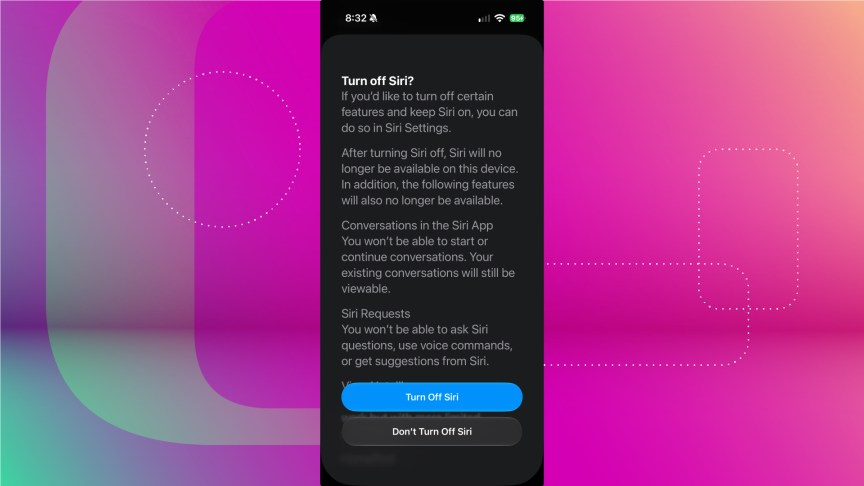
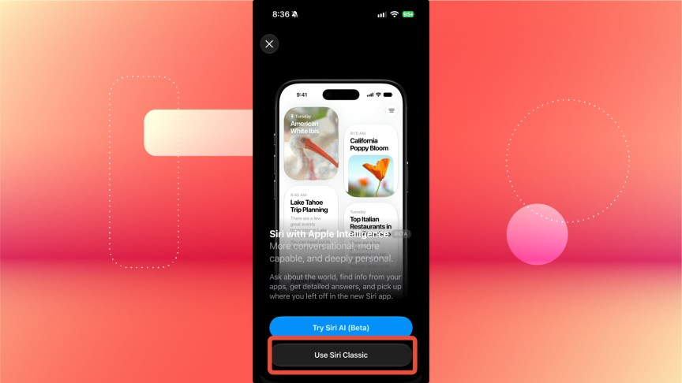

Con iOS 27, Apple renovó su asistente digital y lo centró en Siri AI, la versión basada en inteligencia artificial que se presentó en la conferencia de desarrolladores de la compañía. La duda de muchos usuarios es qué ocurre si actualizan el iPhone y no quieren dar el salto al asistente nuevo.

La respuesta tranquiliza: **la actualización no activa Siri AI de forma automática**. Hay que solicitarlo y entrar en una lista de espera, así que es posible instalar iOS 27 y seguir sin el asistente nuevo. Esta guía repasa las tres situaciones posibles: activar Siri AI, desactivarlo después y recuperar el Siri de siempre, al que Apple llama Siri Classic.

## Requisitos previos

- Tener el iPhone actualizado a iOS 27. Apple publicó esta versión el lunes 14 de septiembre.
- Haber aceptado o estar dispuesto a aceptar los términos del asistente en pantalla cuando el sistema los muestre.
- **Aunque ya tuvieras Apple Intelligence activado antes de actualizar, es necesario inscribirse igualmente en la lista de espera de Siri AI.** Es una condición que no se hereda de la configuración anterior.

## Cómo activar Siri AI en iOS 27

Si quieres usar el asistente nuevo, el primer paso es apuntarse a la lista de espera. Se hace desde los ajustes del sistema:

1. Abre **Ajustes** (Settings).
2. Entra en **Siri**.
3. Pulsa **Try New Siri**.

Después, sigue las indicaciones que aparezcan en pantalla: con eso quedarás inscrito en la lista de espera. El iPhone avisará cuando te hayan aceptado, pero conviene tener paciencia, porque el tiempo de espera varía. Puede ser cuestión de minutos, de horas o bastante más. En la fase beta, el autor del artículo original esperó un par de horas, mientras que algunos usuarios de Reddit señalaron esperas mucho más largas.

Cuando te admitan, podrás empezar a usar el asistente nuevo y aparecerá una aplicación de **Siri AI** en la pantalla de inicio.

## Cómo desactivar Siri AI en iOS 27

Si ya tienes acceso a Siri AI y prefieres apagarlo, el proceso también se resuelve desde los ajustes:

1. Abre **Ajustes** (Settings).
2. Entra en **Siri**.
3. Pulsa **Turn Off Siri** (Apagar Siri), cerca de la parte inferior del menú.
4. Vuelve a pulsar **Turn Off Siri** en la ventana emergente que aparecerá a continuación.

Ese aviso final detalla todas las funciones que quedarán limitadas o dejarán de estar operativas si confirmas el cambio, entre ellas la imposibilidad de iniciar conversaciones en Siri AI. Apagar el asistente nuevo exige una confirmación doble a pantalla completa, un detalle que el autor del artículo original critica por considerarlo excesivo en comparación con otros ajustes, que se desactivan con un aviso mucho más discreto.

## Cómo recuperar Siri Classic en iOS 27

La buena noticia es que no hace falta elegir entre Siri AI y quedarse sin asistente: existe una tercera vía para usar la versión anterior de Siri, la que Apple denomina Siri Classic. Según el artículo original, es la única forma conocida de recuperarla una vez has tenido acceso a Siri AI, sin necesidad de restaurar el iPhone desde una copia de seguridad anterior.

El primer paso es apagar Siri AI siguiendo las indicaciones del apartado anterior. A partir de ahí:

1. Abre **Ajustes** (Settings).
2. Entra en **Siri**.
3. Pulsa **Turn On Siri** (Activar Siri).
4. Pulsa **Use Siri Classic** (Usar Siri Classic).
5. Pulsa **Continue** (Continuar).

Con esto, Siri volverá a ser el asistente de siempre, sin la capa de inteligencia artificial.

## Cómo verificar que funcionó

Si al invocar el asistente ves el aspecto y el comportamiento anteriores a iOS 27, y no aparece la aplicación de Siri AI en la pantalla de inicio, el cambio se aplicó correctamente. En el caso contrario, repite el proceso desde **Ajustes > Siri** y comprueba que confirmaste el aviso de apagado.

## Cómo volver a activar Siri AI más adelante

Si más adelante quieres darle otra oportunidad al asistente nuevo, por ejemplo cuando Apple corrija los fallos propios de una versión en pruebas, puedes volver a activarlo desde **Ajustes > Siri > Try Siri AI (Beta) > Continue**.

## Advertencias y limitaciones

- **Siri AI sigue en fase beta.** Es previsible que Apple lo actualice y mejore en futuras versiones del sistema, así que el comportamiento actual puede cambiar.
- El tiempo de espera de la lista puede ser impredecible: desde minutos hasta periodos mucho más largos, según los casos que recoge el artículo original.
- Desactivar Siri AI limita o desactiva algunas funciones, tal como advierte el propio sistema antes de confirmar. Merece la pena leer ese aviso completo antes de continuar.
- El método para recuperar Siri Classic descrito aquí requiere haber tenido antes acceso a Siri AI y no implica restaurar el dispositivo. Si buscas volver atrás sin haber entrado nunca en la lista de espera, simplemente no actives el asistente nuevo tras actualizar.
