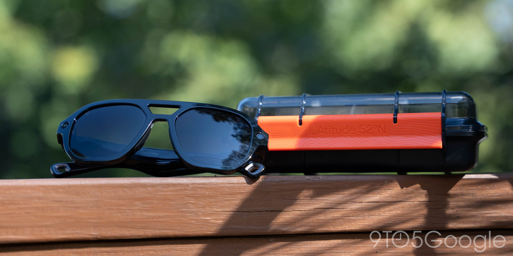
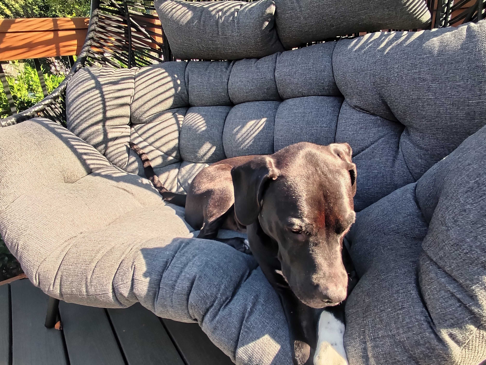
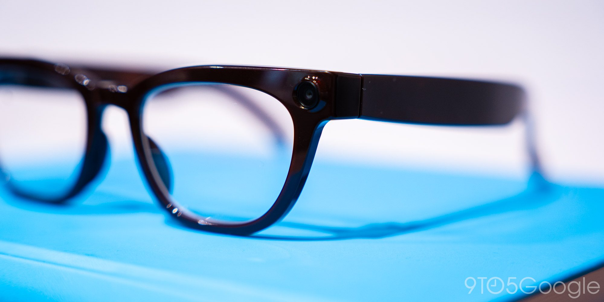

Durante años, la cámara fue el argumento de venta de las gafas inteligentes de consumo, el detalle que las separaba de unas simples gafas con altavoces. Ahora se ha convertido en su punto más incómodo. Esa es la tesis que firma Ben Schoon, editor sénior de 9to5Google, en su boletín semanal 9to5Google Weekender. Conviene subrayar que no es un dato medido ni una conclusión de este portal, sino una opinión personal del autor, y como tal hay que leerla.

El punto de partida es su propia experiencia. Schoon recuerda que el audio de conducción abierta ya hacía útiles a estas gafas, pero que el verdadero gancho comercial siempre estuvo en la cámara. Las Ray-Ban de Meta, sostiene, actuaron como catalizador: la compañía insiste en sus funciones de inteligencia artificial, aunque para él buena parte del atractivo real reside en llevar una cámara lista para grabar en primera persona, en cualquier momento. Ese fue el motivo por el que se las compró.

Sin embargo, asegura que apenas ha vuelto a usarlas en el último año. Tampoco probó a fondo otras que le ofrecieron hasta hace poco. Cuando lo hizo, por ejemplo con las Latitude 52°N Berlin —presentadas como una alternativa con mejor cámara que las de Meta—, su veredicto fue matizado: no considera que la cámara sea mejor, con la falta de foco y la luz solar directa como problemas evidentes, aunque valora que pueda capturar en horizontal.

## De reclamo estrella de las gafas inteligentes a punto incómodo

La razón del cambio, según el autor, no está en la tecnología sino en el uso que se le da. Cualquier tecnología nueva puede ser mal utilizada, admite, pero la naturaleza discreta de estas cámaras convierte un mal uso puntual en algo que incomoda de verdad a quien lo sufre. Y sostiene que esa reacción es legítima.

Él mismo reconoce que al principio le costaba entender las críticas a llevar una cámara en la cara, hasta que la acumulación de ejemplos le hizo ver cuánta gente estaba dispuesta a hacer un uso indebido. Las fotografías que acompañan su texto, tomadas con estas gafas, ilustran el otro lado: la libertad de capturar en primera persona lo que se tiene delante.

## Dos errores que Schoon achaca a Meta

Para el autor, el problema de fondo no es solo el mal uso, sino cómo se ha gestionado. En el caso de las Ray-Ban identifica dos fallos.

El primero es quién estaba al mando. Recuerda que la larga trayectoria de Meta en el tratamiento de datos privados no encajaba bien con una cámara sobre la cara del usuario y afirma que las filtraciones sobre moderadores humanos revisando grabaciones privadas sin censura, junto con los planes de reconocimiento facial y de grabación continua que han ido apareciendo en informaciones de otros medios, acabaron con cualquier confianza que pudiera quedar.

El segundo es el tiempo que tardó la compañía en reaccionar. Según Schoon, durante casi dos años circularon relatos sobre acuerdos para desactivar el LED de privacidad de las Ray-Ban, y no fue hasta julio de este año cuando Meta implantó una corrección. Un segundo resquicio, incluso más evidente, se está parcheando ahora. Su balance de todo ello es tajante: en su opinión, Meta ha arruinado la experiencia para el resto de la industria.

## El reto de las gafas Android XR

El sector afronta ahora la llegada de las primeras gafas Android XR de Samsung y Google, que en todos sus estilos incorporan cámara. Para el autor, arrancan con una desventaja clara, porque el estigma de las conocidas despectivamente como "perv glasses" es ampliamente conocido y sonoro. Samsung ha afirmado que dispone de protecciones inmediatas contra la manipulación de la cámara, pero Schoon duda de que todo el mundo lo sepa.

El contexto de mercado no ayuda a bajar la tensión. Las gafas inteligentes han crecido al calor de Meta, en un [mercado que se ha duplicado con las Ray-Ban como referencia](/noticias/smart-glasses-market-doubles-meta/), y ese mismo liderazgo es el que arrastra ahora el debate sobre la privacidad.

## Qué cambia para el lector

La consecuencia práctica, si se confirma la tesis de Schoon, es una posible división del catálogo. Hay gafas que ofrecen funciones útiles sin cámara —Even Realities es su ejemplo más claro—, y el autor confiesa que al probarlas echaba de menos la utilidad de una cámara integrada y un altavoz para capturar lo que tenía alrededor o para usar funciones de IA. Escanear y traducir menús o pedir descripciones de objetos reales son, admite, usos realmente prácticos.

El pulso, por tanto, no es tanto tecnológico como social. Mientras el estigma siga vivo, opciones como la [ampliación de la prohibición de gafas con cámara en Australia](/noticias/australia-smart-glasses-ban-expansion/) o las [herramientas que detectan estos dispositivos por Bluetooth](/noticias/zuckoff-detects-camera-glasses-bluetooth/) seguirán ganando terreno, y las marcas tendrán que demostrar que su cámara no es una amenaza. El propio Schoon confía en que la mala fama se calme con los años, pero advierte de que llevar esta tecnología a su estado ideal llevará tiempo en cualquier caso.
