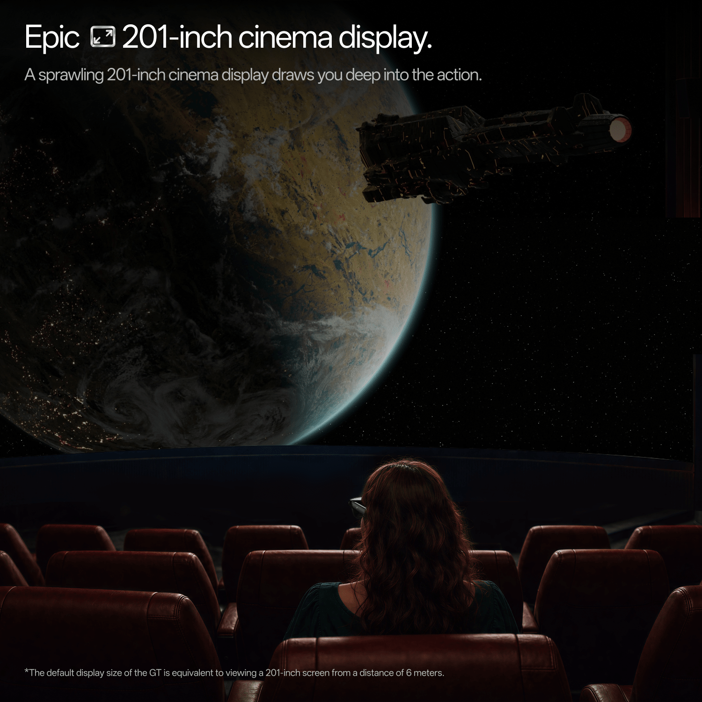
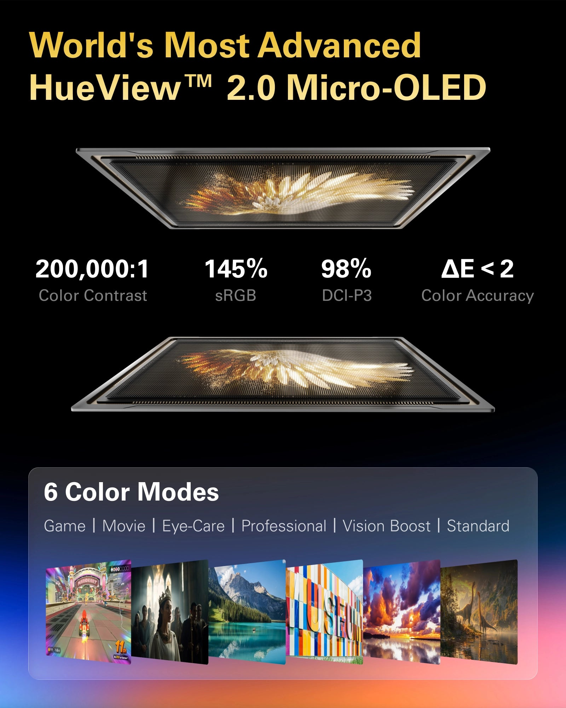
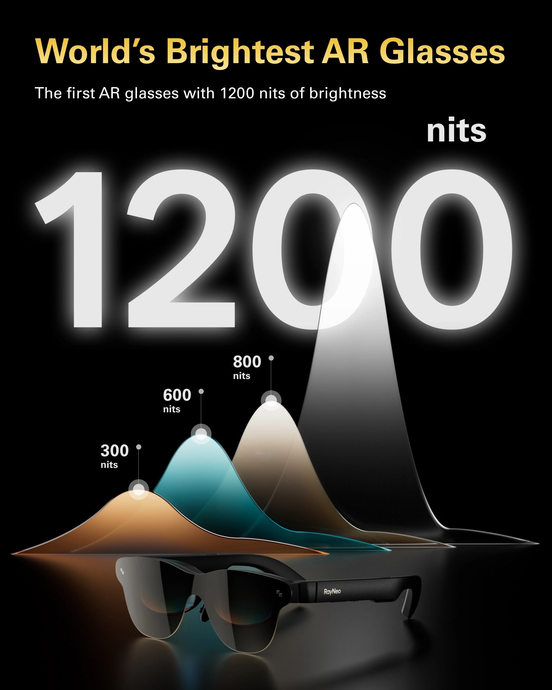
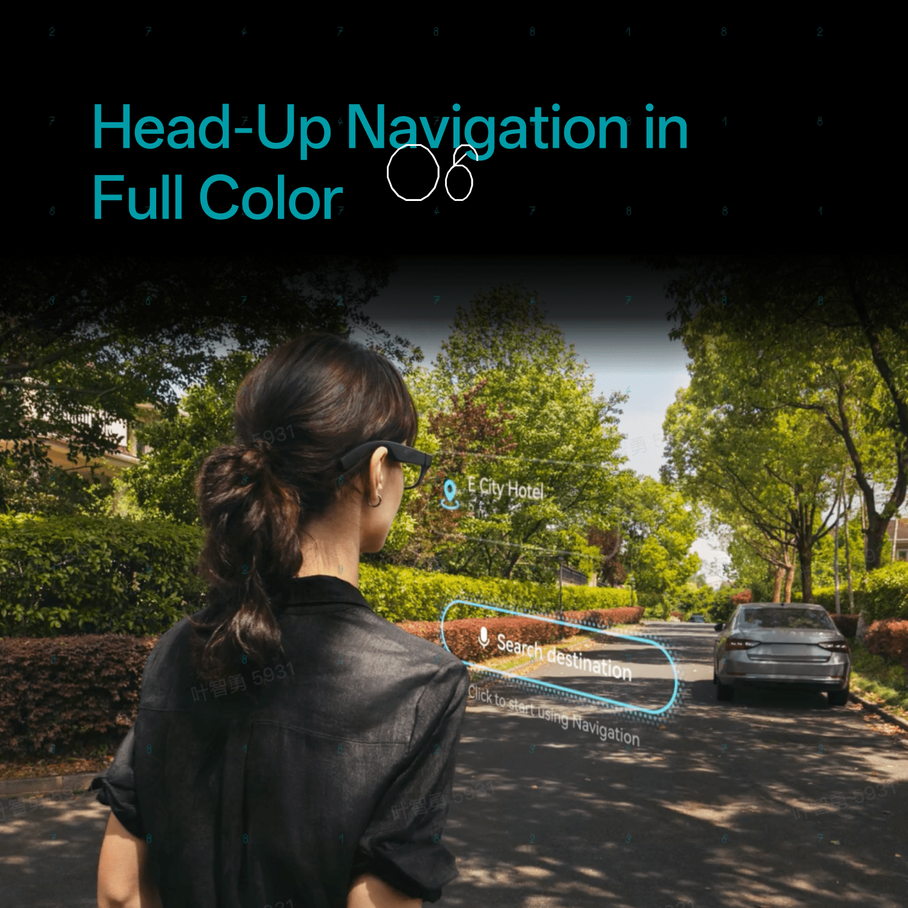

No existe un modelo único de gafas inteligentes con la mejor pantalla, y la razón es estructural: los paneles de este tipo de dispositivos se diseñan para tres trabajos distintos, y las especificaciones que hacen excelente a uno lo vuelven inservible en otro. Una pantalla pensada para desaparecer detrás de la habitación que tienes delante no puede ser, a la vez, el cine más brillante que hayas visto. La propia RayNeo, fabricante de estas gafas, plantea así la comparación en una guía publicada en su blog, centrada en cuatro medidas concretas.

Dentro de cada tipo, en cambio, la comparación es limpia. Entre los modelos actuales de la marca, el X3 Pro es el más brillante, con 3.500 nits de media y 6.000 de pico; el GT Max ofrece la imagen más grande e inmersiva, con 267 pulgadas virtuales en 59 grados; el GT y el Air 3s Pro rinden el detalle más fino gracias a una densidad de píxeles mayor; y el iO tiene la pantalla que menos se nota, que es justo para lo que fue diseñado.

## Los cuatro números que deciden la calidad de una pantalla

La comparación parte de cuatro métricas, y conviene entender qué mide cada una antes de mirar cifras.

- **Brillo, en nits.** Es la cantidad de luz que llega al ojo. En pantallas translúcidas decide si el texto sobrevive a la luz del día. Más no siempre es mejor: una pantalla demasiado brillante de noche se convierte en una distracción.
- **Campo de visión, en grados.** Es la porción de tu visión que ocupa la imagen. Un campo amplio se siente más cinematográfico; uno estrecho mantiene la imagen fuera de tu camino.
- **Píxeles por grado, o PPD.** Mide cómo de juntos están los píxeles dentro de ese campo. Es el número que decide si el texto pequeño se ve nítido, y suele ser el que más se omite en el material de marketing. Dos productos con el mismo panel de 1920x1080 se verán distintos si uno reparte esos píxeles en un campo más amplio.
- **Contraste y color.** Los paneles micro-OLED apagan cada píxel de forma individual, y por eso las gafas con pantalla declaran una relación de contraste de 200.000:1 y una cobertura del 98 % de DCI-P3. Para ver películas a oscuras importan más los negros profundos que el brillo de pico. El dato relacionado, ΔE inferior a 2, mide el error de color: por debajo de 2 se considera que el ojo deja de notar la diferencia con la fuente.

## Las pantallas de RayNeo, modelo a modelo

Puestos todos los modelos actuales frente a las mismas cuatro medidas, el patrón aparece de inmediato: ninguno gana en las cuatro, y cada uno cede en un número distinto.

| Modelo | Brillo | Campo de visión | Píxeles por grado | Contraste y color |
| --- | --- | --- | --- | --- |
| iO | 1.300 nits a la altura del ojo | 23,5 grados | Pensado para texto de un vistazo | Monocromo verde, lente con 97 % de transparencia |
| GT | Hasta 1.200 nits percibidos | 46 grados | 49 | 200.000:1, 98 % DCI-P3, ΔE inferior a 2 |
| Air 3s Pro | 1.200 nits | 46 grados | 49 según pruebas independientes | 200.000:1, 98 % DCI-P3, ΔE inferior a 2 |
| GT Max | Hasta 1.200 nits percibidos | 59 grados | 38 | 200.000:1, 98 % DCI-P3, ΔE inferior a 2 |
| X3 Pro | 3.500 de media, 6.000 de pico | Ajustado para una superposición frontal | 640x480 por ojo, color completo | Color completo, guía de onda translúcida |

El iO usa un motor microLED binocular con una guía de onda difractiva, que produce una imagen monocroma verde equivalente a una pantalla de 33 pulgadas vista desde dos metros. Alcanza los 1.300 nits a la altura del ojo en un campo de 23,5 grados y su lente mantiene un 97 % de transparencia. Juzgados como pantalla de cine, esos números parecen modestos; juzgados para su trabajo, son el punto: un subtítulo o una entrada de calendario deben leerse al sol y ser invisibles para quien se sienta enfrente.

### Dónde se separan los modelos de pantalla grande

El GT Max, el GT y el Air 3s Pro comparten un panel micro-OLED de 1920x1080 por ojo con hasta 120 Hz de refresco, contraste de 200.000:1 y cobertura del 98 % de DCI-P3. La diferencia está en cómo proyectan esa imagen.

| | GT Max | GT | Air 3s Pro |
| --- | --- | --- | --- |
| Campo de visión | 59 grados | 46 grados | 46 grados |
| Pantalla virtual | 267 pulgadas | 201 pulgadas a 6 metros | 201 pulgadas a 6 metros |
| Píxeles por grado | 38 | 49 | 49, según pruebas independientes |
| Brillo percibido | Hasta 1.200 nits | Hasta 1.200 nits | 1.200 nits |
| Peso | 78 g | 68 g | 76 g |
| Precio | 429 dólares, 399 tras el descuento automático | 299 dólares | 279 dólares |

El compromiso de esa tabla es lo más útil de entender sobre las gafas con pantalla. El GT Max reparte el mismo número de píxeles en un campo más amplio, así que la imagen es más grande y algo menos densa. El GT y el Air 3s Pro los concentran, de modo que el texto se ve más nítido en un marco que parece más pequeño. Para películas y juegos suele ganar la vista amplia, porque la inmersión viene de llenar la visión; para documentos, código y hojas de cálculo gana la densidad.

Un detalle específico del GT Max y el GT: el brillo varía según el modo espacial. El modo fijado, que ancla la pantalla a un punto fijo del espacio, funciona a 336 nits, mientras que los modos Siga y Fijo alcanzan los 1.200. Si una película se ve más apagada de lo esperado, ese ajuste es lo primero que conviene revisar.

### Por qué la pantalla más brillante tiene menos píxeles

El X3 Pro es la excepción y el modelo que los analistas destacan. Usa proyectores microLED a color completo con lentes de guía de onda de 640x480 por ojo, equivalentes a una pantalla de 43 pulgadas a dos metros, y su brillo pertenece a otra categoría: 3.500 nits de media y 6.000 de pico. El medio TechRadar Pro la describió como «probablemente la mejor pantalla disponible hoy en cualquier producto de gafas inteligentes», según recoge la guía de RayNeo.

La cifra de resolución parece pequeña junto a 1920x1080 y, en contexto, no es un defecto. Esta pantalla existe para superponer flechas de navegación, texto traducido y notificaciones sobre el mundo real a plena luz del día, no para mostrar una película. Para ese trabajo importan mucho más el brillo y la transparencia que el número de píxeles.

## Qué gafas inteligentes elegir según el uso

La propia comparación de la marca cierra con una guía de compra por prioridad, útil para orientarse antes de decidir:

- **Una pantalla invisible para los demás:** el iO, con lente al 97 % de transparencia, monocroma y 23,5 grados.
- **La imagen más grande:** el GT Max, 267 pulgadas a 59 grados.
- **El texto más nítido:** el GT o el Air 3s Pro, 49 PPD en un campo de 46 grados.
- **Legibilidad diurna con superposiciones en color:** el X3 Pro, 6.000 nits de pico.
- **La mejor pantalla por precio:** el Air 3s Pro, con el panel 1080p a 120 Hz compartido por 279 dólares.

Donde más se suele fallar es al comparar entre tipos. Una cifra de brillo de una superposición AR translúcida y otra de una pantalla de cine miden experiencias distintas, y una superposición de 640x480 no compite con un monitor virtual de 1080p. Conviene decidir primero el trabajo y comparar después dentro de cada tipo.

Conviene recordar que esta comparativa la firma el propio fabricante sobre sus productos actuales, de modo que las cifras son las declaradas por RayNeo salvo donde la marca indica pruebas independientes. El mercado de las gafas inteligentes crece con fuerza —[un 263 % en el primer semestre de 2026](/noticias/smart-glasses-market-doubles-meta/)—, y buena parte de él sigue concentrado en modelos sin pantalla, así que la elección de panel es hoy una decisión de nicho dentro del segmento.

## Advertencias sobre el ajuste

Hay un factor que ninguna ficha técnica recoge y que forma parte de la calidad de imagen: el ajuste. La zona más nítida se sitúa donde tus ojos se alinean con la óptica, y por eso el GT Max se vende en tres tallas de distancia interpupilar y el Air 3s Pro anuncia una «eyebox» de 14x7 mm que, según la marca, mantiene la imagen nítida para el 93 % de los usuarios sin reajustes constantes. Si una primera mirada deja una zona borrosa hacia un borde, lo primero que hay que tocar es la altura de las almohadillas nasales y el ajuste de la distancia interpupilar antes de culpar al panel.
