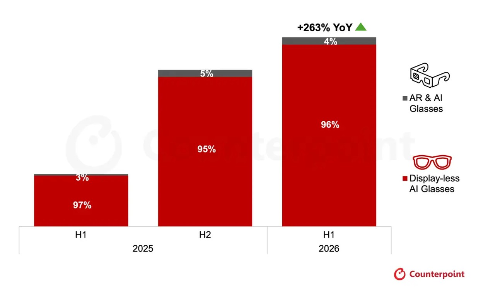

El mercado de las gafas inteligentes ha dejado de comportarse como una curiosidad de feria. Los envíos globales de gafas de IA crecieron un **263 % interanual** en el primer semestre de 2026, según el *Intelligent Eyewear Market Tracker* de [Counterpoint Research](https://counterpointresearch.com/en/insights/global-ai-glasses-shipments-surge-263-percent-yoy-with-display-less-ai-glasses), unos datos que recoge Android Authority. El crecimiento no lo protagonizan las gafas de realidad aumentada, sino los modelos sin pantalla, y dentro de ese segmento hay un nombre que se lleva casi todo el pastel: Meta.

## El negocio real está en las gafas inteligentes sin pantalla

De todos los envíos de gafas de IA del semestre, el **96 %** correspondió a modelos sin pantalla, la categoría más barata y madura, en la que encajan productos como las Ray-Ban Meta AI Glasses. Ese subsegmento creció un **258 % interanual** y un **22 %** respecto al segundo semestre de 2025.

La concentración es el dato que más llama la atención: Meta acaparó el **94 % de los envíos de gafas de IA sin pantalla** en el primer semestre de 2026. Sus propios volúmenes subieron un **260 % interanual**, impulsados por las nuevas variantes de Ray-Ban, la expansión a más países, las promociones en tienda y la llegada de modelos de marca Meta más económicos.

Que un solo fabricante controle más de nueve de cada diez unidades de la categoría principal no es una anécdota: marca el ritmo de precios, de formatos y de funciones que verá el resto del mercado.

## Las gafas con pantalla AR crecen aún más rápido, pero desde muy abajo

El segmento con pantalla real sigue siendo una porción mínima del total, aunque avanza a un ritmo superior. Counterpoint cifra en un **449 % interanual** el aumento de los envíos de gafas con pantalla AR, eso sí, partiendo de una base muy pequeña.

Aquí el liderazgo cambia de manos: **Rokid** encabeza la categoría con una cuota del **41 %**, por delante de Meta, que se queda en el **37 %**. China concentró el **45 %** de los envíos, un adelanto que Counterpoint atribuye en parte a una cadena de suministro de componentes más asentada.

## Costes y privacidad: los dos frenos que vigila el sector

El informe señala dos vientos de cara para los próximos meses. El primero es el **encarecimiento de los componentes**, un problema que arrastra buena parte de la industria tecnológica. El segundo es la **creciente preocupación pública por las cámaras y la privacidad**, un asunto que se ha avivado a medida que las gafas se han vuelto más populares; el episodio del indicador de grabación de Meta, con un resquicio que permitía tapar el LED una vez iniciada la grabación, es un ejemplo.

Pese a ello, Counterpoint no espera que estos factores descarrilen el crecimiento. La firma anticipa la llegada de **nuevos formatos pensados para esquivar el problema de la cámara**, entre ellos gafas de audio con IA sin cámara. De hecho, un informe de la semana pasada apunta a que Meta estudia un modelo basado en micrófonos e IA en lugar de en una cámara.

## Qué cambia para el lector hispanohablante

Para quien piense en comprar sus primeras gafas inteligentes, el panorama deja dos lecturas. Los modelos sin pantalla son hoy la opción madura y accesible, pero también un mercado casi monopólico en el que Meta decide el ritmo. Quien busque una pantalla AR tendrá que mirar a fabricantes como Rokid, asumiendo precios más altos y un ecosistema menos rodado.

La otra lectura es que los frenos del sector —costes de componentes y recelo hacia las cámaras— pueden trasladarse al bolsillo del usuario en forma de precios menos agresivos y modelos distintos. Si Counterpoint acierta, las próximas gafas mayoritarias podrían prescindir de la cámara para sortear la polémica.

El movimiento no es exclusivo de las gafas: el resto del segmento wearable sigue renovándose a buen ritmo. Sin ir más lejos, esta misma semana OPPO desvela su [Watch S2 con ColorOS Watch 17](/noticias/oppo-watch-s2-coloros-watch-17/), una muestra de que la batalla por la muñeca y la cara continúa.
