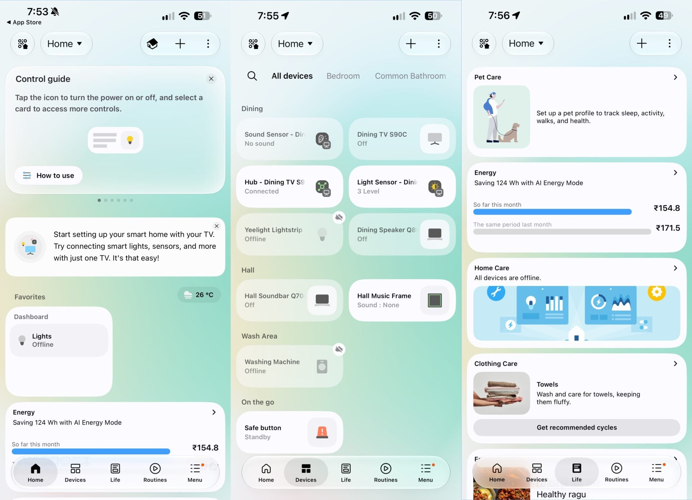
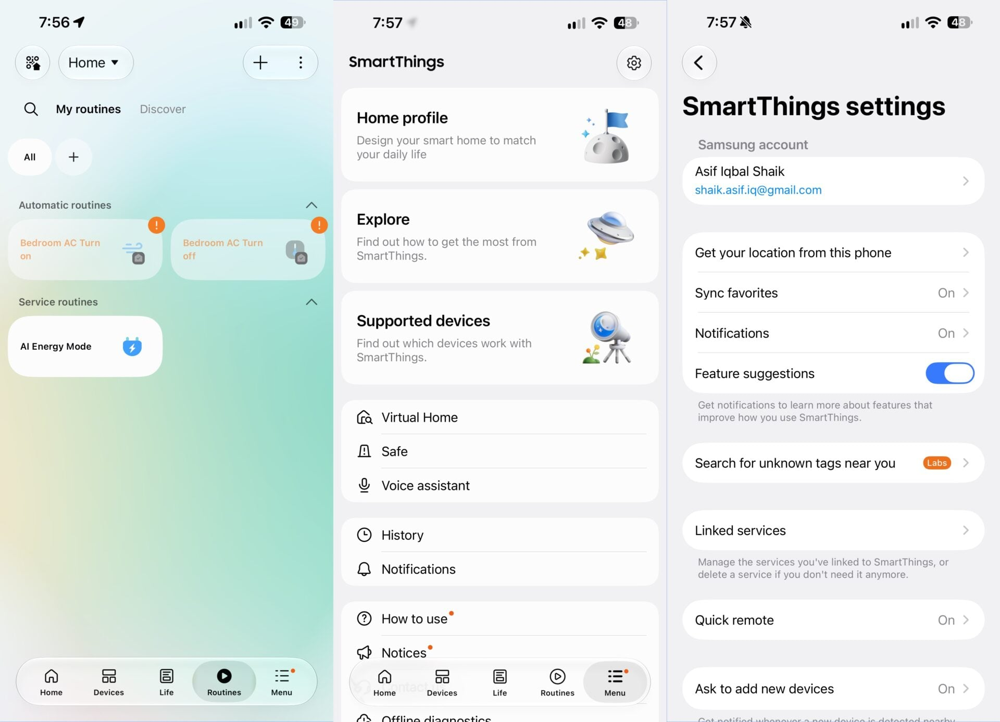

Samsung ha publicado el rediseño de su aplicación **SmartThings**, y el primer
sistema en recibirlo es iOS: la actualización 1.7.51 de la app para iPhone ya
está disponible antes que en los propios teléfonos Galaxy del fabricante o en el
resto de equipos Android. La nueva versión estrena el lenguaje de diseño Liquid
Glass de Apple con una paleta general más clara, y llega unos meses después de
que SamMobile publicara un primer vistazo exclusivo de esta misma interfaz.

## Qué cambia en la interfaz de SmartThings

La app mantiene sus cinco pestañas principales, pero la navegación pasa a una
barra compacta y flotante con acabado Liquid Glass. Las tarjetas de cada
dispositivo o rutina son más pequeñas por defecto, aunque siguen pudiendo
redimensionarse si se prefiere ver más detalle: tocar el icono de un equipo lo
enciende o aplica la acción que tenga asignada, mientras que el resto de la
tarjeta abre sus controles completos.

En la parte superior de la pestaña de inicio aparece ahora una tarjeta de
resumen dinámica con datos como el consumo eléctrico semanal o mensual, un
acceso rápido al mando de los televisores, avisos de cuidado familiar y
automatizaciones sugeridas. Puede descartarse para que los dispositivos
conectados aparezcan de inmediato. La sección de favoritos sigue en la misma
pestaña, y ahora el código QR del hogar, el selector de ubicación y el menú de
más opciones van rodeados de un contorno con forma de píldora en lugar de ir
sin borde.

## El mando de televisión gana un modo claro y más libertad de movimiento

El mando virtual integrado para televisores y monitores inteligentes incorpora
un modo claro (*Light Mode*) específico, puede redimensionarse para alcanzarlo
con una sola mano y desplazarse a cualquiera de las cuatro esquinas de la
pantalla. La página dedicada a la televisión adopta a su vez la barra de
pestañas flotante y se divide en tres bloques: «Para ti», «Destacados» y
«Ajustes», con un acceso permanente al mando en la esquina inferior derecha.

Las rutinas, el menú y los ajustes comparten ese mismo tratamiento renovado,
incluida la ordenación de rutinas y el apartado de servicios vinculados.

## Lo que todavía no cambia

Los menús profundos de cada equipo, como las pantallas específicas de los
plugins de aire acondicionado, barras de sonido, altavoces inalámbricos o
lavadoras y secadoras, siguen con el diseño anterior. SamMobile indica que
Samsung muy probablemente actualice esos plugins de forma individual en
futuras versiones de la aplicación.

Por ahora, el despliegue se ha quedado en iPhone: el rediseño llegará después
a los Galaxy y a otros dispositivos Android, sin que la información publicada
indique una fecha concreta. Quien gestione su hogar desde un Galaxy tendrá que
esperar, mientras Samsung sigue renovando el software de sus equipos con la
reciente apertura de [la beta de One UI 9.0](/noticias/galaxy-a54-one-ui-9/)
para varios modelos de la gama.
