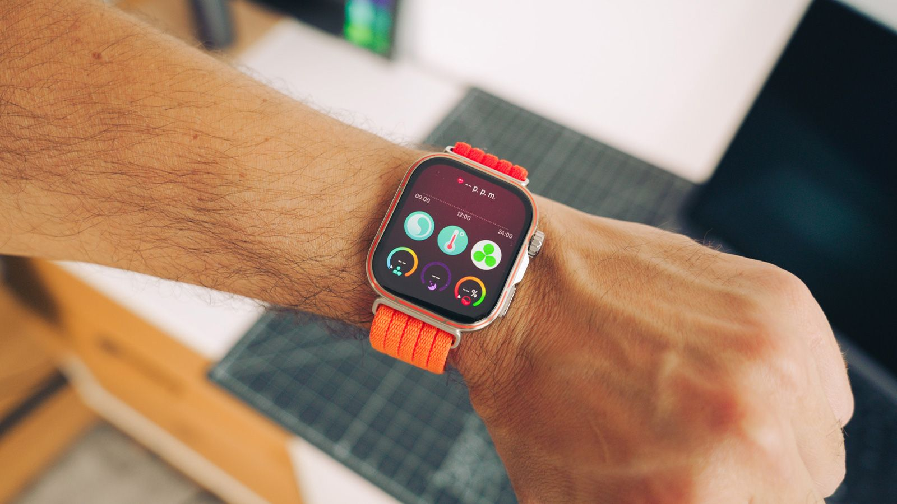
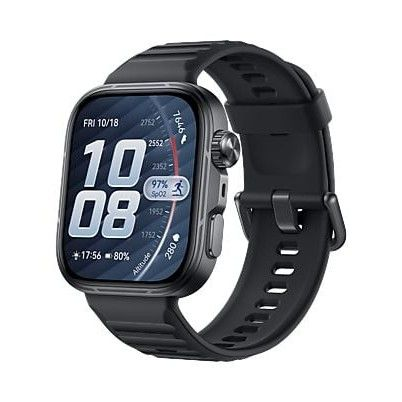
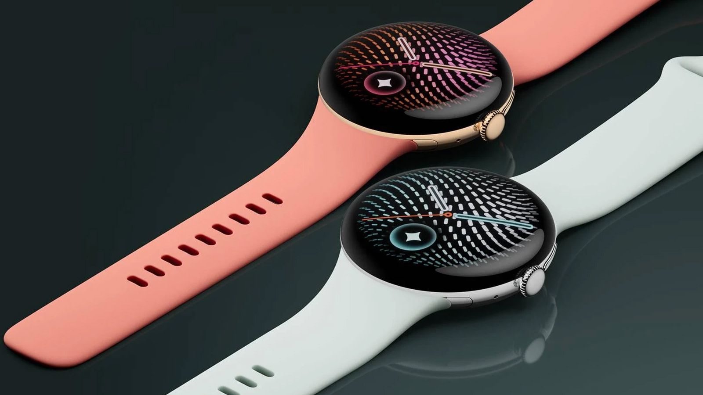
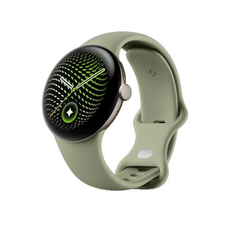
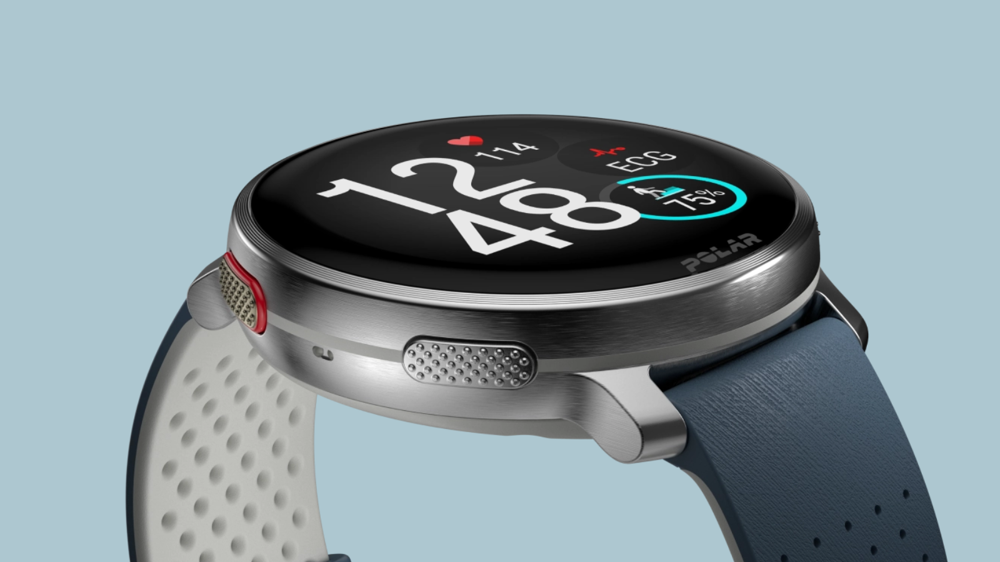
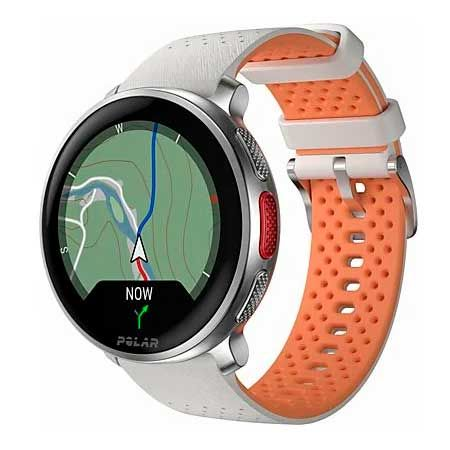
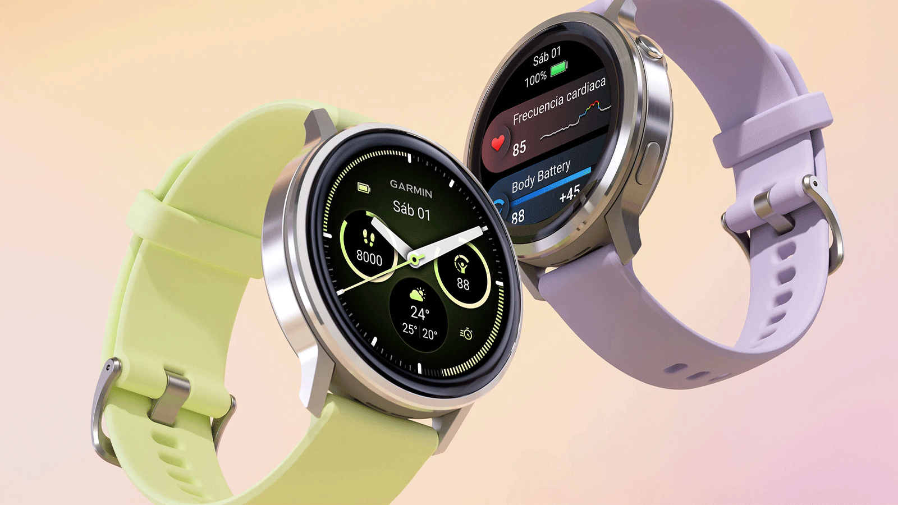
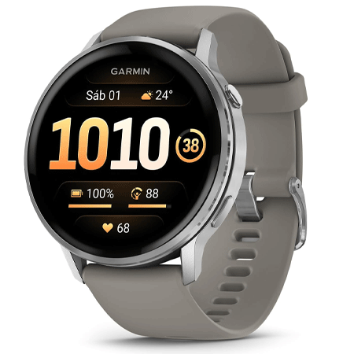

El Apple Watch Series 12 es el reloj más reciente de Apple, pero su salto respecto al Series 11 es limitado: mantiene un diseño prácticamente idéntico y una batería que sigue obligando a pasar por el cargador cada noche. A eso se suma, según MovilZona, que buena parte de las funciones de inteligencia artificial anunciadas a nivel global no llegan a España en el lanzamiento por las exigencias regulatorias europeas en privacidad y gestión de datos. Ese es el contexto que enmarca las alternativas al Apple Watch Series 12 que recoge MovilZona.

Con ese punto de partida, el medio ha publicado una selección personal de cuatro relojes que, bajo su criterio, resultan más interesantes que el smartwatch de Apple. Este artículo mantiene un encuadre neutro: presentamos esas cuatro alternativas y comparamos en qué se diferencian del Series 12, atribuyendo a MovilZona tanto la selección como las valoraciones que la acompañan. No se trata de una medición independiente ni de un veredicto de esta redacción.

## Qué cambia (y qué no) en el Apple Watch Series 12

Según la fuente, el Series 12 no introduce cambios significativos frente al Series 11: conserva un diseño casi calcado y una autonomía que no se ha movido. El gran reclamo de la generación, sus herramientas de inteligencia artificial, queda además reducido en el mercado español, donde la mitad de las funciones anunciadas a nivel global no estarán disponibles en el lanzamiento, siempre según MovilZona.

Para el medio, ese conjunto —pocas novedades de hardware y una IA recortada— hace difícil justificar el sobreprecio habitual de la marca, salvo para quien sea un incondicional de Apple y tenga todo su ecosistema. Es el argumento que da pie a su lista de alternativas.

## Las cuatro alternativas que propone MovilZona

### Huawei Watch Fit 5 Pro

MovilZona destaca su pantalla AMOLED de formato cuadrado, que no esconde su inspiración en el reloj de Apple, junto con un brillo muy alto que se ve bien bajo el sol directo y unos acabados que transmiten sensación prémium. Su construcción, con biseles reducidos al mínimo y resistencia al agua mejorada, lo convierte en un dispositivo todoterreno tanto para el trabajo como para entrenamientos exigentes.

En el apartado de salud, el medio subraya sus sensores TrueSeen de última generación, capaces de registrar frecuencia cardíaca, oxígeno en sangre y estrés. Donde el reloj marca la diferencia frente al de Apple, según MovilZona, es en la autonomía: casi dos semanas de uso real sin pasar por el cargador. Las referencias de precio que maneja el medio en el momento de publicar parten de 259 euros.

### Google Pixel Watch 5

Para MovilZona, el Pixel Watch 5 es la mejor opción dentro de Wear OS para quien busque una integración con inteligencia artificial que funcione en Europa, aunque matiza que no es completa. Mantiene la esfera de cristal abombado y el diseño circular, pero mejora la resistencia del panel y reduce los marcos para aprovechar mejor la pantalla. La respuesta háptica de sus avisos es, en su valoración, la mejor del mercado.

Su valor añadido está, según el medio, en la alianza con Fitbit para el deporte y la salud: análisis del sueño, detección de picos de esfuerzo y gestión del descanso con métricas que considera útiles sin abrumar. Añade la integración de Gemini como asistente de voz nativo para gestionar tareas rápidas desde la muñeca. El precio de partida que recoge MovilZona ronda los 439 euros.

### Polar Vantage V3

Si la prioridad es la precisión y la medición deportiva, MovilZona sitúa al Polar Vantage V3 como una propuesta difícil de superar frente a Apple. Equipa una pantalla AMOLED de gran nitidez con biseles reducidos, protegida por un cristal curvado que se integra en un diseño deportivo y cómodo para llevar todo el día.

El elemento diferencial que señala el medio es el conjunto de biosensores Polar Elixir: registro de electrocardiogramas desde la muñeca, saturación de oxígeno en sangre y temperatura cutánea nocturna. A eso suma navegación por GPS de doble frecuencia con mapas offline vectorizados, para seguir rutas sin depender del teléfono. Su autonomía se extiende durante días, hasta triplicar lo que ofrece Apple en este terreno, siempre según MovilZona. El precio de partida que cita parte de 449,90 euros.

### Garmin Venu 4

MovilZona describe el salto del Garmin Venu 4 como notable y lo recomienda para quien busque un buen smartwatch en 2026. Estrena un diseño metálico con caja ligera de 45 milímetros y pantalla AMOLED brillante de 1,4 pulgadas, e incorpora una linterna LED integrada pensada para el día a día.

Su atractivo principal, según el medio, es el nuevo registro de estilo de vida, que analiza hábitos como el consumo de cafeína o alcohol y muestra cómo influyen en el descanso. Añade más de 80 aplicaciones deportivas, control de temperatura cutánea, seguimiento del ritmo circadiano y alertas avanzadas de salud, además de llamadas, comandos de voz y hasta 12 días de batería. El precio de partida que recoge MovilZona ronda los 418 euros.

## Qué significa para el comprador español

La conclusión que se extrae de la selección de MovilZona no es que exista un sustituto universal del Apple Watch Series 12, sino que la decisión depende de qué se valore más. Quien priorice la autonomía tiene opciones que se alejan de la carga diaria; quien busque precisión deportiva encuentra propuestas centradas en biosensores y GPS; y quien viva dentro del ecosistema de Apple seguirá teniendo argumentos para quedarse, como reconoce el propio autor de la lista.

Para el lector hispanohablante hay un matiz relevante: la advertencia sobre las funciones de IA que no llegan a España afecta a la propuesta de Apple en este mercado, mientras que las alternativas se apoyan en puntos fuertes que no dependen de esas capacidades. Es un factor a tener en cuenta al comparar, aunque las valoraciones de cada modelo son, conviene recordarlo, las de MovilZona y no una medición independiente.

El mercado de alternativas, además, no se limita a estos cuatro nombres: siguen apareciendo propuestas de otros fabricantes, como [el OPPO Watch S2 con ColorOS Watch 17](/noticias/oppo-watch-s2-coloros-watch-17/) o [el Moto Watch Ultra con LTE](/noticias/moto-watch-ultra-lte/). Y para quien mide su rendimiento con las puntuaciones de preparación física, conviene revisar [la brecha de evidencia que arrastran estas métricas](/noticias/wearable-readiness-scores-evidence-gap/) antes de tomarlas como referencia absoluta.
