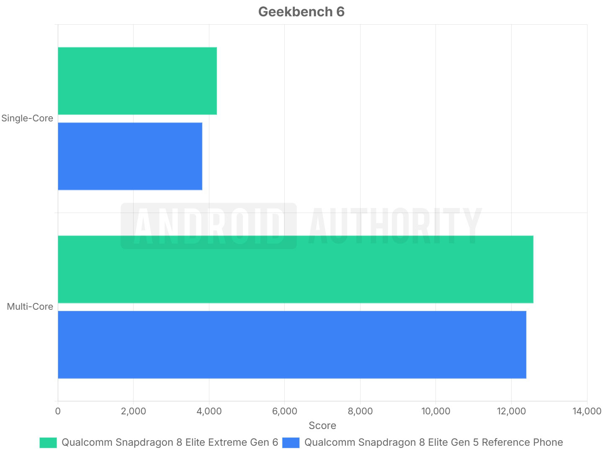
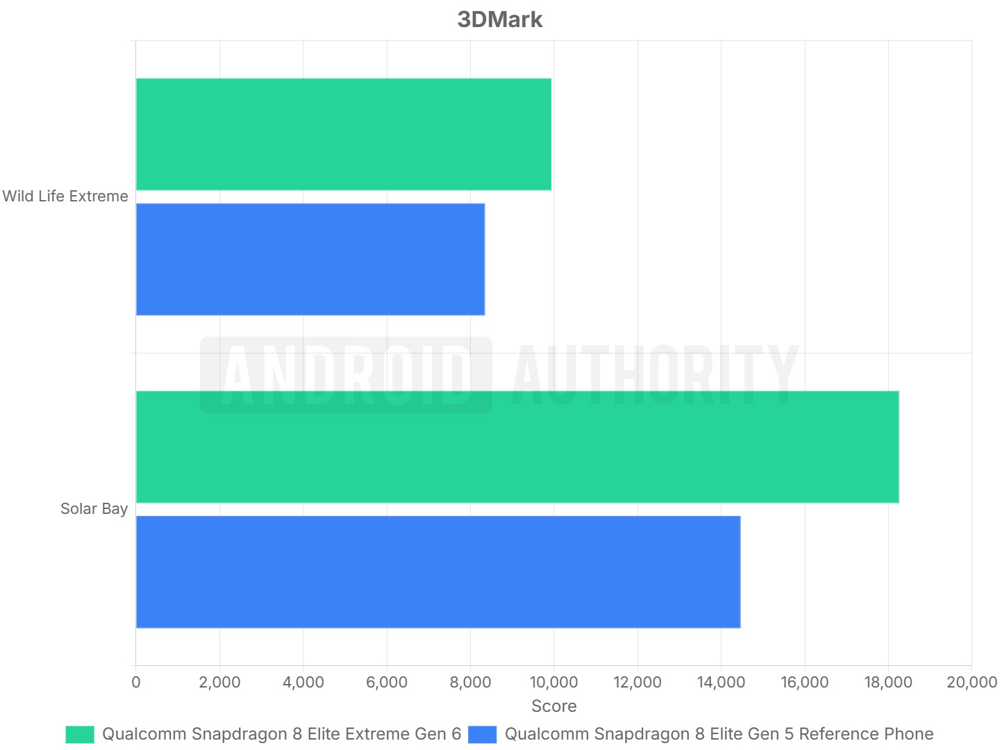
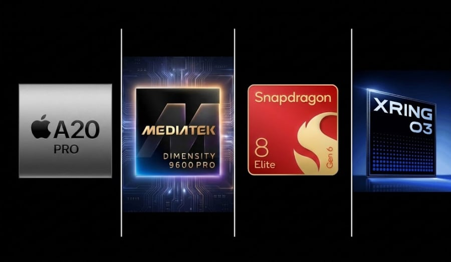
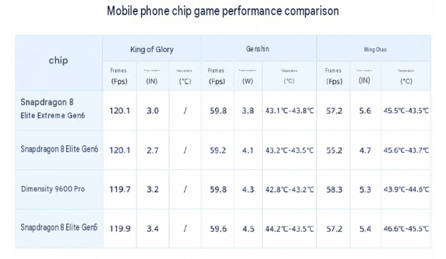

El Snapdragon 8 Elite Extreme Gen 6 ya tiene sus primeras mediciones independientes. Android Authority ha analizado el teléfono de referencia de Qualcomm y el resultado dibuja un chip muy parecido a su predecesor en CPU, pero claramente superior en gráficos. A esas cifras se suman la comparativa cruzada de los chips insignia de 2026 que ha difundido Digital Chat Station y la lista de móviles que ya han confirmado su lanzamiento con este procesador.

## Primeras pruebas del Snapdragon 8 Elite Extreme Gen 6: gráficos arriba, CPU contenida

Qualcomm presume de haber alcanzado los 5 GHz en los núcleos Prime, frente a los 4,6 GHz del Snapdragon 8 Elite Gen 5. Según las pruebas de Geekbench 6 de Android Authority, ese aumento de frecuencia se traduce en un **10 % más de rendimiento en un solo núcleo**, justo lo que cabría esperar de la subida de reloj y señal de que la arquitectura Oryon no ha cambiado demasiado en esta generación.

El panorama cambia al mirar los ocho núcleos en conjunto: la prueba multi-núcleo apenas mejora un **1,5 %**, una diferencia que cae dentro del margen de error de este tipo de test. El salto de los núcleos de eficiencia hasta los 4 GHz (frente a 3,62 GHz) no basta, por tanto, para despegar en cargas multihilo, donde el equilibrio entre rendimiento, calor y consumo se mantiene en niveles similares a los de 2025.

Donde sí hay margen es en la GPU. En 3DMark Wild Life Extreme, orientado a la rasterización tradicional, el chip Extreme rinde un **19 % más** que el modelo del año pasado; el trazado de rayos sube un **26 %**, un avance que acerca al Adreno de Qualcomm a las GPU Mali de Arm. Conviene recordar que estas pruebas no aprovechan Adreno Neural Fusion, la tecnología de escalado y generación de fotogramas por IA que solo admite la versión Extreme y que exige soporte del propio juego.

## Cómo queda frente a A20 Pro, Dimensity 9600 Pro y XRING O3

La comparativa que circula en internet, elaborada por Digital Chat Station y publicada por GizmoChina, reúne a los chips de gama alta de Qualcomm, MediaTek, Apple y Xiaomi. Usa Geekbench 7, una versión distinta de la que empleó Android Authority, por lo que sus porcentajes no son directamente equiparables a los del apartado anterior.

| Chip | Geekbench 7 (1 núcleo) | Geekbench 7 (varios) | 3DMark Steel Nomad Light | Consumo en SNL |
| --- | --- | --- | --- | --- |
| Apple A20 Pro | 4.033 | 11.547 | 4.255 | 14 W |
| MediaTek Dimensity 9600 Pro | 3.426 | 11.563 | 4.238 | 16 W |
| Snapdragon 8 Elite Extreme Gen 6 | 3.419 | 11.155 | 3.688 | 17 W |
| Snapdragon 8 Elite Gen 6 | 3.308 | 10.368 | 3.579 | 14 W |
| Snapdragon 8 Elite Gen 5 | 3.047 | 9.836 | 3.015 | 13 W |
| Xiaomi XRING O3 | 3.034 | 12.259 | 4.604 | 18 W |

En un solo núcleo manda el Apple A20 Pro con 4.033 puntos, alrededor de un 18 % por encima del Dimensity 9600 Pro, que es segundo. El Snapdragon Extreme se queda muy cerca, con 3.419, y su versión estándar se queda en 3.308. En multinúcleo el orden se rompe: el XRING O3 de Xiaomi, con diez núcleos fabricados en 3 nm y memoria LPDDR6, se coloca primero con 12.259 puntos.

Frente al Snapdragon 8 Elite Gen 5, el Extreme crece en torno a un 12 % en un núcleo y un 13 % en varios, cifras que encajan con el 13 % de mejora de CPU que Qualcomm comunicó en la presentación. El Snapdragon 8 Elite Gen 6 estándar se queda un 3 % por debajo de la variante Extreme en un núcleo y un 7 % en varios.

En gráficos, el XRING O3 logra la mejor puntuación de Steel Nomad Light (4.604), aunque es el que más energía consume, 18 W. El A20 Pro y el Dimensity 9600 Pro quedan justo detrás con 4.255 y 4.238 puntos y consumos de 14 W y 16 W. Cuando se mira el rendimiento por vatio, el orden vuelve a cambiar: el A20 Pro ronda los 304 puntos por vatio, seguido del Dimensity 9600 Pro con unos 265, mientras que el Snapdragon Extreme se queda en unos 217, por debajo incluso de los 232 del Gen 5.

En juegos las distancias se estrechan. En Honor of Kings los cuatro chips comparados se mantienen en torno a 120 fotogramas por segundo, con el Snapdragon 8 Elite Gen 6 gastando menos (2,7 W) que el Extreme (3,0 W). En Genshin Impact todos oscilan entre 59,2 y 59,8 fps, y el Extreme es el que menos consume (3,8 W). Las diferencias se agrandan en Wuthering Waves, donde el Dimensity 9600 Pro firma los mejores 58,3 fps y el Snapdragon Extreme se queda en 57,2. Digital Chat Station no detalla en qué teléfonos se hicieron estas pruebas, un dato clave porque la refrigeración y los perfiles de cada fabricante alteran el resultado final.

## Los móviles que estrenarán el chip

El Xiaomi 18 Pro Max fue el primero en subirse al Snapdragon 8 Elite Extreme Gen 6: se presentó en China el 23 de septiembre y la marca ya ha confirmado su llegada global. A partir de ahí, una lista creciente de fabricantes ha confirmado sus planes:

- **Xiaomi 18 Pro Max** (23 de septiembre, China). Pantalla LTPO AMOLED de 6,9 pulgadas y 4.000 nits, más una segunda pantalla de 2,9 pulgadas en la parte trasera. Triple cámara de 200 MP + 200 MP de teleobjetivo con zoom óptico 3,2x + 50 MP ultra gran angular, batería de 8.500 mAh y carga de 100 W por cable, 50 W inalámbrica y 27 W inversa.
- **HONOR Magic9 Pro Max** (28 de septiembre, China). Doble sensor de 200 MP (principal de 1/1,28 pulgadas y teleobjetivo super-night), cámara desarrollada junto a ARRI, 6,8 pulgadas OLED y 8.800 mAh. Se venderá en configuraciones de 12 GB + 256 GB hasta 16 GB + 1 TB.
- **iQOO 16** (29 de septiembre, China). Será el primer móvil con un panel 2K de 165 Hz desarrollado con Samsung, con pantalla de 6,85 pulgadas, tres sensores de 50 MP y 8.400 mAh.
- **OnePlus 16** (septiembre, previsto). Confirma una triple cámara con 200 MP principal, teleobjetivo periscópico de 50 MP con zoom 3x y ultra gran angular de 50 MP. Los filtrados apuntan a una pantalla plana de 6,78 pulgadas a 185 Hz y 9.000 mAh.
- **RedMagic 12 Pro+** (octubre, confirmado). Marcos de 0,96 mm, cámara bajo pantalla de novena generación, 8.400 mAh con carga de 120 W, y hasta 24 GB de RAM LPDDR5X.
- **Motorola Signature 27** (previsto para este año). Su cámara principal se mantiene en 50 MP y el teleobjetivo sube a 200 MP. Es uno de los terminales ya anunciados por la marca.

Según GizmoChina, la lista crecerá el año que viene con modelos como el Galaxy S26 Ultra, que también apostaría por esta plataforma.

## Qué cambia para el comprador

Estas cifras proceden del teléfono de referencia de Qualcomm, no de un móvil de tienda. Cada fabricante ajusta la refrigeración, los límites de potencia y el software, así que los resultados en un terminal real pueden variar de forma notable. La propia Android Authority recomienda esperar a las reviews de los modelos comerciales antes de decidir una compra solo por el chip, y recuerda que las funciones de escalado y generación de fotogramas por IA siguen dependiendo del soporte del juego.

Para quien quiera entender la plataforma completa, [el anuncio oficial de los Snapdragon 8 Elite Extreme Gen 6 y 8 Elite Gen 6](/noticias/qualcomm-snapdragon-8-elite-extreme-gen-6-oficial/) repasa especificaciones, IA local y conectividad. Y para comparar con el otro gran salto de la temporada, [las primeras pruebas del A20 Pro de los iPhone 18 Pro](/noticias/apple-a20-pro-iphone-18-pro-benchmark/) y el [estreno del Dimensity 9600 Pro en el OPPO Find X10](/noticias/oppo-find-x10-dimensity-9600-pro/) ponen en contexto a los principales rivales de Qualcomm.
