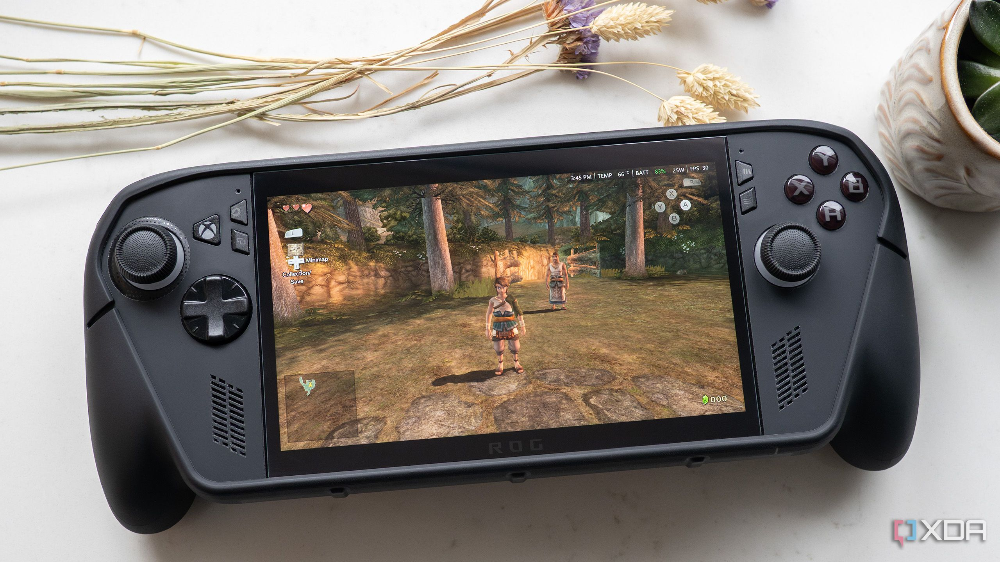

Durante una mesa redonda celebrada en el marco del Snapdragon Summit, Qualcomm dejó la puerta abierta a que sus chips de la serie X lleguen a las consolas portátiles dedicadas. Preguntado por XDA sobre la posibilidad de ver un Snapdragon X2 —por ejemplo, el X2 Elite Extreme, el X2 Plus o el X2 Elite— dentro de una portátil con Windows 11 al estilo de la ROG Xbox Ally X, Kedar Kondap, director general de computación y juego de la compañía, no confirmó ningún producto, pero reconoció que el interés es alto y que, desde el punto de vista técnico, nada impide a un fabricante montar el X2 Elite Extreme de 18 núcleos en un dispositivo de este tipo.

## Snapdragon X2 en portátiles: dónde está Qualcomm hoy

La compañía ya tiene presencia en el segmento, pero no con la serie X. Kondap recordó que Qualcomm da soporte a varios sistemas operativos —un esfuerzo que incluye [llevar Linux a los Snapdragon X2 con Debian y Ubuntu](/noticias/qualcomm-snapdragon-x2-soporte-linux/)— y que sus plataformas móviles y específicas para juego ya equipan múltiples dispositivos portátiles. Entre los ejemplos citó la serie Snapdragon G, presente en portátiles Android de marcas como Retroid, OneXPlayer y Ayaneo, además del Snapdragon 680 del PlayStation Portal, orientado a juego en streaming, y el Snapdragon 720G del Lenovo Legion Play.

## Los obstáculos: compatibilidad y antitrampas

El principal escollo sería el software. Al tratarse de chips Arm64, gran parte del catálogo de juegos de Windows para x86 y x64 tendría que ejecutarse a través de Prism, la capa de traducción de Microsoft, una barrera adicional que no sufren las portátiles con procesadores AMD como la ROG Xbox Ally X ni Steam Deck al correr juegos de Windows mediante Proton. A ello se suma la compatibilidad con los sistemas antitrampas, que hoy impide ejecutar en Windows sobre Arm títulos multijugador populares como Valorant, Sea of Thieves y Rocket League.

## Qué cambiaría para el jugador

Sobre el papel, la serie X2 encaja bien en una portátil de gama alta: combina un rendimiento sólido de CPU y GPU con la eficiencia energética propia de la arquitectura Arm, dos virtudes clave en un formato que vive de la batería. Según XDA, la GPU Adreno X2-90 del Snapdragon X2 Elite Extreme se sitúa en un rango comparable al de los gráficos integrados Arc B390 de Intel para Panther Lake, que equipará la MSI Claw 8 EX AI+. De momento no hay anuncio ni calendario, pero el mensaje de Qualcomm es claro: si un fabricante quiere construirla, el silicio ya está listo.
