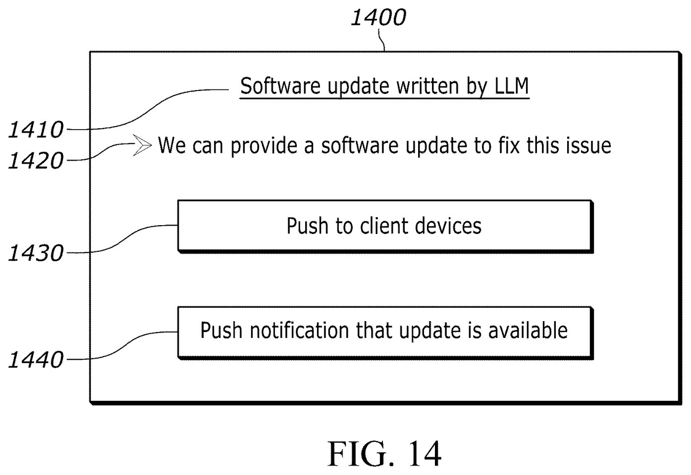
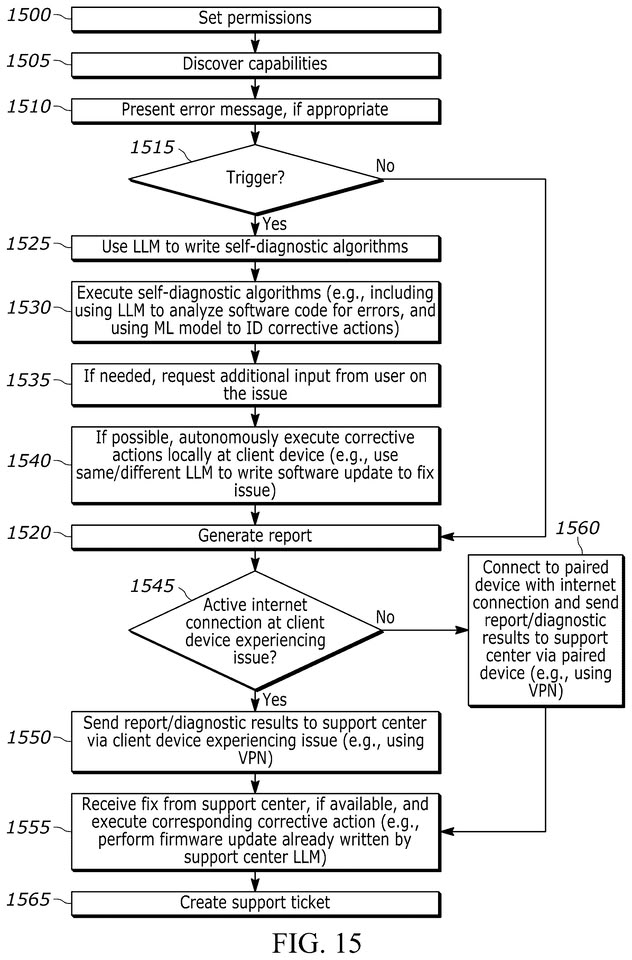
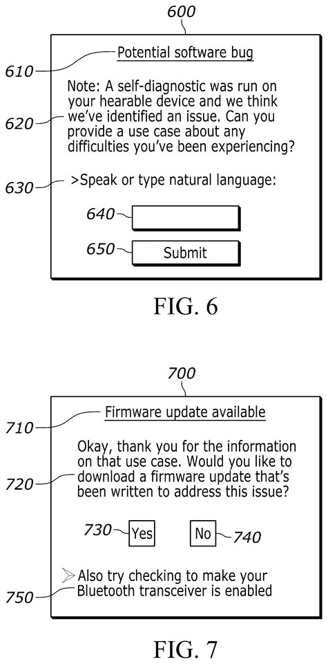

Sony ha presentado una patente para un sistema de inteligencia artificial que permitiría a sus dispositivos, incluidas las consolas PlayStation, diagnosticar y corregir por sí solos problemas de software. El documento, difundido por el agregador de patentes Patentlyze y recogido por TechPowerUp a partir de un reporte de TweakTown, describe un servidor en la nube que vigila el hardware conectado y recurre a un modelo de lenguaje para redactar un programa de diagnóstico a medida. Eso sí, conviene recordar la letra pequeña desde el primer párrafo: es una solicitud de patente, no un producto anunciado, y el examen inicial de la oficina estadounidense ya la ha rechazado.

## Qué describe la patente

Según el texto de la solicitud, el sistema se apoyaría en un servidor central que supervisa los dispositivos conectados. Cuando detecta una incidencia, recurre a un modelo de lenguaje grande (LLM) para escribir un programa de diagnóstico adaptado a ese problema concreto. A partir de ahí, el sistema tendría dos salidas posibles: enviar el arreglo al dispositivo de forma automática o registrar la incidencia para que la revise un ingeniero más adelante.

El alcance del documento no se limita a las consolas. La patente abarca la línea de electrónica de consumo de Sony y menciona expresamente televisores, cámaras y auriculares como posibles destinatarios, siempre según la descripción recogida por TechPowerUp.

El objetivo que sugiere el documento es fácil de deducir: menos llamadas al servicio de atención al cliente y menos pantallas de error. En lugar de esperar a una actualización de firmware común para todos, cada equipo recibiría una solución pensada para su fallo específico.

## Una patente no es un producto

Este punto merece énfasis porque es donde suelen torcerse las expectativas. La propia información publicada señala que el examinador de la oficina de patentes ya ha emitido un rechazo sobre la solicitud, de modo que no hay ninguna garantía de que el texto salga adelante tal como está redactado, y mucho menos de que acabe convertido en una función real de las consolas.

Tampoco ayuda el historial. Las empresas registran miles de patentes cada año y la mayoría nunca llega a nada. Sony tiene una colección de solicitudes llamativas que jamás vieron la luz, entre ellas una que describía un mando capaz de liberar olores durante el juego y otra más antigua sobre estimulación cerebral por ultrasonidos para simular olores y sabores en una sala de cine. Presentar una idea no es lo mismo que fabricarla.

## Promesas y riesgos de la auto-reparación con IA

La parte atractiva del planteamiento es evidente: consolas que resuelven contratiempos de software sin que el usuario tenga que buscar el error en un foro o tramitar una reparación. Menos fricción y menos devoluciones, que es justo lo que busca cualquier fabricante.

El problema aparece cuando se le da a un modelo de IA la capacidad de escribir y distribuir firmware propio a millones de consolas. Si el código generado no pasa por una verificación rigurosa, el arreglo puede convertirse en el fallo. A esto se suma el conocido problema de las alucinaciones de los modelos de lenguaje: un error de lógica en un parche a nivel de firmware no se corrige con reiniciar el equipo, sino que puede dejar el aparato inservible.

## Qué cambia para el jugador

Hoy, ninguno. No hay anuncio, fecha ni confirmación por parte de Sony: es una patente en trámite y ya rechazada en su primera evaluación. Si algún día llegara a implementarse, implicaría un modelo de soporte muy distinto al actual, con el servicio técnico delegando parte del diagnóstico en sistemas automáticos respaldados por la nube.

Para el lector hispanohablante la recomendación es la de siempre ante este tipo de documentos: seguir la pista sin comprar el relato. Las consolas PlayStation reciben hoy sus mejoras a través de actualizaciones de firmware centralizadas, como ocurrió con [el firmware de PS5 que activó PSSR 2.0 en PS5 Pro](/noticias/sony-pssr-2-firmware/). Un sistema de reparación personalizado por dispositivo sería un salto cualitativo, pero todavía está en el papel.
