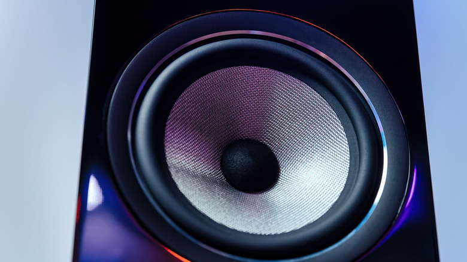
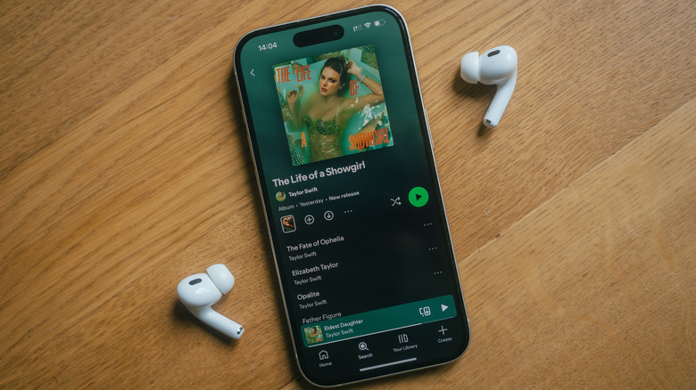

Muchos usuarios se quejan de que el streaming musical no suena lo suficientemente bien, pero no han entrado nunca en los ajustes de la aplicación. Los auriculares o los altavoces marcan buena parte de lo que se escucha, sí, pero las opciones que ofrece Spotify y las del propio dispositivo también cuentan. Esta guía repasa, paso a paso, dónde está cada ajuste de audio de Spotify y qué hace cada uno, tanto en móvil como en escritorio.

## Requisitos previos

- Una cuenta de Spotify iniciada en la aplicación.
- Algunas opciones, como **Very high** y **Lossless**, están reservadas a los suscriptores de Premium. Las cuentas gratuitas disponen de **Low**, **Normal** y **High**.
- Para aprovechar realmente el audio sin pérdida en el móvil hacen falta auriculares con cable; los dispositivos Bluetooth no transportan una señal lossless real.

## Pasos

### 1. Abrir los ajustes de calidad

En iPhone o Android, abre la aplicación de Spotify, toca tu foto de perfil en la esquina superior izquierda y entra en **Settings and privacy**. A continuación, selecciona **Media Quality**.

En escritorio, pulsa el botón de tres puntos de la esquina superior izquierda y elige **Edit > Preferences**. Después, desplázate hasta la sección **Audio quality**.

Conviene tener presente que el reproductor web de Spotify no permite cambiar la calidad, así que para obtener el mejor resultado hay que usar la aplicación de escritorio.

### 2. Elegir el nivel de calidad de streaming

En el móvil, la calidad se configura de forma independiente para **Wi-Fi** y para **Cellular**; en escritorio solo hay un selector. Todas las cuentas pueden escoger entre **Low**, **Normal** y **High**, mientras que los suscriptores de Premium tienen además **Very high** y **Lossless**.

Junto a cada opción aparecen el bitrate y el consumo aproximado de datos por hora, de modo que se puede valorar el equilibrio entre calidad y gasto de datos. La opción **Automatic** ajusta la calidad según la fuerza de la conexión; si se busca siempre la máxima calidad, hay que desactivar el interruptor independiente **Auto-adjust** para que Spotify no la modifique durante la escucha.

### 3. Ajustar la calidad de descarga

Un poco más abajo aparece la sección **Download quality**, con las mismas opciones para los archivos que se guardan y se reproducen sin conexión. Si ya había música descargada y se cambia la calidad, hay que pulsar **Download** para volver a descargar todo con el nuevo valor.

Si el plan de datos móviles es limitado pero sobra espacio en el teléfono, descargar la música en **High** o **Very high** es una buena estrategia: después se pueden reproducir en orden aleatorio las **Liked Songs** descargadas sin gastar datos.

### 4. Entender Lossless y comprobar la calidad en otros dispositivos

**Lossless** ofrece audio con calidad de CD mediante una compresión que no elimina información. El problema es que el equipo de escucha puede dejar esa calidad en nada: el Bluetooth no puede transportar una señal sin pérdida real, así que no tiene sentido seleccionarla si se usan auriculares o altavoces Bluetooth.

En el móvil hacen falta auriculares con cable para disfrutar de Lossless. En teoría, los altavoces integrados del teléfono pueden reproducirlo, pero por esa vía no se aprecia la diferencia. Cualquier par de auriculares USB-C puede transportar una señal sin pérdida, aunque un DAC (convertidor digital-analógico) más potente ofrece una mejor experiencia. Los altavoces con cable conectados al ordenador sí admiten audio sin pérdida, y Spotify también funciona en otros dispositivos compatibles con sonido de alta definición. Un altavoz con Wi-Fi que funcione con Spotify Connect debería admitir reproducción sin pérdida, ya que el Wi-Fi no está sujeto a las limitaciones de ancho de banda del Bluetooth.

Algunas aplicaciones, como la de Spotify en un televisor inteligente, pueden ofrecer calidad sin pérdida según el modelo. Si no incluyen su propio selector de calidad, hay que empezar a reproducir música en ellas y luego abrir la aplicación en el teléfono para controlarlas mediante Spotify Connect: en la parte inferior izquierda de la pantalla **Now Playing**, toca el nombre del dispositivo de escucha y vuelve a tocarlo en la parte superior de la lista **Connect**. Ahí se muestra la calidad actual y se puede pulsar **Change quality settings** para cambiarla.

### 5. Revisar el ecualizador

Fuera de los ajustes de calidad propiamente dichos hay más opciones que pueden mejorar el sonido. Dentro de **Settings**, entra en **Playback > Equalizer** para elegir un preajuste o ajustar las frecuencias manualmente. Puede marcar la diferencia, pero conviene evitar acumular varias capas de ecualización: el teléfono puede tener su propio ecualizador, sumado al de Spotify y, quizá, al de los altavoces o auriculares.

### 6. Normalización de volumen y mono audio

En ese mismo menú merece la pena revisar **Volume normalization**, que fija un volumen de referencia para toda la música y evita tener que subir o bajar el sonido constantemente. Tenerla activada no debería afectar a la calidad salvo que se elija **Loud**, aunque hay quien asegura que el audio suena mejor con esta opción desactivada; lo razonable es probar ambas. Ya que se está ahí, conviene comprobar que **Mono audio** esté desactivado, salvo que se necesite por accesibilidad.

### 7. Transiciones y ahorro de datos

Aunque no estén ligadas directamente a la calidad, las opciones de **Track transitions** de la misma página también influyen en la experiencia: **Crossfade**, por ejemplo, recorta el final de las canciones si se configura con un periodo de mezcla largo. Por último, si no preocupa el consumo de datos móviles, vale la pena visitar el menú **Data-saving and offline** dentro de **Settings**. Para obtener la mejor calidad hay que asegurarse de que **Data saver** esté desactivado, ya que reduce la calidad del streaming cuando no se está en Wi-Fi.

## Cómo verificar que funcionó

La propia aplicación ofrece las pistas para confirmarlo. En el selector de calidad, cada opción muestra el bitrate y el consumo aproximado de datos por hora: si el valor corresponde al nivel elegido, el cambio se aplicó. Al reproducir en otro dispositivo mediante Spotify Connect, la pantalla **Now Playing** indica la calidad actual, de modo que se puede comprobar en el momento qué está sonando. Si se ajustó la calidad de descarga, basta con volver a la sección **Download quality** y comprobar que el valor guardado es el nuevo.

## Advertencias y limitaciones

- Elegir la máxima calidad no garantiza una mejora audible. Unos auriculares de gama muy baja carecen de la fidelidad necesaria para distinguir un streaming con pérdida de alta calidad de uno sin pérdida; hacen falta auriculares o monitores in-ear de calidad.
- El entorno también pesa: aunque CarPlay y Android Auto puedan transmitir audio sin pérdida, no se aprecia con los altavoces de serie de un coche y el ruido de la carretera.
- La propia cadena de dispositivos puede limitar el resultado. Un televisor LG C1 y una PS5, por ejemplo, pueden reproducir audio de Spotify sin pérdida de 16 bits a través de la conexión eARC a una barra de sonido, pero no alcanzan la calidad completa de 24 bits.
- La audición de cada persona es distinta y no todo el mundo percibe la diferencia entre un stream con pérdida de alta calidad y uno sin pérdida. Recursos en línea como la prueba de alta fidelidad de ABX pueden ayudar a comprobarlo.
- La decisión depende del contexto: en casa, en una sala silenciosa y con altavoces de gama alta, tiene sentido apostar por Lossless; con auriculares Bluetooth en una ciudad ruidosa, una calidad menor ahorra datos móviles sin perder apenas nada.
