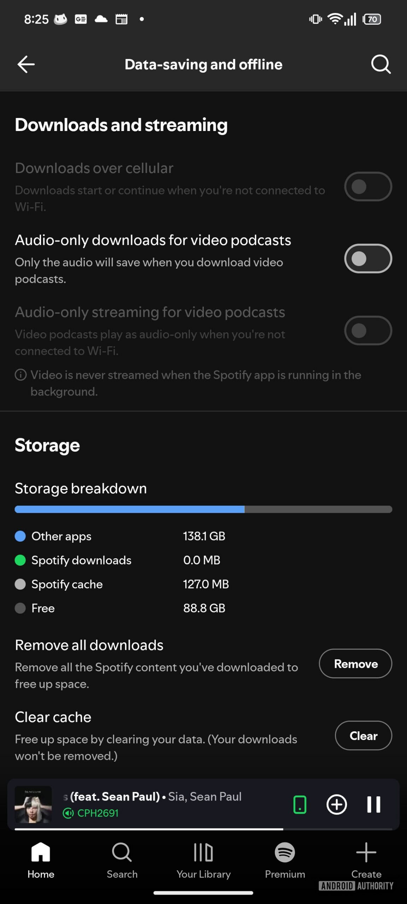

Spotify trabaja en un ajuste que devolvería al usuario el control sobre el espacio que ocupa su aplicación de Android, acostumbrada a llenar el almacenamiento del teléfono con archivos temporales que hoy crecen a sus anchas. El medio Android Authority ha encontrado en el código de la app las primeras pistas de una función llamada «Cache Limit» (límite de caché), que permitiría fijar cuánto espacio puede ocupar el contenido temporal y avisar de las consecuencias de cada elección.

## Qué ha encontrado Android Authority

La pista procede de un análisis del APK de Spotify para Android en su versión 9.1.88.815, el método con el que este medio localiza funciones que aún no se han publicado. En concreto, aparecen cadenas de texto de una futura sección de ajustes dedicada al almacenamiento temporal:

- «Cache limit» («Límite de caché»), descrita como la opción que permite «gestionar cuánto espacio usa Spotify para el contenido en caché».
- Un valor expresado como «Up to %1$s GB», es decir, un tope configurable en gigabytes.

Según Android Authority, estas cadenas apuntan a un submenú propio donde el usuario podrá fijar un límite máximo de espacio para los archivos temporales.

## Cómo funcionaría el límite de caché

El hallazgo no se queda en el ajuste. Los textos encontrados incluyen también los mensajes que acompañarán a la elección del límite. Si se configura un valor demasiado bajo, la app advertirá de que «una caché pequeña puede afectar a la reproducción y aumentar el consumo de datos»; en sentido contrario, indicará que «una caché más grande supone una reproducción más fluida y menos consumo de datos». También habrá un valor por defecto etiquetado como «Spotify recommended» («recomendado por Spotify»).

Hay un detalle pensado para evitar sustos: al borrar la caché a mano, Spotify preguntará si se prefiere fijar un límite en su lugar, explicando que vaciarla afecta temporalmente a la reproducción y dispara el consumo de datos, mientras que un límite lo gestiona todo de forma automática. Y una aclaración explícita: cambiar este ajuste nunca elimina la música ni los pódcast descargados, porque las descargas del usuario viven en un apartado separado de la caché temporal.

## Por qué importa: la caché sin control

La caché de Spotify existe por un buen motivo: guarda fragmentos de las canciones, los pódcast y las carátulas para que la reproducción no se corte y para gastar menos datos al repetir un tema. El problema es que ese mecanismo ha funcionado durante años sin control del usuario y, con el uso, puede crecer hasta ocupar varios gigabytes, hasta el punto de dejar el teléfono sin espacio.

Hoy la única salida es entrar en **Spotify Settings > Data saving & offline > Clear cache** («Ajustes > Ahorro de datos y sin conexión > Borrar caché») y vaciarla manualmente. Es un parche que se vuelve molesto para quien llena el almacenamiento con frecuencia, y explica que la queja se repita en los foros de la comunidad de Spotify y en Reddit desde hace casi una década.

El contexto económico añade presión: el encarecimiento de la memoria RAM y del almacenamiento está disparando el precio de las versiones de móvil con más capacidad, así que estirar cada gigabyte disponible importa más que nunca. Este movimiento encaja con otros recientes de la compañía, como el ajuste para [separar la música infantil de las recomendaciones y del Wrapped](/noticias/spotify-wrapped-kids-music/).

## Cuándo llegará y con qué cautela leerlo

Conviene no adelantar acontecimientos: la función de límite de caché no está activa, Spotify no la ha anunciado y lo único que existe por ahora son las cadenas de texto dentro del código. Los análisis de APK detectan trabajo en curso, y no es raro que una función así pase antes por la rama beta que por la versión estable, o que acabe descartándose.

Para el lector, la lectura práctica es sencilla: si la función llega, dejará de depender de borrados manuales y tendrá una cifra concreta de espacio bajo control. Mientras tanto, la ruta para liberar almacenamiento sigue siendo la de siempre: borrar la caché desde los ajustes y, si el teléfono se queda corto, revisar qué descargas conviene eliminar.
