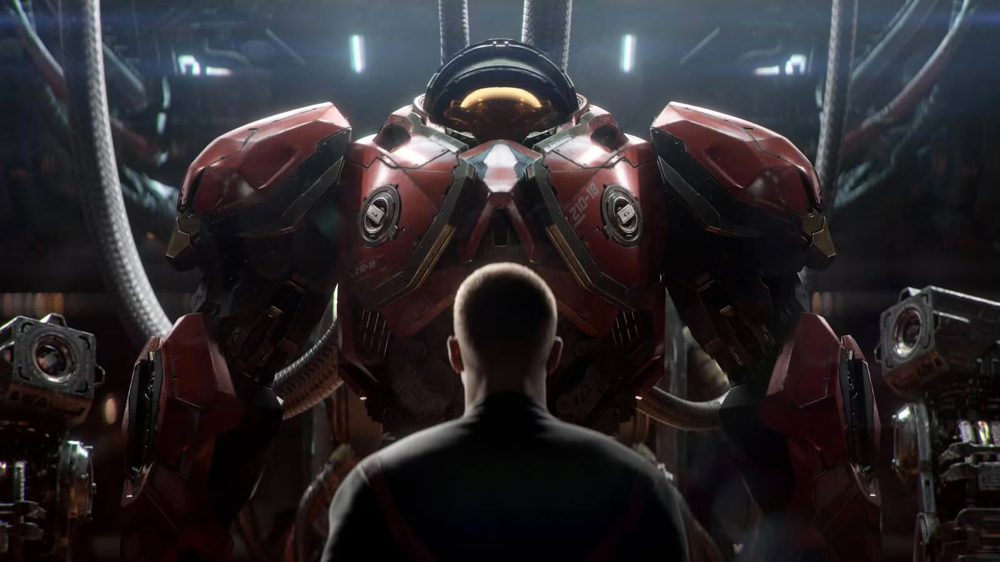

El nuevo shooter de mundo abierto ambientado en el universo de **StarCraft** no será exclusivo. Así lo ha asegurado un portavoz de Blizzard a **Kotaku**, en unas declaraciones que dejan abierta la puerta a que el juego, previsto para 2030, acabe apareciendo en más de una plataforma. La compañía, sin embargo, no ha concretado cuáles.

Blizzard presentó el proyecto en el BlizzCon celebrado hace poco más de una semana como una continuación de la saga StarCraft, esta vez con formato de shooter en mundo abierto y con confirmación oficial solo para Xbox. Esa confirmación parcial, poco habitual, fue el punto de partida de las preguntas que Kotaku trasladó al estudio.

## StarCraft «no será exclusivo»: la respuesta de Blizzard

Según recoge Kotaku, un portavoz de Blizzard respondió que «solo puede decir por ahora que StarCraft no será exclusivo». Cuando el medio preguntó si eso significaba que no sería exclusivo de consola de Xbox y que también llegaría a otra consola, o si simplemente se refería a que también estaría en PC, la compañía no ofreció más detalles. El portavoz añadió, eso sí, que si Kotaku publicaba una historia afirmando que StarCraft era exclusivo de Xbox, le pediría que la corrigiera.

La respuesta deja un margen amplio de interpretación. Lo único que puede afirmarse con lo dicho es que el juego estará en algo que no sea Xbox, y lo más probable es que ese algo sea PC: la gran mayoría de los lanzamientos de Blizzard en más de 30 años han pasado por ordenador, y las dos entregas originales de StarCraft fueron juegos de PC. Preguntada por las plataformas de Diablo 5, la compañía describió PC y Battle.net como «fundacionales» para el estudio.

## Por qué importa para el futuro de StarCraft

El contexto de la pregunta no es casual. Desde que **Asha Sharma** asumió la dirección ejecutiva de Xbox, buena parte de su estrategia pasa por recuperar los exclusivos como reclamo para fidelizar al público de la marca. La propia Xbox ha defendido que títulos como *Gears of War: E-Day* y *Clockwork Revolution* seguirán siendo exclusivos, sin conversaciones para revertirlo.

En la práctica, y como recuerda TechPowerUp, un exclusivo de Xbox suele ser hoy un lanzamiento para Xbox y PC a la vez: *E-Day*, por ejemplo, también llegará a PC a través de Steam. Eso explica que la atención se centre ahora en las consolas ajenas al ecosistema de Microsoft.

## Qué plataformas suenan y con qué cautela

Kotaku apunta a PlayStation como la candidata más probable y no descarta Nintendo Switch 2. TechPowerUp añade que, de confirmarse una versión para consolas de Sony, lo lógico sería un lanzamiento compatible con PS5 y PS6, dado que la ventana prevista —2030— estaría cerca de la llegada de la próxima generación. Conviene subrayar que esto es análisis, no confirmación: Sony todavía no ha fijado una fecha oficial para PS6, como ya recogimos al hablar de los [rumores sobre su lanzamiento y su posible precio](/noticias/ps6-release-date-price-rumor/).

Para el jugador hispanohablante, la lectura es sencilla: la puerta a jugar el nuevo StarCraft fuera del ecosistema Xbox queda abierta, pero nadie ha firmado todavía qué consolas lo recibirán. Hasta que Blizzard detalle la lista completa de plataformas, cualquier ventana de lanzamiento concreta —incluida la de PS6— debe tratarse como especulación. El propio estudio ya ha dejado claro, en el caso de otros proyectos centrados hoy en PC, que [no descarta dar el salto a consolas](/noticias/warcraft-wow-xbox-blizzard/).
