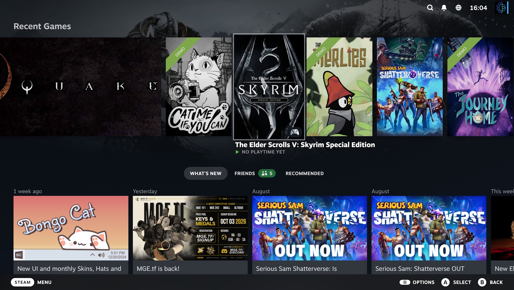
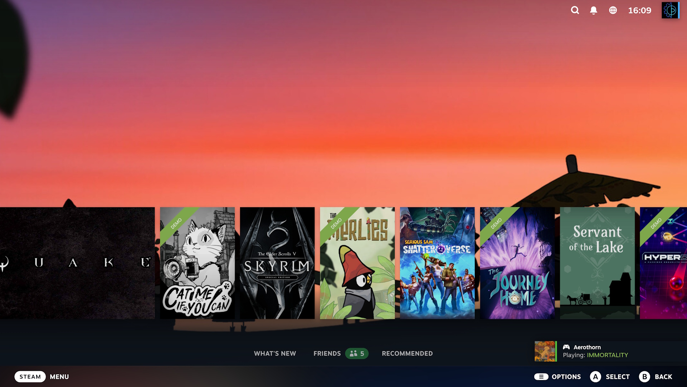

Valve ha empezado a probar en el canal beta del cliente de Steam un rediseño de la pantalla de inicio de Big Picture Mode que también llega a Steam Deck. La novedad principal se llama Big Art Mode y cambia por completo la forma en que el sistema muestra los juegos recientes: en lugar de la rejilla habitual, el carrusel de títulos se reduce y el arte del juego seleccionado se extiende por todo el fondo. El cambio es, ante todo, estético, pero afecta a la primera pantalla que ven quienes usan la consola portátil o conectan el PC al televisor.

## Big Art: menos interfaz, más portada

Con el modo activado, la interfaz deja de competir con las carátulas. El carrusel de juegos recientes baja de altura y el arte destacado ocupa el fondo, lo que da un aspecto más limpio y cercano al de una consola de salón que al de una biblioteca de escritorio. Todo el contenido que ofrecía la interfaz anterior sigue estando disponible: simplemente queda más abajo y obliga a desplazarse para verlo.

La propia Valve reconoce que no todos los juegos se adaptan igual de bien al sistema, algo habitual cuando una función depende de que el título tenga arte en formato panorámico. Es un detalle menor, pero conviene tenerlo en cuenta: el resultado final dependerá de la biblioteca de cada usuario.

## Salvapantallas con arte del juego y logo rebotando

La segunda incorporación visible es un salvapantallas para Big Picture Mode, accesible desde Ajustes > Personalización. Valve ofrece dos opciones de serie: una presentación con arte de los juegos jugados recientemente, que puede incluir también capturas propias, y un salvapantallas retro con el logotipo de Steam rebotando por los bordes de la pantalla, un guiño directo al viejo reproductor de DVD.

Además, el sistema admite salvapantallas personalizados. Igual que ocurre con los vídeos de arranque, se pueden colocar en el directorio `config\uioverrides\screensavers` de la instalación de Steam y usar el salvapantallas del logo rebotante como ejemplo para crear los propios. Para el lector hispanohablante acostumbrado a personalizar su equipo, esta puerta abierta a la comunidad es probablemente lo más interesante de la función.

## Rendimiento, grabación y Linux

La actualización no es solo cosmética. Valve asegura que el arranque del cliente es ahora más rápido, que se ha reducido el impacto en el rendimiento de la grabación de partidas en algunos juegos con Direct3D 12 bajo Windows y que se han corregido bloqueos al capturar pantallas en títulos D3D11 y D3D12. En Linux, la compañía menciona mejores velocidades de descarga en conexiones con alta latencia y un selector de herramienta de compatibilidad siempre visible, con el perfil recomendado o el runtime nativo en la parte superior de la lista.

También se añade un calendario personal a la pestaña de recomendaciones de la pantalla de inicio y se reorganizan los ajustes del temporizador de inactividad según se use batería o corriente. Son cambios discretos, pero apuntan a una misma dirección: hacer que la experiencia de sofá y mando sea más cómoda sin sacrificar el comportamiento de escritorio.

## Cómo probarlo y qué esperar

El modo Big Art se activa desde Ajustes > Inicio, y los salvapantallas desde Ajustes > Personalización. Para acceder antes que el resto hay que apuntarse al canal beta del cliente desde el menú Interfaz de los ajustes de Steam. Al tratarse de una beta, es razonable esperar algún fallo puntual, aunque Valve suele depurar con rapidez este tipo de funciones antes de llevarlas al canal estable.

Para Steam Deck, que compite en la práctica con consolas portátiles cerradas, este tipo de mejoras de interfaz son relevantes: gran parte del atractivo del dispositivo pasa por cómo se siente al usarlo sin teclado ni ratón. Si la beta se consolida, Big Art Mode podría convertirse en el aspecto por defecto del modo consola de Steam, y eso beneficia tanto a la portátil como a los equipos de salón que usan Big Picture.
