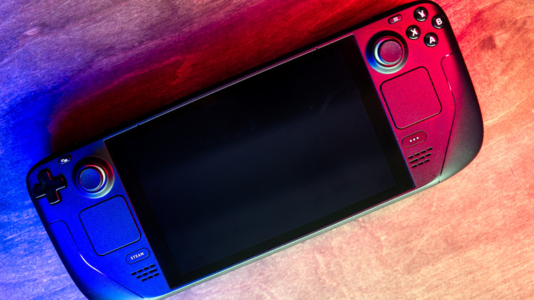

La Steam Deck es un ordenador de bolsillo con Linux, y como cualquier equipo puede funcionar sin problemas durante meses y, de un día para otro, arrastrar fallos de rendimiento, archivos dañados o errores difíciles de localizar. Cuando un reinicio no basta, el restablecimiento de fábrica suele ser la salida: devuelve el dispositivo al estado en el que salió de la caja. También es el paso previo habitual antes de vender la consola.

Esta guía está pensada para quien ya probó lo básico y sigue con problemas, y para quien quiere dejar el equipo limpio para un nuevo dueño. Hay dos caminos: hacerlo desde los ajustes cuando la consola arranca con normalidad, o desde el modo de recuperación cuando el sistema ya no inicia bien.

## Antes de empezar

El restablecimiento borra todo lo que esté guardado en el almacenamiento interno, tanto lo bueno como lo malo, incluidos los juegos instalados en la propia consola. Por eso conviene prepararse primero:

- Haz una copia de seguridad de las partidas guardadas, los diseños de mando y cualquier otro dato que no dependa de Steam Cloud. Todo lo que viva fuera de la nube se pierde.
- Si tienes una tarjeta microSD insertada, retírala antes de empezar. El proceso no debería tocarla, pero es la forma más segura de garantizar que su contenido queda intacto.
- Si vas a reinstalar SteamOS, necesitarás conexión a internet para volver a descargar el sistema después del borrado.

## Paso 1: restablecer desde el menú de ajustes

Si la Steam Deck enciende y responde con normalidad, el restablecimiento se hace sin ordenador ni unidad USB. Solo hay que seguir estos pasos en la propia consola:

1. Pulsa el botón **Steam** para abrir el menú principal.
2. Entra en **Ajustes**.
3. Selecciona **Sistema**.
4. Baja hasta la sección **Avanzado**, cerca de la parte inferior de la página.
5. Elige **Restablecer al estado de fábrica**.
6. Activa la opción **Reinstalar SteamOS** si estás intentando solucionar un problema.
7. Confirma la acción.

La consola empezará a preparar el restablecimiento y, a continuación, borrará el dispositivo. El proceso tarda entre 10 y 15 minutos, en función de la cantidad de datos almacenados. Si has activado la reinstalación, necesitarás conexión a internet para que SteamOS vuelva a descargarse después del borrado.

La opción **Reinstalar SteamOS** marca la diferencia según el motivo del restablecimiento. Si solo quieres arreglar un fallo, conviene dejarla activada, porque reinstala el sistema desde cero. Si el objetivo es preparar la consola para otro dueño, lo recomendable es desactivarla: el proceso es más rápido y se limita a eliminar tus datos personales.

## Paso 2: restablecer desde el modo de recuperación

Cuando la Steam Deck no arranca con normalidad, el restablecimiento se hace desde el modo de recuperación. El acceso depende de una combinación de botones que hay que mantener en el momento adecuado:

1. Apaga el dispositivo por completo manteniendo pulsado el botón de encendido durante 10 segundos.
2. Mantén pulsados el botón de encendido y el botón **"..."** a la vez.
3. Sigue manteniendo pulsado el botón **"..."** cuando suene el aviso de arranque.
4. Si lo haces correctamente, entrarás en el menú de SteamOS.
5. Desplázate hasta **ERASE USER DATA FROM DECK**.
6. Selecciona la opción con el botón **A**.

A continuación verás líneas de comandos y la consola procederá a borrar todos los datos de usuario, incluidos los ajustes personales, los juegos locales y las partidas guardadas.

## Paso 3: volver a una versión anterior de SteamOS

Desde ese mismo menú de SteamOS hay una vía para retroceder a una versión previa del sistema, útil cuando sospechas que la culpable de los fallos es una actualización reciente:

1. Entra en el menú de SteamOS con los pasos del apartado anterior.
2. Selecciona la opción **Previous SteamOS**, seguida de su número de compilación exacto.

La consola se reiniciará en la versión anterior de SteamOS y conservará todos tus datos de usuario. Eso sí, la reversión solo se mantiene hasta el siguiente reinicio.

## Cómo verificar que funcionó

- Tras el restablecimiento, la Steam Deck arranca como si fuera nueva: verás la configuración inicial de SteamOS en lugar de tu escritorio personalizado.
- Si el motivo del borrado era un fallo de rendimiento o errores de archivos, comprueba si ese problema concreto ha desaparecido al volver a usar la consola.
- Si lo que hiciste fue una reversión a una versión anterior, ten en cuenta que volverá a su versión más reciente en cuanto reinicies, así que confirma el cambio solo mientras dure esa sesión.

## Advertencias y limitaciones

- **El restablecimiento borra todo el almacenamiento interno.** Antes de continuar, verifica que no queda nada importante fuera de Steam Cloud.
- **Agota antes las vías sencillas.** Si solo intentas arreglar un problema y no preparar la consola para otro dueño, conviene probar antes un reinicio, comprobar si hay una actualización de software pendiente o retroceder a una versión anterior de SteamOS.
- **La reinstalación exige internet.** Sin conexión, la consola se queda sin SteamOS después del borrado, así que este paso no debe hacerse en un equipo sin red.
- **La reversión es temporal.** Retroceder a una compilación anterior no es una solución permanente: se pierde en el siguiente reinicio.
