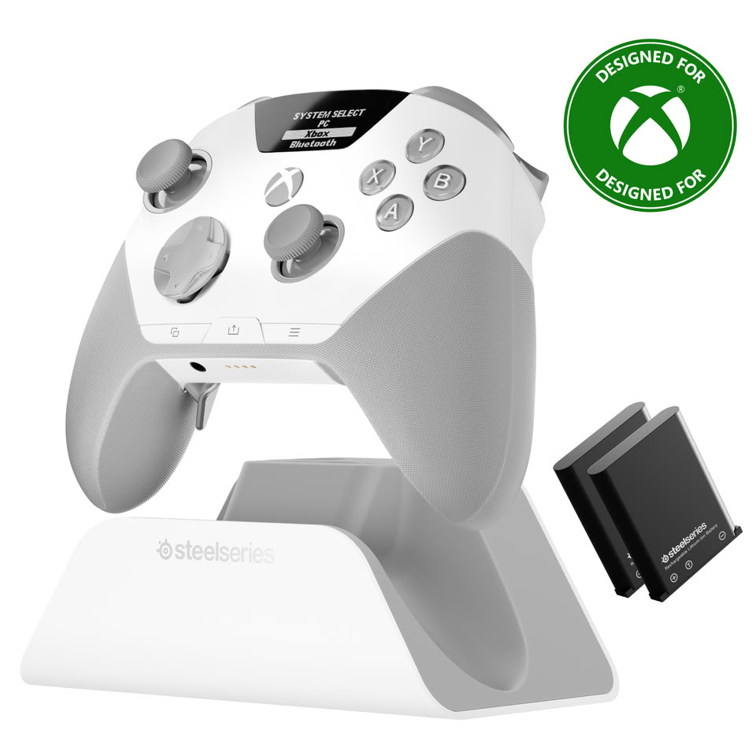
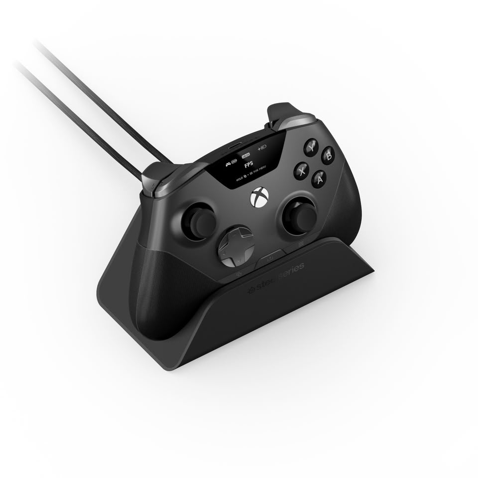
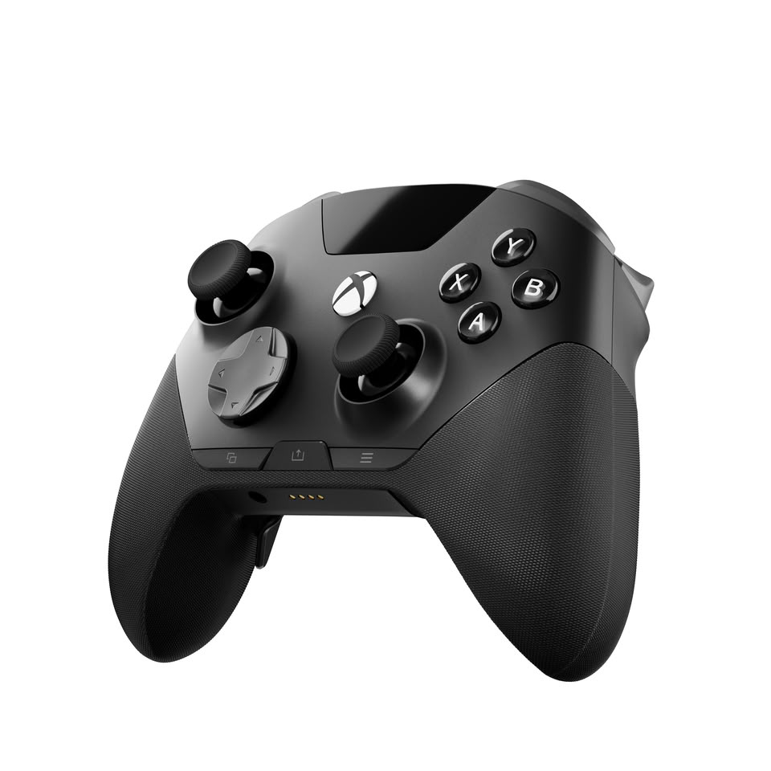
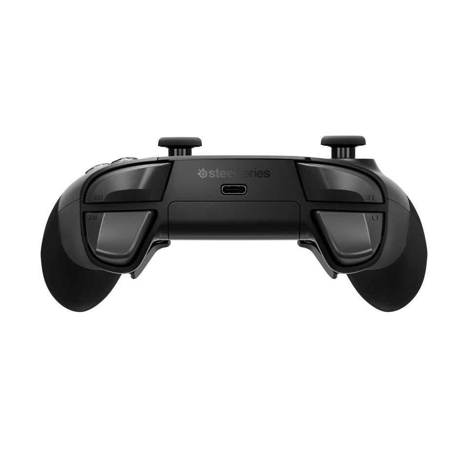

SteelSeries ha presentado el Aeon Pro, un mando de gama alta pensado para jugadores que reparten su tiempo entre el PC y la Xbox. La compañía lo describe como el primer sistema de base con acoplamiento rápido —QuickSwitch Dock System— para ambas plataformas, una patente en trámite que busca resolver un problema cotidiano: pasar de un dispositivo a otro sin cables ni configuraciones manuales.

El mando llega con dos baterías intercambiables en caliente, de modo que una puede estar cargándose en la base mientras la otra alimenta el mando. SteelSeries lo denomina Infinite Power System y, en la práctica, apunta a que el jugador no tenga que interrumpir una partida por quedarse sin energía.

## Un mando pensado para durar y para personalizarse

Más allá de la base, el Aeon Pro apuesta por componentes que suelen asociarse a la gama alta. Los mandos analógicos usan sensores de efecto Hall, una tecnología que evita el desgaste físico de los potenciómetros tradicionales y, con ello, la temida deriva. Los gatillos son de primer nivel y todos los botones emplean interruptores mecánicos para ofrecer una respuesta táctil más rápida.

La personalización también es uno de sus pilares. El sistema modular de sticks permite cambiar entre tres perfiles —cóncavo estándar, cóncavo alto y convexo corto— y guardar los recambios en la propia base. A esto se suman botones traseros contorneados y reasignables, además de un agarre texturizado que recorre el cuerpo del mando.

## Pantalla OLED y software GG

El Aeon Pro incorpora una pantalla OLED integrada que da acceso directo a los perfiles personalizados, incluida la reasignación de funciones tanto en PC como en Xbox. Quien quiera afinar más puede recurrir a la suite SteelSeries GG, desde la que se ajustan cada botón, gatillo y perfil, se modula la intensidad individual de los cuatro motores de vibración y se gestionan las integraciones con Sonar y los ajustes de energía en PC.

## Precio y disponibilidad

El mando está disponible en negro o blanco desde el 8 de septiembre de 2026 en la web de SteelSeries y en distribuidores seleccionados. Sus precios recomendados son 259,99 dólares en Norteamérica, 229,99 libras en Reino Unido, 259,99 euros en la región EMEA y 259,99 dólares en Asia-Pacífico.

## Nuestra lectura

El Aeon Pro compite en un segmento donde ya hay mandos premium muy capaces, así que su gran baza no es la potencia bruta, sino la comodidad: la base con baterías intercambiables y el acceso directo a perfiles desde la pantalla OLED atacan dos fricciones reales del juego multiplataforma. El precio, en cambio, lo sitúa por encima de muchas alternativas, y ahí la pregunta es si el jugador valora de verdad la ergonomía y la ausencia de deriva tanto como para pagar la diferencia.

Para el público hispanohablante, el dato relevante es la disponibilidad europea y un precio en euros que lo colocan como una opción de nicho dentro de los periféricos de juego. Queda por ver cómo responde el mercado a una propuesta que apuesta por la modularidad y la energía continua como argumentos principales.

