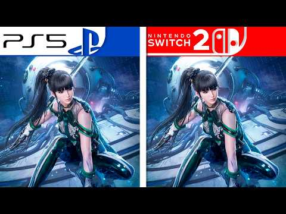

La espera para jugar a **Stellar Blade** en la consola híbrida de Nintendo se acorta. Shift Up ha publicado una **demo del juego en la eShop de Nintendo Switch 2**, una versión de prueba que ya puede descargarse y que sirve para comprobar cómo se comporta el título antes de su lanzamiento oficial, previsto para el **5 de noviembre de 2026**. El estudio acompañó el anuncio con un nuevo tráiler centrado en los atuendos inspirados en Bayonetta.

La demo, además, ha servido de base para una **comparativa en vídeo entre la versión de PlayStation 5 y la de Switch 2**, difundida por GoNintendo y recogida por Nintenderos. Se trata de una comparación de terceros, no de una confirmación oficial de rendimiento por parte de la compañía, pero da una primera idea del resultado del port.

## Qué muestra la comparativa frente a PS5

El vídeo pone en paralelo ambas versiones para examinar gráficos y tasa de fotogramas. El gráfico que lo acompaña resume la propuesta de cada plataforma: **PS5 en su modo rendimiento con 1440p dinámicos y 60 fps**, frente a **Switch 2 con 1080p reescalados y 60 fps con generación de fotogramas**. Son cifras del propio material comparativo, no una ficha oficial, pero encajan con los objetivos técnicos que el estudio ya había comunicado. La lectura que hacen los medios que lo han recogido es que **Switch 2 no queda descolgada**: el port mantiene el tipo pese a la diferencia de hardware, con un resultado más ajustado de lo que se podría esperar en un título de esta escala.

Conviene recordar las **especificaciones técnicas que se dieron a conocer antes del lanzamiento** de la demo. Según los datos publicados por Nintenderos, Shift Up apunta a **60 FPS tanto en modo portátil como en modo televisión**, con **720p reescalados** en portátil y **1080p reescalados** en el dock. El reescalado se apoyaría en **DLSS de NVIDIA** y la interpolación de fotogramas en **AMD FSR 3.1**. No habría modos gráficos entre los que elegir y el estudio prepara un **parche de día uno** para optimizar aún más el rendimiento.

A esas cifras hay que añadir lo que cuentan quienes ya han probado la demo en foros como ElOtroLado. Allí se describen unas primeras impresiones favorables —el juego se ve bien tanto en televisor como en portátil—, con matices: el pelo se percibe peor resuelto y aparecen **tirones puntuales** en momentos concretos, como al activar el sonar o durante algún combate contra jefes. Son impresiones de jugadores, no mediciones, y la propia demo podría seguir puliéndose hasta el lanzamiento.

## Qué incluye Stellar Blade Complete Edition y qué debe saber quien vaya a comprarla

La versión que llegará a Switch 2 es la **Complete Edition**, que reúne el juego base junto a los contenidos adicionales ya publicados en otras plataformas: los DLC de la colaboración con **NieR:Automata** y con **Goddess of Victory: Nikke**, más una serie de extras adicionales. La editora también ha detallado que los cuatro **atuendos inspirados en Bayonetta** estarán disponibles de forma gratuita en Switch 2 desde el lanzamiento.

En el apartado comercial, el precio de referencia es de **59,99 euros** y las reservas ya están abiertas en la eShop y en comercios. Quien reserve recibirá un desbloqueo anticipado de varios objetos cosméticos para la protagonista. Para quienes prefieren el formato físico, hay un detalle relevante: **la edición física incluye el juego completo en el cartucho**, sin tarjeta de clave ni descarga adicional obligatoria, algo que no siempre ocurre en los lanzamientos actuales de la consola. También habrá una **SteelBook de edición limitada** en cantidades reducidas.

## Qué cambia para el jugador

La combinación de demo disponible y comparativa favorable rebaja bastante la incertidumbre que suele rodear a los ports de peso. Hasta ahora, la duda razonable era cuánto sacrificaría la versión de Switch 2 frente a la de PS5; el material difundido apunta a un recorte contenido y, sobre todo, a un objetivo de fluidez claro. En una consola donde el VRR en modo dock aún depende de parches por juego, como analizamos en el caso del [VRR de Switch 2 en televisor](/noticias/switch-2-docked-vrr/), que el estudio persiga 60 FPS estables es una buena señal.

Nuestra lectura es que **la demo es la noticia, más que la comparativa**. Permite al jugador juzgar por sí mismo el rendimiento, el control con los Joy-Con 2 —que tendrá soporte de movimiento para ciertas actividades— y el estado del port a casi dos meses del estreno. La comparativa da contexto, pero la decisión de compra ya no depende de vídeos de terceros: se puede probar antes. Eso sí, conviene confirmar en la ficha de la eShop la fecha exacta de lanzamiento y el contenido de cada edición, porque algunas coberturas han manejado fechas ligeramente distintas.
