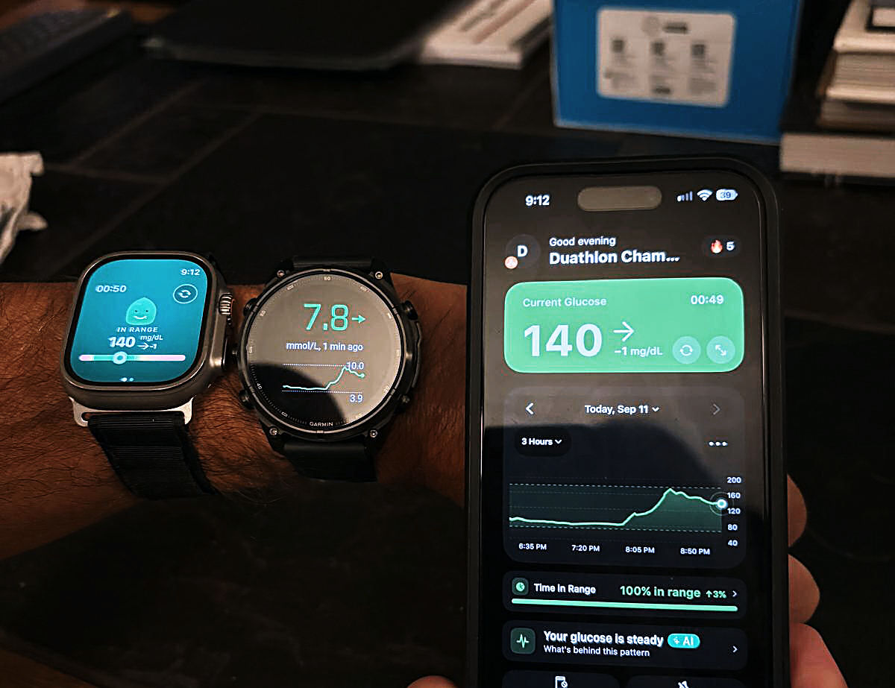

El nivel de glucosa ya se puede consultar desde la muñeca, y no solo desde un teléfono. La aplicación **Sugar Sense**, disponible para Garmin Connect IQ y watchOS, lee los datos del sensor **FreeStyle Libre 3 Plus** de Abbott y los muestra en un reloj, sin exigir que ese reloj esté emparejado con el móvil que recoge las lecturas. Así lo describe un análisis de campo publicado por **the5krunner**, que probó el conjunto sobre un **Garmin Fenix 9 Pro** y un [Apple Watch Ultra 4](/noticias/apple-watch-series-12-ultra-4-theater-mode/).

## Un sensor que busca su hueco fuera de la clínica

Abbott suministraba a Supersapiens uno de sus sensores para revenderlo junto a su aplicación orientada a atletas. El suministro se agotó y la aplicación dejó de funcionar. Supersapiens cerró en 2024 y se llevó consigo el sensor, la app y su campo de Connect IQ, recuerda el autor. Herramientas más recientes como Sugar Sense ocupan ahora ese hueco, con mucha menos analítica y bastante menos compatibilidad con dispositivos deportivos que la desaparecida propuesta.

Conviene tener claro qué mide. El sensor es invasivo: una aguja diminuta atraviesa la piel y toma muestras periódicas del líquido intersticial, de modo que mide la glucosa en sangre a efectos prácticos. Con esa información se ve qué alimentos disparan el azúcar —algo que varía de una persona a otra e incluso según el orden en que se comen los alimentos de una misma comida—, si a los picos les siguen bajones, si determinadas horas del día coinciden con antojos o si los niveles se mantienen estables durante el sueño. En el plano deportivo permite comprobar si el cuerpo está aportando suficiente glucosa al músculo. En una prueba casera con un gel, el autor tardó algo más de 20 minutos en ver el pico reflejado en la app, en reposo.

## Libre 3 Plus: tamaño, precio y vida útil

El **FreeStyle Libre 3 Plus** es el sensor de formato pequeño de Abbott, del tamaño aproximado de una moneda de una libra esterlina y el CGM más pequeño de la compañía hasta la fecha, por debajo del parche del Libre 2. El precio típico en Reino Unido ronda las 80-90 libras por sensor, y en la Unión Europea se mueve entre unos 60 y 100 euros según la farmacia. En Estados Unidos solo se dispensa con receta.

Cada sensor dura unas dos semanas y conviene llevarlo con una funda protectora que no viene incluida: si se desprende por un golpe, ya no se puede volver a colocar. El gasto se acumula con rapidez si se quiere mantener de forma continua a lo largo del año.

## Cómo llega la glucosa al reloj, y dónde falla

Poner en marcha el sensor no es inmediato. Instalar y hacer funcionar la aplicación FreeStyle Libre 3 es, en palabras del autor, una pequeña pesadilla. Después hay que compartir las propias lecturas con uno mismo a través de **LibreLinkUp**, una aplicación de compartición aparte. A partir de ahí, Sugar Sense y otras apps se enganchan vía LibreLinkUp y leen datos relativamente en directo, una parte que resultó sencilla. La integración con Garmin Connect IQ y con watchOS 27 fue fácil en ambos casos.

La limitación principal está en el teléfono. El sensor solo envía datos a las aplicaciones del móvil, así que ese teléfono debe permanecer dentro del alcance del Bluetooth para seguir recogiendo lecturas; si se aleja, el sensor guarda los datos en caché hasta que vuelve a estar cerca. El lado del reloj es más tolerante de lo que el autor esperaba: el Garmin o el Apple Watch no necesitan estar emparejados con ese mismo teléfono, porque leen de los servidores de Sugar Sense por la conexión que tengan. Un segundo móvil, o incluso la aplicación Libre 3 corriendo en un teléfono viejo de repuesto en el bolsillo, sirve igual.

Para una lectura instantánea se puede apoyar la parte superior del teléfono sobre el sensor mediante NFC, un método que al autor le pareció poco fiable.

## Qué cambia para el lector

La app Sugar Sense es bastante básica, pero muestra con claridad los datos centrales de glucosa, y sus alertas de nivel bajo funcionan correctamente. Quien ya use un monitor continuo de glucosa a diario notará que ofrece menos analítica que otras propuestas.

Sobre a quién le encaja: si la persona es diabética o prediabética, este tipo de sensor probablemente ya se lo hayan recomendado o prescrito para un uso frecuente. Para el resto, el autor lo plantea como una compra puntual que ayuda a entender cómo el cuerpo transforma los macronutrientes en glucosa y cómo los músculos la consumen después. Exige cierta dedicación para registrar y entender los datos: sugiere dos semanas de medición, ajustar los hábitos durante un mes y volver a medir más tarde, porque mantenerlo todo el año sale caro.

También hay un aviso de contexto. La UCI se pronunció esta misma semana sobre los suplementos y, de paso, sobre los CGM, que no salieron bien parados: su comunicado señala un desfase de 10 a 15 minutos frente a la glucosa en sangre real, lecturas inconsistentes alrededor de las comidas y en esfuerzos de alta intensidad, y resultados que cambian según si el sensor va en el brazo o en la pierna. Son limitaciones que conviene tener presentes antes de interpretar cualquier dato de bienestar. Como recalca el autor, quien tenga una condición diagnosticada debería confirmar el uso del sensor con su equipo de diabetes. Esta pieza describe una experiencia de prueba y no constituye una recomendación médica.

Para poner en contexto la gama de relojes deportivos, en TechSpain24 ya hemos cubierto la [rebaja del Garmin Fénix 8 tras la llegada del Fénix 9](/noticias/garmin-fenix-8-price-drop/).
