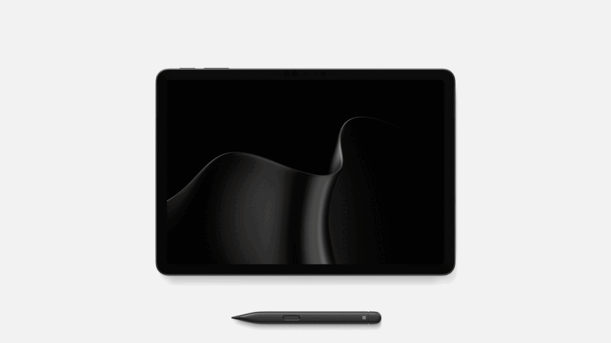
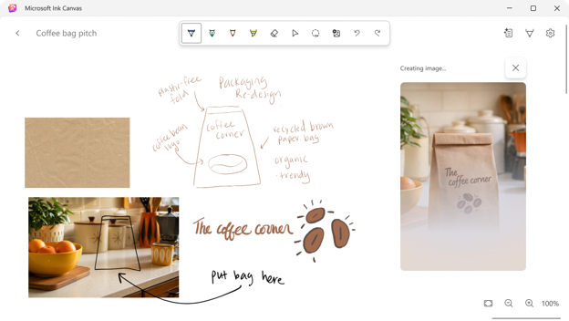
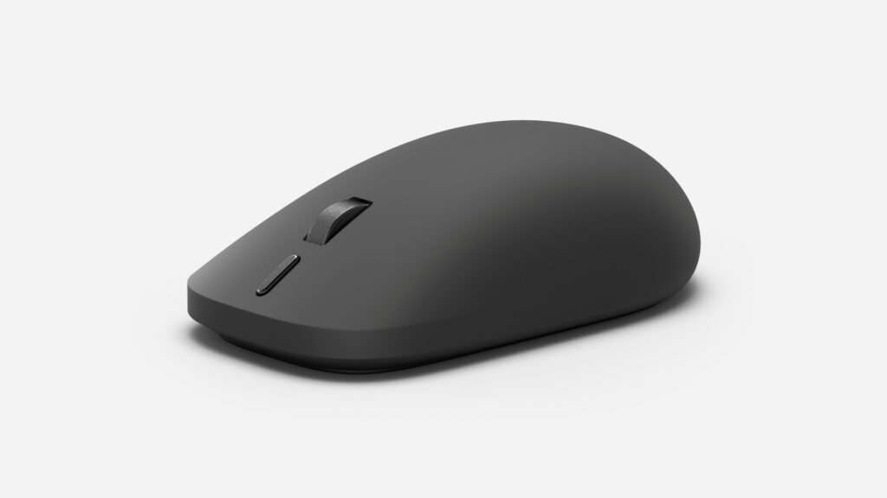

Microsoft ha renovado sus dos portátiles más pequeños coincidiendo con la celebración del Snapdragon Summit. El nuevo **Surface Pro de 12 pulgadas** y el **Surface Laptop de 13 pulgadas**, presentados por la compañía como segunda edición de ambos modelos, adoptan el procesador **Snapdragon X2 Plus** de Qualcomm, mantienen el diseño y el formato de la generación anterior y llegan acompañados del Surface Mouse, un ratón con respuesta háptica. La compañía los sitúa como sus equipos más portátiles y subraya que el cambio va más allá del chip.

## Snapdragon X2 Plus: las cifras que promete Microsoft

Según la compañía, el salto frente a las primeras ediciones —equipadas con Snapdragon X Plus— se traduce en hasta un 17 % más de rendimiento en ofimática, alrededor de un 18 % más de eficiencia de batería, más de un 60 % más de rendimiento gráfico y hasta un 95 % más de velocidad en inferencia de IA local sobre la NPU. Microsoft enmarca estas cifras en su trabajo conjunto con Qualcomm durante el desarrollo del silicio, orientado a sostener el rendimiento y mantener la eficiencia en equipos finos y sin ventilador.

Las ganancias reales de autonomía son más discretas que esos porcentajes. En el Surface Pro de 12 pulgadas se traducen en una hora adicional de navegación web, hasta unas 13 horas, mientras que en el Surface Laptop de 13 pulgadas suponen dos horas más, hasta unas 18 horas, según recoge The Verge a partir de los datos del fabricante. El blog de Microsoft cifra además en 22,5 horas la reproducción de vídeo local del Laptop.

## Pantallas, diseño y conectividad

Ambos modelos reutilizan el chasis de la generación anterior, así que los cambios se concentran en el interior y en detalles concretos. La actualización más visible es la pantalla: las dos pasan de 400 a 500 nits, lo que supone un 25 % más de brillo. El Surface Pro de 12 pulgadas mantiene un panel PixelSense de 2196 × 1464 (220 ppp) que llega hasta los 90 Hz; el Surface Laptop de 13 pulgadas conserva su formato 3:2, con una resolución de 1920 × 1280 (178 ppp) y 60 Hz, junto a un teclado retroiluminado de tamaño completo, touchpad de precisión y cuerpo de aluminio.

En conectividad, los dos incluyen dos puertos USB-C 3.2, compatibilidad con Wi-Fi 7 y Bluetooth 5.4; el Laptop añade un USB-A 3.2 y un conector de auriculares de 3,5 mm, siempre según la comparativa de The Verge. Microsoft recupera el color negro en ambos, además de las variantes plateada y violeta, y destaca que la carcasa del Pro incorpora un 86 % de contenido reciclado.

## Microsoft Ink Canvas, la novedad de software

Junto al hardware, el Surface Pro de 12 pulgadas estrena **Microsoft Ink Canvas**, una experiencia centrada en el lápiz que permite dibujar, anotar, generar imágenes y resumir texto directamente sobre el lienzo con ayuda de la IA. La aplicación viene preinstalada en este modelo y el 13 de octubre llegará a la Microsoft Store para otros dispositivos Surface y Windows compatibles, aunque las funciones de IA requieren una suscripción a Microsoft 365 y están sujetas a límites de uso.

Conviene separar esta puesta de largo de la cita que Microsoft ya tenía fijada para el [evento de Surface y Windows 11 del 7 de octubre](/noticias/microsoft-surface-event-2026/), centrado en la IA local. Son anuncios distintos: el de ahora llega desde el Snapdragon Summit y detalla producto, configuración y precio.

## Precio, disponibilidad y para quién tiene sentido

El contexto de precios marca la letra pequeña. El Surface Pro de 12 pulgadas parte de 1.149,99 dólares y el Surface Laptop de 13 pulgadas, de 1.199 dólares, ambos disponibles a partir del 13 de octubre en mercados seleccionados. Son tarifas sensiblemente superiores a las de las primeras ediciones, que arrancaron en 799,99 y 899,99 dólares respectivamente. Parte del encarecimiento se explica porque ya no hay configuración base de 8 GB de RAM: los dos modelos parten de 16 GB y se pueden pedir hasta 24 GB, en un momento de subida generalizada del precio de la memoria.

Para el público español, la información útil es doble. Por un lado, Microsoft no ha detallado todavía precio en euros ni si España figura entre los mercados del lanzamiento, por lo que las cifras en dólares son orientativas. Por otro, el Surface Pro de 12 pulgadas ofrecerá una configuración opcional con 5G, una de las peticiones más repetidas en este formato, y ambos equipos se venderán también por el canal empresarial con herramientas de gestión y seguridad. Quien busque potencia por encima de portabilidad tendrá que mirar a otros modelos con Snapdragon, como el [ZenBook 14 de ASUS](/noticias/asus-zenbook-14-snapdragon-review/), porque aquí la prioridad declarada es llevar el equipo encima todo el día.

