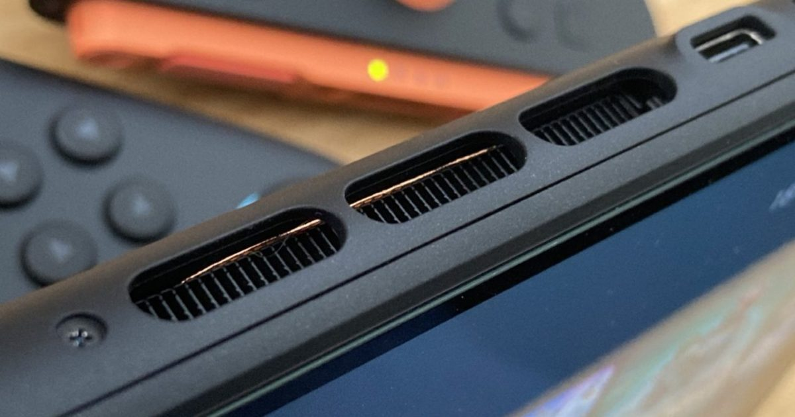

El ventilador del dock de Nintendo Switch 2 puede sonar con fuerza o la consola puede notarse muy caliente al tacto incluso cuando no se está jugando. Esta guía explica, a partir de la documentación oficial de Nintendo recogida por Nintenderos, cómo silenciar la base en modo de espera y qué hábitos evitan el sobrecalentamiento durante el juego.

## Requisitos previos

- Una consola Nintendo Switch 2 con su base dock oficial.
- Acceso al menú de Configuración de la consola.
- Unos minutos y, si es posible, reubicar el dock en un lugar ventilado.

## Paso 1: Desactiva la conexión por cable en el modo de espera

Cuando la base sigue haciendo ruido mientras la consola duerme, la causa habitual es que el equipo continúa procesando datos en segundo plano a través de la conexión de red. La solución oficial consiste en impedir que la consola mantenga la conexión por cable mientras está en reposo:

1. Abre la **Configuración de la consola**.
2. Entra en la sección de internet o en las opciones del modo de espera.
3. Desactiva la opción **«mantener la conexión por cable en el modo de espera»**.

Al cortar esa conexión en reposo, la consola deja de forzar el enlace mientras duerme y el ventilador de la base se detiene.

## Paso 2: Deja espacio libre alrededor del dock de Switch 2

Durante las sesiones de juego es normal que la consola se caliente con los títulos más exigentes, pero necesita respirar. No encajones la base en un hueco estrecho del mueble del televisor ni la pegues a la pared: el aire caliente que expulsa volvería a entrar en la consola. Deja varios centímetros de espacio libre a su alrededor para que el calor se disipe.

## Paso 3: No cargues la consola cuando esté muy caliente

El calor y las baterías no se llevan bien. Si acabas de terminar una sesión larga en modo portátil y notas que la parte trasera quema, evita colocarla de inmediato en el dock para cargarla: estarías sumando el calor del procesador al de la carga. Deja que se temple unos minutos antes de enchufarla.

## Paso 4: Si se congela por el calor, no tires del cable

Si con mucho calor ambiental y mala ventilación la consola llega a congelar la imagen para protegerse, no entres en pánico y, sobre todo, no la desenchufes de la corriente de golpe. Un corte brusco de alimentación puede provocar la pérdida de datos.

## Cómo verificar que funcionó

Deja la consola en modo de espera sobre el dock con el ajuste del paso 1 aplicado: la base debe permanecer en silencio en lugar de arrancar el ventilador. Durante el juego, con el dock despejado, el ruido debe ser ocasional y moderado, no constante.

## Advertencias

- El modo de reposo es seguro: no es necesario apagar la consola por completo para evitar estos problemas, ya que el equipo gestiona su consumo por sí solo.
- Nunca desenchufes la consola de forma brusca si se queda colgada; espera y sigue el procedimiento adecuado para no perder datos.
- Si el ruido o el calentamiento persisten con el dock bien ventilado y el ajuste aplicado, contacta con el soporte oficial de Nintendo: podría tratarse de un defecto de hardware.
