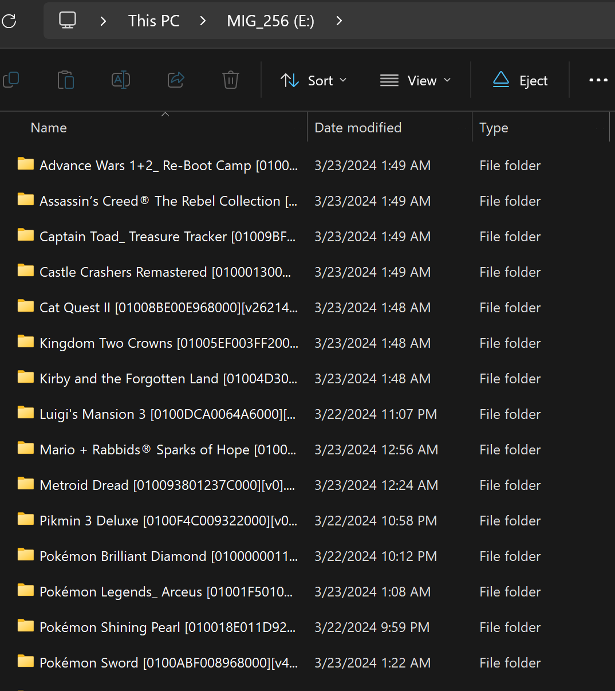
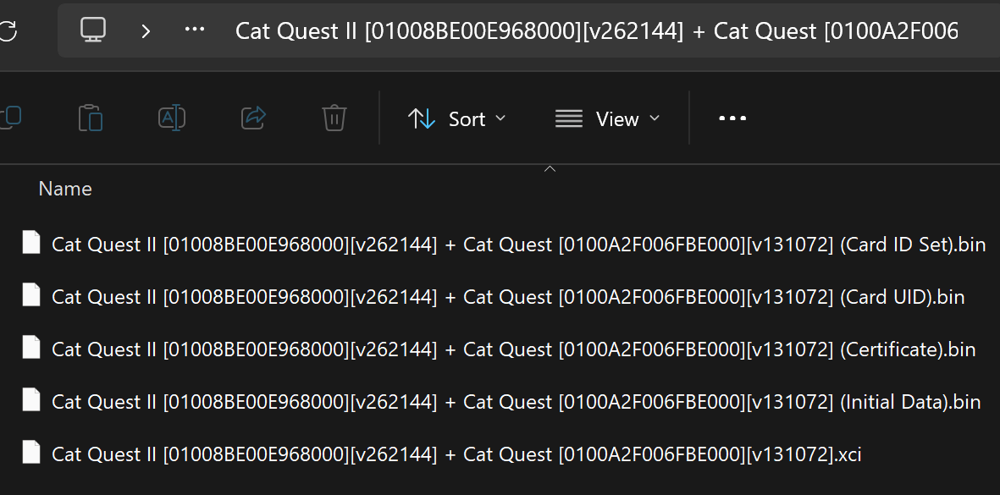
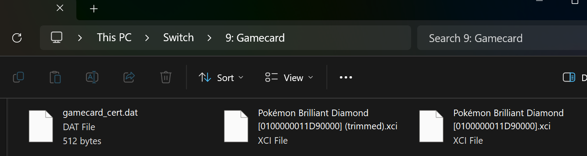
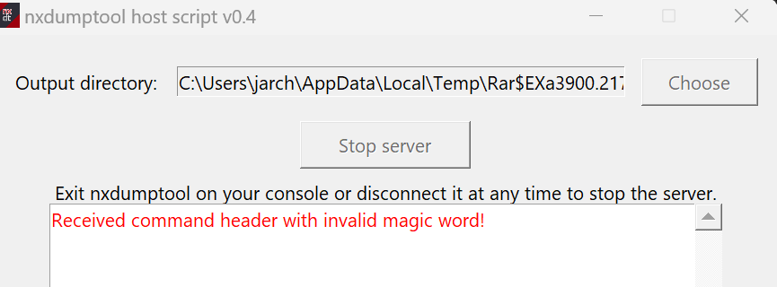

El cartucho flash **MIG Switch** para Nintendo Switch cuenta con un hilo de referencia en los foros de **GBAtemp** que concentra guías de configuración, enlaces de firmware y ayuda para el dispositivo de volcado. Iniciado en marzo de 2024 por el usuario TheStonedModder, el debate supera las 800.000 visitas y se acerca a las 3.000 respuestas, lo que lo convierte en uno de los puntos de encuentro más activos sobre este accesorio.

El mensaje inicial funciona como índice: explica cómo actualizar el firmware del cartucho, cómo organizar los juegos en la tarjeta microSD y dónde conseguir el programa auxiliar para volcar partidas desde un PC con Windows.

## Qué reúne el hilo sobre el MIG Switch

El contenido central son tres guías prácticas. La primera detalla la actualización del firmware: hay que copiar el archivo `.sf2` descargado desde la web oficial a la raíz de una tarjeta microSD vacía, insertarla en el cartucho y colocarlo en la consola hasta que una luz azul se apague. La segunda explica el uso diario: la tarjeta debe estar formateada en exFAT y cada juego va en una carpeta cuyo nombre coincide con el de sus archivos de imagen XCI y de certificado.

El tercer bloque está dedicado al **MIG Dumper**, el accesorio que permite crear copias de los cartuchos originales, e incluye una versión compilada para Windows del programa anfitrión NXDumpTool, pensada para quienes no quieren compilar el código por su cuenta.

Además, el hilo recopila piezas de repuesto imprimibles en 3D, con enlaces a modelos de carcasas para el cartucho y para el dumper alojados en MakerWorld, y mantiene un enlace al firmware más reciente disponible en la sección de descargas del propio foro.

## Por qué importa el MIG Switch para los usuarios de Switch

El interés del MIG Switch, según expone el propio autor del hilo, es económico y práctico: el conjunto de cartucho y dumper ronda los 130 dólares, una cifra inferior a lo que cuesta instalar un modchip en una Switch OLED a través de un técnico o por correo. A eso se suma la comodidad de llevar toda la colección en una sola tarjeta en lugar de cargar con decenas de cartuchos físicos.

El debate también deja constancia de las limitaciones detectadas por la comunidad: los archivos XCI recortados no funcionan en el cartucho y el archivo `.nxindex` que registra el último juego cargado puede bloquear la selección si la tarjeta se llena por completo. Son detalles que solo aparecen tras el uso prolongado y que el hilo documenta con capturas y mensajes de error reales.

## Qué cambia para el lector hispanohablante

Quien tenga un MIG Switch o esté valorando comprarlo dispone en este hilo de un manual vivo en inglés, mantenido por la comunidad, que responde a los problemas más frecuentes sin depender del soporte oficial del fabricante. Conviene leerlo antes de adquirir el accesorio para conocer sus requisitos, como el formateo en exFAT o la necesidad de conservar los archivos de certificado junto a cada juego.

GBAtemp ya centraliza otros recursos comunitarios de Nintendo Switch, como el [hilo que recopila los trucos que funcionan en emuladores](/noticias/switch-cheat-codes-emulators-thread/), por lo que este hilo sobre el cartucho flash se suma a una práctica habitual del foro: convertir un debate largo en documentación de referencia.
