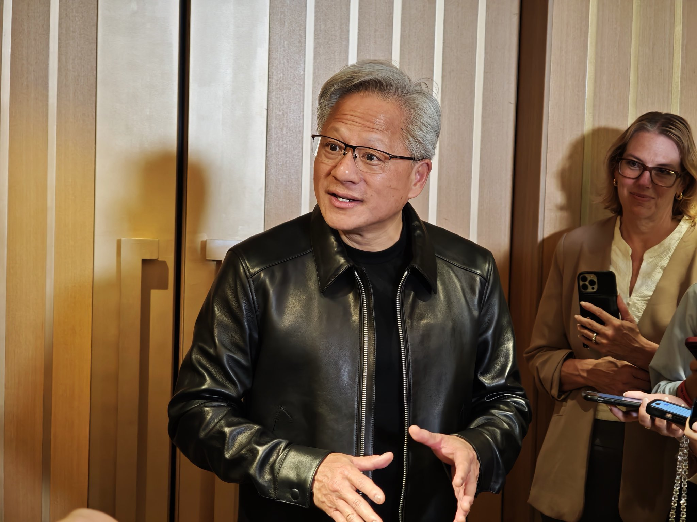

Amazon negocia trasladar unos 8.000 millones de dólares en GPUs de NVIDIA fuera de su balance. Según un informe de Financial Times que cita personas familiarizadas con las conversaciones, la compañía situaría miles de aceleradores Grace Blackwell en un vehículo de propósito especial (SPV, por sus siglas en inglés) financiado por inversores externos y después los alquilaría para seguir usándolos. El plan no está cerrado y la información procede de fuentes anónimas, así que debe leerse como una negociación en curso, no como un hecho confirmado.

## Qué propone Amazon con sus GPUs

En la operación descrita por el diario británico, el vehículo recibiría respaldo de inversores externos y podría ofrecerles hasta un 10 % del capital. Amazon conservaría el acceso a los chips mediante un contrato de arrendamiento, de modo que su capacidad de cómputo no cambiaría, pero el activo y su depreciación saldrían de sus cuentas. El objetivo que citan las fuentes es reforzar el balance: en lugar de asumir en solitario la pérdida de valor de un hardware que envejece, parte de ese riesgo se reparte entre terceros.

Los chips implicados son Grace Blackwell, la familia de NVIDIA para centros de datos, no las GeForce de consumo. Ese detalle importa para leer bien la noticia: el acuerdo afectaría a la infraestructura de nube de Amazon, no a las tarjetas gráficas que llegan a las tiendas.

## Las GPUs ya se usan como activo financiero

El movimiento encaja en una tendencia más amplia: usar las GPUs de NVIDIA como garantía de financiación. En agosto, la compañía anunció un plan de 500.000 millones de dólares junto a Blackstone, Apollo y KKR para que los desarrolladores de IA puedan pedir préstamos respaldados por sus chips. Un informe de Reuters publicado el 1 de octubre señala que parte de Wall Street ve ese plan con recelo y pide garantías más sólidas.

El origen del desacuerdo es la vida útil del hardware. Jensen Huang, consejero delegado de NVIDIA, sostiene que sus GPUs de gama alta pueden generar ingresos durante hasta una década. Un portavoz de la compañía defendió ante Reuters que «la capacidad de cómputo de IA es un activo productivo, duradero e intercambiable que puede respaldar financiación a largo plazo». La visión de los analistas independientes es más conservadora: Andrew Chang, de S&P Global Ratings, admite que los chips «funcionan bien más allá de cinco años», pero asegura que su agencia adopta «una visión prudente de su valor».

«Los bancos suelen valorar las GPUs con un calendario de depreciación de tres a cuatro años», explicó al medio Tony Trzcinka, de Impax Asset Management, frente a la década que defiende NVIDIA. Esa distancia se traduce en condiciones más exigentes: según Loren Moran, de Wellington Management, los inversores pedirán tipos de interés más altos y mayores protecciones antes de financiar préstamos respaldados por chips.

NVIDIA ha ofrecido garantías de valor residual de hasta el 25 % en algunos acuerdos. La propia compañía apunta a que Barkr, una firma de valoración de colateral de IA, estima una vida útil de 9 a 10 años para sus sistemas GB300 NVL72. En el mercado ya hay precedentes: CoreWeave cerró un préstamo de 8.500 millones de dólares respaldado por GPUs y calificado A3, y Broadcom avaló más del 80 % de una estructura de 35.000 millones para financiar capacidad de Anthropic.

## Qué cambia para el usuario

Para quien compra una tarjeta gráfica de consumo, el plan de Amazon no altera precios ni disponibilidad a corto plazo: se trata de aceleradores de centro de datos. Lo relevante es el debate que deja al descubierto. La misma pregunta que se hace un banco —cuánto valor conserva una GPU con los años— es la que se hace cualquier comprador al revender su tarjeta.

Si el mercado financiero acaba descontando ese valor más rápido de lo que sostiene el fabricante, el coste de financiar infraestructura de IA subirá y esa presión se moverá por la cadena de suministro, un terreno en el que ya se han visto movimientos como [la subida de precios de las tarjetas gráficas en China](/noticias/gpu-prices-china-rise/) por el giro de NVIDIA hacia la IA. Conviene separar lo confirmado de lo rumorizado: hoy, el traslado de los 8.000 millones es un plan en negociación según fuentes anónimas, y ni la cifra ni las condiciones están cerradas.
