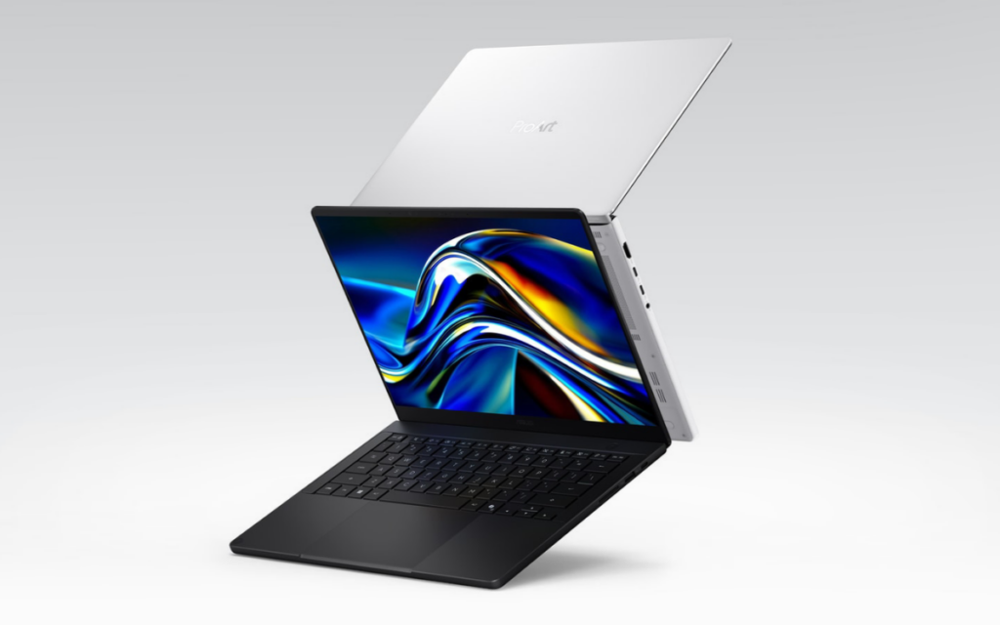
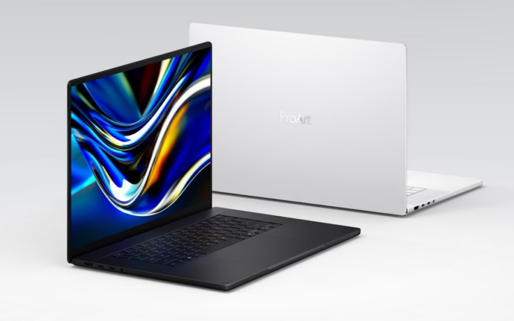

Tras presentarlos en Computex 2026, Asus ya acepta reservas de los portátiles ProArt P16 y ProArt P14, los primeros equipos de la marca en montar la plataforma RTX Spark de Nvidia. La propuesta no va de jugar: apunta a creadores y desarrolladores que quieren resolver cargas de IA y de renderizado pesado en local, sin depender de la nube. El interés está en la GPU Blackwell y en cómo se combina con la CPU Grace bajo un mismo espacio de memoria.

## Qué trae la plataforma RTX Spark

RTX Spark junta dos piezas que en un PC con Windows convencional vivirían separadas: una CPU Arm Grace de hasta 20 núcleos y una GPU Blackwell de hasta 6.144 núcleos CUDA. Ambas comparten un único pool de memoria unificada de hasta 128 GB, un planteamiento pensado para esquivar el cuello de botella que suele arrastrar la memoria dedicada cuando el modelo de turno no cabe en la VRAM de la tarjeta.

Según Asus, esa combinación alcanza hasta 1 petaflop de rendimiento FP4 y permite ejecutar en el propio equipo modelos de lenguaje de hasta 120.000 millones de parámetros con una ventana de contexto de un millón de tokens. Conviene leerlo como lo que es: una cifra del fabricante, no una medición independiente.

## GPU local para trabajo pesado

El argumento de la memoria compartida se entiende mejor en tareas que hasta ahora forzaban una ida y vuelta a la nube: renderizar escenas 3D complejas, editar vídeo en 12K o encadenar flujos de IA generativa. Resolverlas en local cambia la ecuación de coste y de privacidad, porque desaparece el pago por uso y los archivos no salen del equipo.

Asus acompaña el hardware con software para sacarle partido: MuseTree para generar imágenes en local con los modelos FLUX y WAN, StoryCube para organizar material con IA, soporte nativo de ComfyUI y una alianza con Nous Research para integrar Hermes Agent, un agente autónomo de código abierto. Es la misma dirección que Nvidia venía preparando con [CUDA en Windows on Arm](/noticias/cuda-13-4-windows-on-arm/), el terreno que RTX Spark necesita para que el ecosistema de herramientas no se quede atrás.

## Pantallas, diseño y autonomía

Ambos modelos usan paneles Lumina Pro OLED con refresco variable de 120 Hz, cobertura del 100 % de DCI-P3 y hasta 1.600 nits de brillo máximo en HDR, además de recubrimientos antirreflejo. La diferencia está en la resolución: el P16 llega a 4K y añade compatibilidad con Nvidia G-Sync, mientras que el P14 se queda en 3K.

El resto del conjunto no descuida la movilidad. El ProArt P16 mide 12,9 mm de grosor y pesa 1,77 kg, con una batería de 99,9 Wh; el ProArt P14 baja a 13,9 mm y 1,48 kg, con 90 Wh. Los dos incluyen Wi-Fi 7, USB4 y una dotación de puertos amplia para su tamaño.

## Precio, disponibilidad y qué cambia para el lector

Las reservas están abiertas desde el 7 de octubre y los envíos en Estados Unidos comenzarán el 16 de octubre. El modelo base parte de 2.599,99 dólares, un precio del mercado estadounidense. Las configuraciones de 24 a 48 GB de memoria se venderán a través de Best Buy y la tienda propia de Asus, mientras que las de 64 y 128 GB pasarán por la tienda de Asus, Best Buy y Micro Center.

Estos ProArt no son equipos de volumen: son una apuesta por llevar la carga de IA al escritorio y cobrarla como hardware, no como suscripción. Para el lector que compara alternativas, la referencia real ya no es una generación pasada, sino [otros portátiles de memoria unificada](/noticias/amd-ryzen-ai-max-pro-495-laptop/) que atacan el mismo hueco desde el lado de AMD. Quien necesite ese volumen de memoria para modelos locales tendrá que poner en una balanza el desembolso inicial frente al gasto recurrente de las API en la nube.
