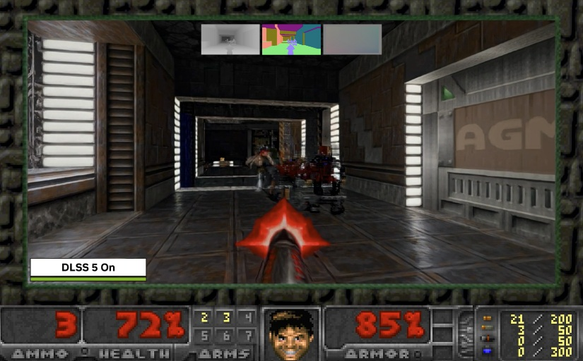

El DOOM original de 1993 vuelve a ejercer de banco de pruebas. El desarrollador Nikolai Zhivotenko ha publicado **DOOM + DLSS 5**, un experimento que lleva el renderizado neuronal DLSS 5 de NVIDIA al clásico de id Software a través de un port a Windows que reconstruye la ruta de presentación sobre **DirectX 12**. No se trata de inyectar DLSS 5 en el ejecutable de DOS original, sino de reescribir el renderizador para que entregue la información adicional que exigen las técnicas modernas de reconstrucción temporal y neuronal. La información procede de Wccftech.

## El motor del DOOM original, adaptado a los búferes modernos

El proyecto parte de **Linux DOOM 1.10**, la versión que id Software publicó como código abierto, y se ha convertido en una aplicación de 64 bits para Windows. El juego sigue renderizando internamente a su resolución original de **320×200**, pero la imagen final se presenta en una ventana de **1280×800**. El cambio que habilita todo lo demás es que el motor modificado genera ahora **profundidad, normales y movimiento en cada fotograma**: el G-buffer que esperan las tecnologías de reconstrucción mucho más recientes y que el rasterizador original de 1993 jamás produjo.

En ese sentido, el mérito no está en la calidad de imagen, sino en la integración: un motor diseñado tres décadas antes empieza a hablar el idioma de datos de las tuberías gráficas actuales.

## Qué modos de reescalado admite

El port funciona además como banco de pruebas de reescalado. Ofrece modos separados para **DLSS Ray Reconstruction**, **DLSS 4 Super Resolution con el preset K**, **DLSS 4.5 con el preset L**, **AMD FSR 2.2**, **Anime4K** y un simple escalado por vecino más cercano a 4×. El modo DLSS 5 ejecuta primero la ruta de DLSS 4.5 y después aplica DLSS 5 Neural Rendering, siempre que esté instalado el DLSS 5 Swapper necesario.

## Qué cambia para el lector

Conviene ajustar expectativas: no hay cifras de rendimiento ni de fps publicadas, y el propio autor no presenta el resultado como una mejora de imagen. La reconstrucción neuronal trabaja aquí con una geometría y una imaginería muy alejadas de las que alimentan habitualmente a estos modelos, así que algunos detalles reconstruidos pueden verse extraños. Lo relevante del experimento es que funcione: que una arquitectura de 1993 pueda entregar el G-buffer que piden las técnicas modernas, del mismo modo que [otras reimplementaciones han llevado DLSS 5 a Vulkan y a hardware no soportado](/noticias/dlss-5-reimplementacion-vulkan-open-source/).

Hay también límites de compatibilidad. Ni el DOOM que se distribuye en Steam ni DOOM 64 pueden activar DLSS mediante esta vía: hace falta compilar el port desde su repositorio en GitHub, que se publica bajo licencia GPLv2, y aportar un IWAD compatible. Quien busque el atajo de una herramienta que aplique DLSS 5 sin tocar el juego puede mirar propuestas como [Borderless Gaming, que lo hace sin mods por título](/noticias/tarjetas-graficas/borderless-gaming-dlss-5-universal/), aunque aquí el interés es otro: demostrar que el DOOM original todavía tiene margen para adoptar tecnologías gráficas nuevas.
