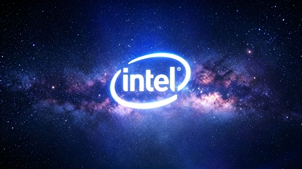

La filial japonesa de Intel cumple 50 años y el fabricante nipón Inversenet ha decidido celebrarlo a través de su marca de equipos personalizados FRONTIER. La compañía ha anunciado una edición especial de sobremesa limitada a 50 unidades, ya disponible en su tienda de venta directa. El equipo se apoya en componentes de gama alta y en un acabado que rinde homenaje al fabricante de chips.

## Una edición con la firma de Intel

La base es el chasis de torre completa de la serie GBL de FRONTIER, al que se han añadido paneles laterales con una lámina personalizada de Intel. El conjunto completa la estética con tiras ARGB y un disipador de CPU con control de iluminación RGB, todo unificado en el azul característico de la marca.

La caja no llega sola: el paquete incluye un set de cuatro insignias, pegatinas y dos figuras de colección, una en azul y otra en rojo.

## Tres configuraciones, una base común

FRONTIER ofrece tres modelos y todos comparten la misma combinación de procesador y gráfica. El encargado de la CPU es el Core Ultra 7 270K Plus, con 24 núcleos (8 de rendimiento y 16 de eficiencia) y 24 hilos. Según el fabricante, su bus de interconexión sube de los 2,1 GHz de la generación anterior a 3,0 GHz, lo que supone un incremento de en torno al 42 % que, según la compañía, reduce la latencia y ayuda a mejorar los fotogramas por segundo en juegos.

En el lado gráfico, los equipos recurren a la serie GeForce RTX 50, basada en la arquitectura Blackwell de NVIDIA y con núcleos Tensor de quinta generación y núcleos RT de cuarta. Sobre el papel, esa base refuerza el trazado de rayos en tiempo real y el procesamiento de IA, además de habilitar DLSS 4 con generación multifotograma para sostener la tasa de imágenes sin renunciar a la calidad visual.

Para la refrigeración, el chasis GBL combina un frontal de rejilla con dos ventiladores de 16 cm y uno de 14 cm. Sus dimensiones son de aproximadamente 232 mm de ancho, 493 mm de alto y 496 mm de profundidad.

## Qué conviene tener en cuenta

A diferencia de otras propuestas de aniversario volcadas en la propia tarjeta, como la [GeForce RTX 5080 de 30.º aniversario de Manli](/noticias/manli-rtx-5080-30th-anniversary/), aquí el homenaje se reparte entre el chasis, la iluminación y el merchandising. La pieza se sostiene sobre datos del fabricante y una configuración de gama alta, pero el anuncio no incluye precios ni cifras de rendimiento medido. Eso deja fuera, por ahora, cualquier lectura de precio por fotograma o de rendimiento por vatio: el 42 % que se cita corresponde al bus de interconexión de la CPU, no a la GPU, y no equivale a una mejora proporcional en juegos.

Lo relevante para quien busque un equipo nuevo no es tanto el envoltorio conmemorativo como la combinación de componentes: confirma que el Core Ultra 7 270K Plus y las RTX 50 ya llegan listos para comprar en prebuilt de gama alta. Para juzgar si esa relación precio/rendimiento tiene sentido, lo prudente es esperar a los análisis independientes con juegos, resoluciones y ajustes concretos antes de decidir.
