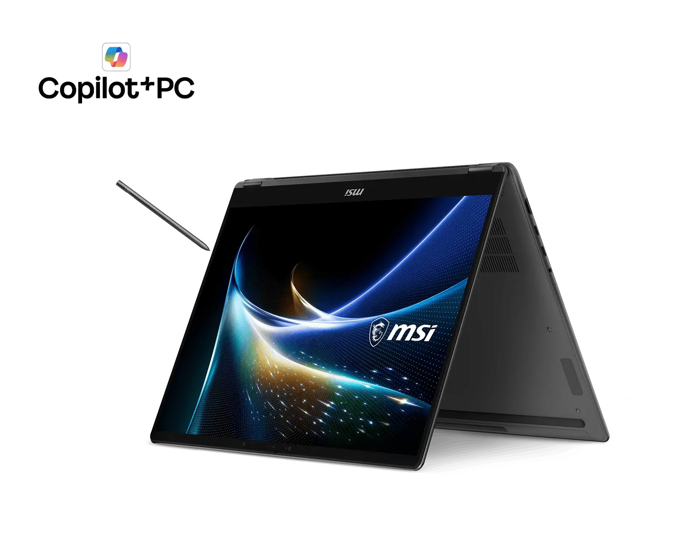
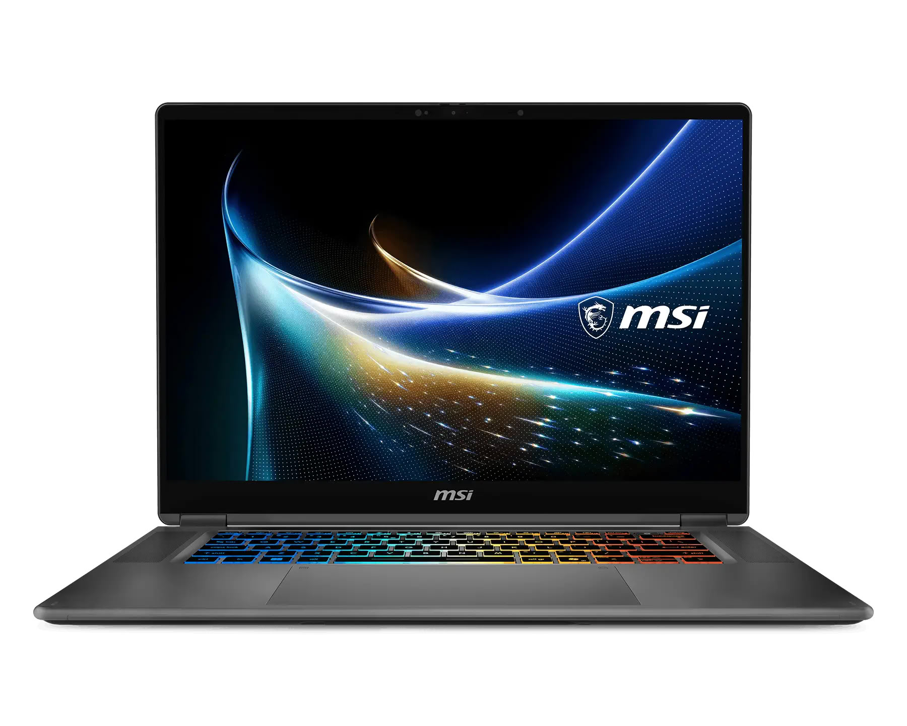
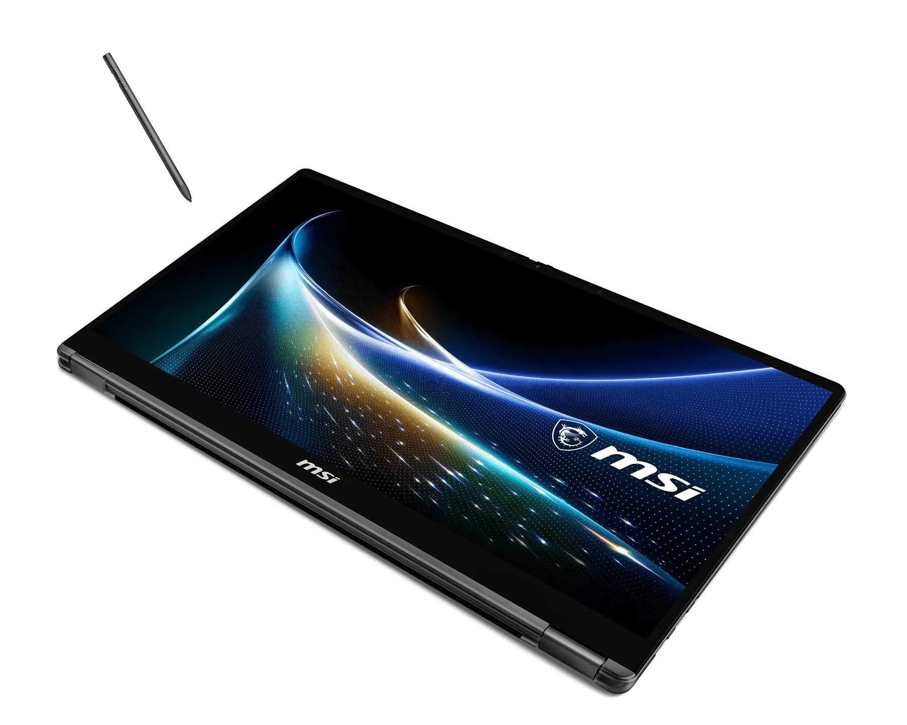
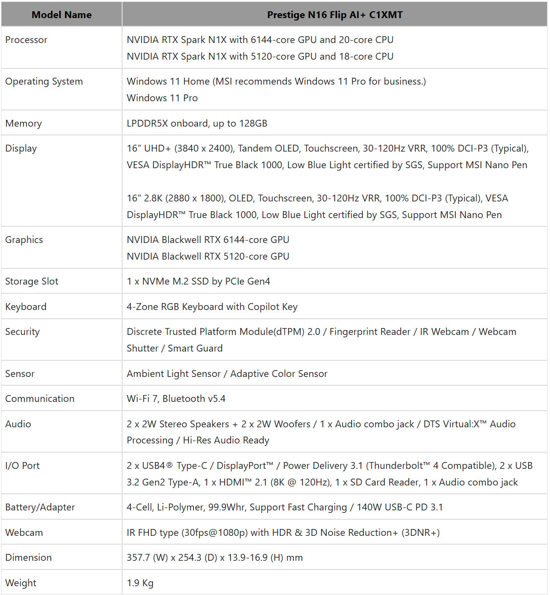

MSI ha abierto las reservas del Prestige N16 Flip AI+ en mercados seleccionados a través de sus distribuidores certificados. Se trata de un convertible de 16 pulgadas que el fabricante presenta como el primer 2 en 1 de la primera hornada de portátiles con NVIDIA RTX Spark, el superchip que reúne una CPU Grace y una GPU Blackwell bajo un mismo grupo de memoria unificada.

Conviene fijar el marco antes de entrar en las cifras: todo lo que sigue procede de la nota de prensa de MSI y de la ficha de producto, no de una prueba independiente. Son datos del fabricante, y como tales hay que leerlos.

## Qué ha presentado MSI

El Prestige N16 Flip AI+ llega en dos configuraciones de RTX Spark N1X: una con GPU Blackwell de 6.144 núcleos y CPU de 20 núcleos, y otra con GPU de 5.120 núcleos y CPU de 18 núcleos. La memoria es LPDDR5X soldada, con hasta 128 GB que la CPU y la GPU comparten. NVIDIA cifra el rendimiento del superchip en hasta 1 petaflop en FP4, una medida orientada a cargas de IA en precisión reducida más que a juegos.

En pantalla hay dos opciones: un panel Tandem OLED UHD+ de 3.840 × 2.400 o un OLED de 2.880 × 1.800, ambos de 16 pulgadas, táctiles, con refresco variable de 30 a 120 Hz, cobertura del 100 % de DCI-P3 y certificación VESA DisplayHDR True Black 1000. El conjunto se completa con una bisagra de 360 grados para alternar entre modo portátil, tableta, tienda y presentación, el lápiz MSI Nano Pen incluido —con un hueco en el chasis que lo carga—, un touchpad un 53 % más grande que el de la generación anterior, lector de tarjetas SD, cuatro altavoces y una batería de 99,9 Wh con carga por USB-C de 140 W.

En conectividad incluye dos USB4 Type-C compatibles con Thunderbolt 4, dos USB 3.2 Gen2 Type-A, HDMI 2.1, lector de SD y Wi-Fi 7 con Bluetooth 5.4. El peso declarado es de 1,9 kg y el grosor va de 13,9 a 16,9 mm según la zona.

## Por qué importa: memoria unificada e IA local con RTX Spark

El argumento de MSI no es la velocidad en juegos, sino dónde vive el modelo de IA. Con hasta 128 GB de memoria unificada, el sistema puede mantener cargados modelos y proyectos que no caben en una GPU dedicada de VRAM fija, además de varias aplicaciones exigentes a la vez. El fabricante cita proyectos 3D de hasta 90 GB. Mantener las cargas en local, añade, evita la dependencia de la nube: menos coste recurrente, más privacidad y respuestas sin la latencia de la red.

Ese enfoque se apoya en CUDA y en aceleraciones concretas por aplicación: DaVinci Resolve con los Tensor Cores de quinta generación, Blender con la reconstrucción de rayos de DLSS 4.5 en el visor CYCLES, Adobe Premiere Pro con los motores NVENC y NVDEC, y ComfyUI con aceleración NVFP4. NVIDIA describe RTX Spark como su chip RTX más eficiente hasta la fecha; es una afirmación del fabricante y, sin mediciones independientes, se queda en eso.

Hay un matiz que el comprador debería tener presente: al ser una plataforma Windows on Arm, el software nativo de Arm convive con el software x86 ejecutado mediante emulación. La compatibilidad es amplia, pero el rendimiento no es idéntico en todos los casos.

## Qué cambia para el lector

El Prestige N16 Flip AI+ ya puede reservarse, aunque la disponibilidad varía según el mercado. MSI no ha publicado precio, así que por ahora no hay forma de calcular un precio por fotograma ni de compararlo con alternativas concretas: el incentivo inmediato es el lote de lanzamiento, valorado en 299 dólares, con un MSI Dual Drive de 128 GB, un año de MSI Care Plus y un año de protección por daños accidentales, disponible hasta el 31 de diciembre de 2026.

Para quien busque IA local en movilidad, el atractivo está en el bloque de memoria unificada más que en las cifras de juego. Es la misma apuesta que ya vimos en la [filtración del Surface Laptop con RTX Spark](/noticias/tarjetas-graficas/surface-rtx-spark-filtracion/) y que MSI ensayó antes en formato mini PC con el [EdgeMesa N AI+](/noticias/msi-edgemesa-n-rtx-spark/). Sin pruebas independientes de consumo, rendimiento sostenido ni autonomía, la decisión sensata es esperar a las primeras reviews antes de convertir las cifras del fabricante en una compra.
