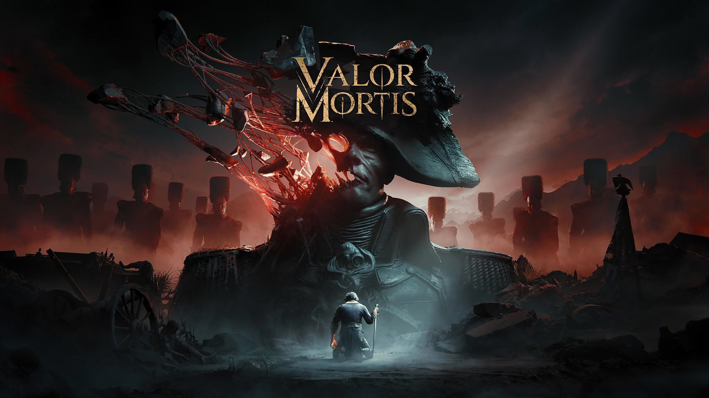

NVIDIA ha publicado los controladores GeForce 617.42 WHQL Game Ready, la primera entrega de la rama 617 y la que sucede a los 617.14 del 22 de septiembre. El paquete llega catorce días después y se apoya en lo de siempre: soporte para juegos recién salidos, unas cuantas optimizaciones y un puñado de correcciones. Lo llamativo, sin embargo, no está en lo que arregla, sino en lo que deja abierto: el problema de consumo de energía en portátiles ha vuelto a la lista de incidencias conocidas.

## Qué añaden los GeForce 617.42

El driver cubre dos estrenos con soporte Game Ready: **Call of Duty: Modern Warfare 4** y **STAR WARS: Galactic Racer**. Además, ajusta el rendimiento en *Dragon's Dogma 2: Dark Arisen* y *Valor Mortis*, y acompaña la Sim Update 7 de *Microsoft Flight Simulator 2024*.

A efectos de rendimiento, las únicas cifras disponibles son las del fabricante. NVIDIA afirma que la generación múltiple de fotogramas (6X Multi Frame Generation) en *Flight Simulator* escala de forma lineal, con incrementos de hasta 6,4 veces frente al promedio de 4,2 veces del modo 4X a 4K, y que la generación dinámica de fotogramas en la serie RTX 50 alterna entre multiplicadores en lugar de fijar uno. Son datos sin medición independiente, así que conviene leerlos como lo que son: la referencia de NVIDIA, no un resultado de terceros.

La rama 615, además, incorpora soporte para CUDA 13.4 y actualiza los módulos empaquetados (PhysX 9.26.0703, HD Audio 1.4.6.3 y el panel de control DCH 8.1.969.0). El instalador de escritorio pesa 990,85 MB, frente a los 984,3 MB de la entrega de hace cinco semanas.

## Un crash corregido y el bug que reaparece

El único fallo de juego que NVIDIA registra como resuelto es un cierre inesperado al escritorio en *Assassin's Creed Shadows* tras sesiones prolongadas, un problema que arrastraba desde los controladores 616.56. La incidencia lleva el identificador \[6685219\] y permanecía abierta desde los 616.92 del 9 de septiembre; quien omitió la entrega de septiembre se lleva ahora esa corrección y el soporte de los nuevos juegos en una sola descarga.

En general, el apartado de bugs corregidos figura como «N/A», y ahí está el contraste: el único problema abierto que NVIDIA lista es la reaparición del identificador \[6007998\], según el seguimiento de las notas de versión publicado por MIXED Reality News. Se trata del modo de administración de energía «Prefer Maximum Performance» (máximo rendimiento), que «puede no aplicarse correctamente» en equipos portátiles. NVIDIA nunca lo ha marcado como corregido: figuró en siete controladores consecutivos —de los 610.47 de mayo a los 616.92 de septiembre—, desapareció sin explicación de los 617.14 y ha vuelto ahora. Las notas no especifican qué GPU, qué modelo de portátil ni qué síntoma concreto afecta, así que la incidencia describe un rango amplio de comportamiento sin precisar ninguno.

## Qué cambia para el usuario

Para quien tenga una GeForce, los 617.42 son una actualización de rutina con dos razones claras: los estrenos de esta quincena y el arreglo de *Assassin's Creed Shadows*. El calendario que acompaña al lanzamiento sitúa el acceso anticipado a la campaña de *Modern Warfare 4* el 16 de octubre para reservas, y la apertura completa —con multijugador y DMZ— el 23 de octubre. *Dragon's Dogma 2: Dark Arisen* llega como actualización gratuita del juego base el 9 de octubre, y la Sim Update 7 de *Microsoft Flight Simulator 2024*, el 13 de octubre.

La letra pequeña sigue siendo la de siempre: la lista de cambios de NVIDIA es «un subconjunto» del total. Sobre la función Advanced Shader Delivery de Windows 11, el driver no dice nada —no aparece en las notas ni en el anuncio—, y *Modern Warfare 4* pide para NVIDIA «616.56», con la promesa de un controlador compatible antes del lanzamiento. Frente a la entrega anterior, el salto es discreto; para quien saltó la de septiembre, en cambio, el paquete concentra más valor. Los controladores están disponibles a través de la aplicación de NVIDIA y de GeForce.com, y la entrega precedente, los [GeForce 616.92 WHQL](/noticias/geforce-616-92-game-ready-drivers/), queda ya un paso por detrás.
