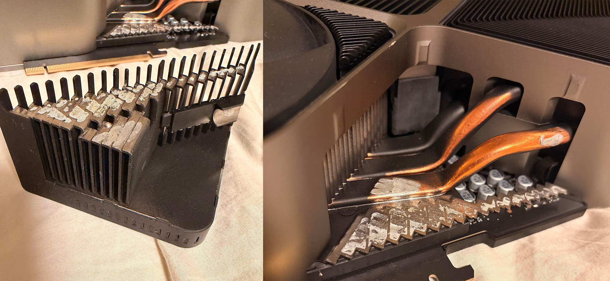

Un propietario de una **GeForce RTX 4090 Founders Edition** ha documentado un fallo poco habitual: uno de los bloques triangulares de aletas de aluminio de su disipador se desprendió mientras movía el ordenador. No es una cubierta decorativa, como suele ocurrir en las tarjetas personalizadas, sino una pieza del propio sistema de refrigeración diseñado por NVIDIA. Las fotografías compartidas muestran los heatpipes que sostenían ese bloque al descubierto y, según el relato difundido por El Chapuzas Informático a partir del hilo original en Reddit, sería la primera vez que se registra un caso así.

## Un bloque del disipador se desprende en la RTX 4090 Founders Edition

El afectado publicó las imágenes en el subreddit r/nvidia y explicó que el bloque cedió cuando desplazaba el equipo. En las fotos se aprecia una sección considerable de las aletas de aluminio separada del resto del disipador, con los heatpipes que atravesaban la zona visibles. No hay constancia previa de un desprendimiento equivalente ni en la Founders Edition ni, prácticamente, en ningún otro modelo de GPU, según recoge el medio.

La unidad se compró en **agosto de 2023**, por lo que el fallo aparece tras unos tres años de uso. El propietario contactó con NVIDIA al descubrirlo, pero el problema es que la tarjeta se encontraba ya fuera de los tres años de garantía por cuestión de días.

## Garantía vencida por días y reparaciones de más de 400 dólares

Sin cobertura del fabricante, el afectado busca una vía razonable para reparar la tarjeta. Según su relato, algunos servicios especializados en reparación de GPU pueden cobrar **más de 400 dólares** por este tipo de intervención, un importe que en muchos casos se acerca al valor de mercado del propio producto.

Conviene separar dos cosas: la garantía comercial de NVIDIA, que es la que ha vencido, y la garantía legal de conformidad que en España cubre la compra ante el vendedor durante los plazos que fija la normativa, con independencia de las condiciones que imponga la marca. Que el fabricante cierre la puerta no agota necesariamente todas las opciones del comprador, aunque el margen real depende del tiempo transcurrido. Casos como la [RTX 5090 que se quemó en reposo y vio denegada su garantía](/noticias/rtx-5090-idle-burnout-warranty-denied/) muestran que la respuesta del fabricante no siempre coincide con lo que el comprador espera.

## Sin explicación oficial: el ciclo térmico y las fisuras como hipótesis

Por ahora no hay indicios de que estemos ante un problema generalizado de las RTX 4090 Founders Edition. En la propia comunidad, varios propietarios aseguran no haber visto nunca algo similar, y NVIDIA no ha ofrecido una explicación oficial de qué ocurrió para que esta unidad perdiera literalmente un trozo de aluminio.

La hipótesis más repetida apunta a la **unión entre las aletas y los heatpipes**. Algunos usuarios sostienen que la pieza iría soldada y que los numerosos ciclos de calentamiento y enfriamiento acumulados durante años podrían haber generado pequeñas fisuras, hasta que el movimiento del ordenador terminó de forzar el desprendimiento. Es una explicación plausible, pero sin confirmar: solo NVIDIA podría emitir un diagnóstico definitivo, y de momento no lo ha hecho.

## La tarjeta puede seguir funcionando: adhesivo térmico o resoldar

La pérdida de la pieza no implica que la GPU haya dejado de funcionar. El bloque desprendido aportaba superficie adicional para disipar calor, mientras que los heatpipes siguen atravesando otras partes del disipador. En la práctica, la única diferencia debería estar en las temperaturas, un dato que el propietario no ha dado a conocer, por lo que es probable que la desventaja térmica no sea dramática.

Para recuperar la eficiencia, la vía más sencilla es volver a unir la pieza con **epoxi o adhesivo térmicamente conductor**, algo que el propio afectado se ha planteado. Su duda es razonable: que la conductividad de ese adhesivo sea inferior a la de la unión original y acabe penalizando las temperaturas. La alternativa más delicada es desmontar por completo la tarjeta y **volver a soldar el bloque de aluminio**, una operación que, como ya ocurre con el [disipador de una RTX 4090 montado sobre una RTX 3060](/noticias/rtx-4090-cooler-on-rtx-3060/), exige un trabajo cuidadoso para que la mejora compense el riesgo. En la mayoría de los casos, el resultado de resoldar no dista tanto del de un buen adhesivo térmico.
