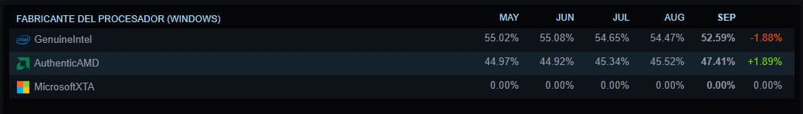

La encuesta de hardware de Steam correspondiente a septiembre de 2026 ya tiene un nuevo primer puesto. La GeForce RTX 5070 es la tarjeta gráfica más utilizada entre los jugadores de la plataforma, con un 6,15 % de cuota y un crecimiento mensual de 2,38 puntos porcentuales, según recoge Profesional Review a partir del informe que Valve publica cada mes en la [Steam Hardware & Software Survey](https://store.steampowered.com/hwsurvey/). El dato confirma el relevo en lo más alto de la tabla, hasta ahora ocupado por modelos de generaciones anteriores, y llega acompañado de otros dos cambios de orden en memoria y resolución.

## La RTX 5070 arrastra a la gama media de Blackwell

El ascenso de la RTX 5070 no llega solo. Otras dos tarjetas de la misma arquitectura escalan en la clasificación: la RTX 5060 Ti alcanza el 4,06 % de cuota y la RTX 5060 se queda en el 4,40 %, ambas al alza respecto al mes anterior. La gama media de la serie RTX 50 ocupa ya varios puestos entre las GPU más usadas, mientras que las propuestas equivalentes de AMD no aparecen en esa zona alta de la tabla. En el lado de AMD, la baza para un equipo nuevo sigue siendo la [Radeon RX 9070 XT, señalada hace unas semanas como la mejor opción en coste por fotograma](/noticias/xda-one-gpu-worth-buying-right-now/) para 1440p y 4K.

Conviene leer la tabla con su contexto: la encuesta de Steam es voluntaria y anónima, así que describe el parque de equipos de quienes la responden, no el conjunto del mercado de PC.

## Los 32 GB de RAM superan a los 16 GB por primera vez

El informe también registra un cambio de referencia en la memoria principal del sistema. Por primera vez, las configuraciones de 32 GB superan a las de 16 GB: las primeras alcanzan el 42,22 % de cuota, con un avance de 4,77 puntos, mientras que las de 16 GB bajan hasta el 37,82 %. El movimiento responde a unos títulos modernos que exigen cada vez más margen de memoria principal. Para quien tenga que decidir una compra, el dato sitúa los 32 GB como la configuración más elegida, aunque el uso concreto —juegos, resolución y ajustes— siga mandando.

## 1080p baja del 50 % y AMD recorta distancia en CPU

En pantallas, el 1080p sigue siendo la resolución dominante, pero cae por debajo de la barrera del 50 %: se queda en el 47,91 %, con una bajada de 2,61 puntos, mientras que el 1440p sube hasta el 27,04 %. La migración hacia paneles de mayor resolución es lenta, pero sostenida. En procesadores bajo Windows, AMD alcanza el 47,41 % de participación frente al 52,59 % de Intel, una diferencia que se ha ido estrechando mes a mes.

En conjunto, la fotografía de septiembre deja una idea clara para el comprador: la RTX 5070 encabeza la tabla de GPU más usadas dentro de Steam, y 32 GB de RAM se han convertido en la configuración más común entre sus jugadores.
