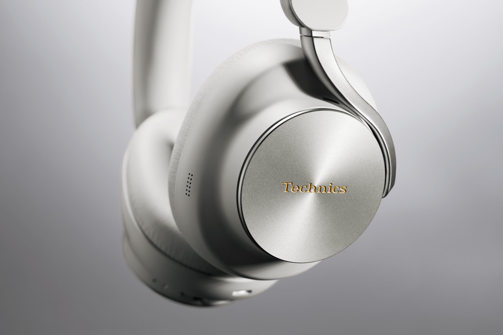
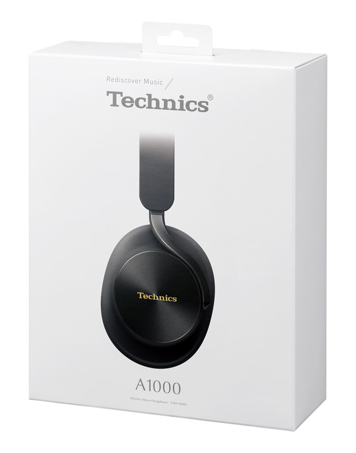
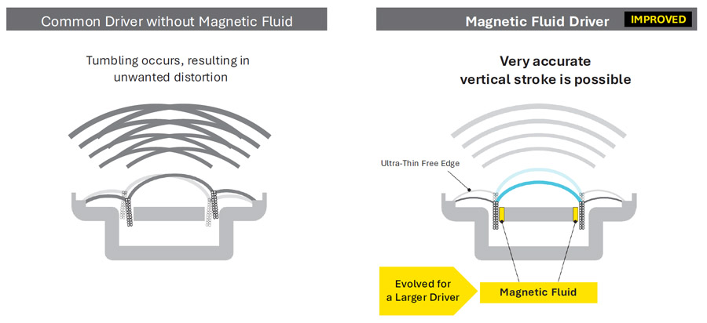
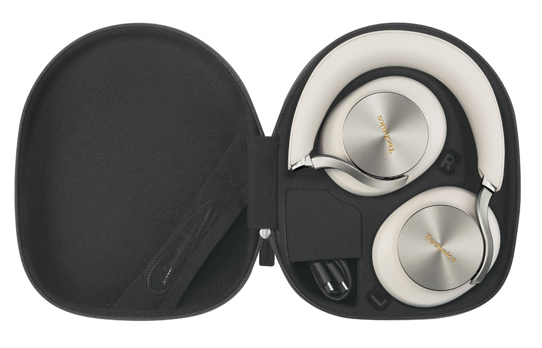
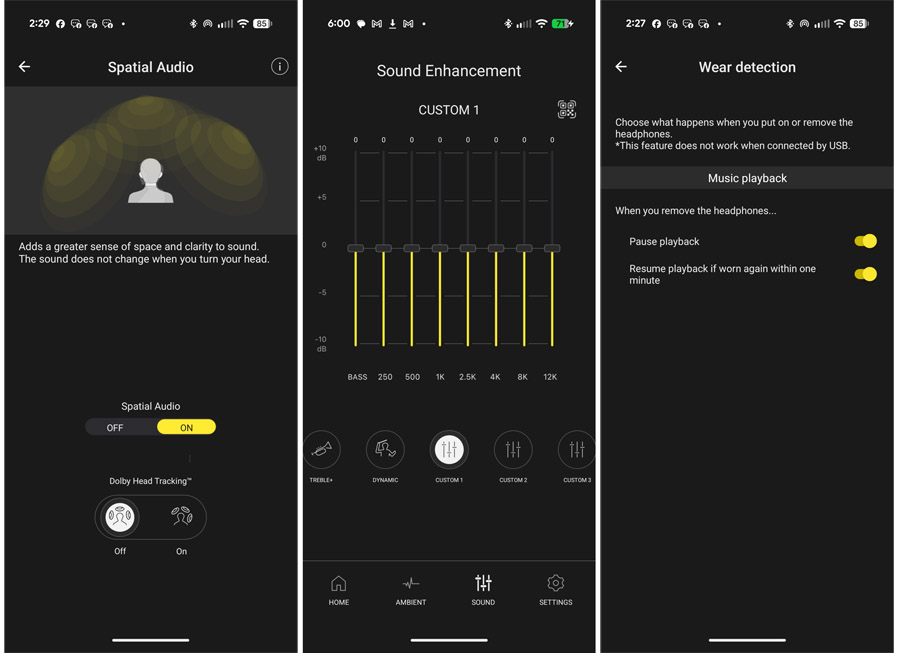

Technics amplía su catálogo de audio de gama alta con los EAH-A1000, unos auriculares de diadema con cancelación activa de ruido (ANC) que trasladan al formato over-ear la tecnología de fluido magnético que la marca japonesa estrenó en sus recientes auriculares de botón. La compañía los pondrá a la venta el 1 de octubre de 2026 en dos acabados —negro y «platinum greige»— con un precio de referencia de 449 dólares.

El medio especializado eCoustics ha publicado ya su análisis del modelo y lo sitúa como un aspirante firme en el segmento premium, donde competirá de tú a tú con los Bose QuietComfort Ultra y los Sony WH-1000XM6. El auricular mantiene un diseño de aluminio y piel sintética, con las copas plegables y una funda rígida con cremallera para el transporte.

## Technics lleva el fluido magnético a los auriculares de diadema

El EAH-A1000 estrena un driver de 40 mm fabricado en fibra de carbono, un material elegido por su rigidez elevada y su bajo peso. La clave está en una nueva formulación del fluido magnético de la marca, que busca garantizar un desplazamiento lineal del diafragma y reducir la distorsión.

Según Technics, ese fluido evita el «bamboleo» o las oscilaciones que pueden aparecer en los drivers convencionales y que se traducen en distorsión audible. La tecnología nació en los auriculares in-ear con cable TZ700 y se reutilizó después en los EAH-AZ100; para el modelo de diadema, la compañía ha desarrollado una versión adaptada al mayor tamaño del nuevo driver. El conjunto se completa con un borde «SST» (Symmetrical Surround Technology), heredado de los altavoces de alta fidelidad de la firma.

## Hasta 90 horas de batería y Bluetooth 6.0

Uno de los puntos fuertes que subraya el análisis es la autonomía. Con el códec LDAC, el EAH-A1000 ofrece hasta 40 horas de reproducción con la cancelación de ruido activada y hasta 80 horas con ella desactivada. Con AAC, las cifras suben a 45 y 90 horas respectivamente. Conectado por USB y sin fuente de alimentación, la autonomía se queda en 30 horas con ANC y 60 sin él. La carga completa ronda las 3,5 horas, y una carga rápida de 15 minutos aporta unas cuatro horas de uso con ANC (con AAC).

En conectividad, el modelo admite Bluetooth 6.0, incluido Bluetooth LE con Auracast, la tecnología que permite enviar una misma señal de audio a varios auriculares o altavoces a la vez. Activar LE, eso sí, implica renunciar al audio espacial y a las funciones de asistente de voz. El auricular puede emparejarse con hasta tres dispositivos de forma simultánea y alternar entre ellos automáticamente, con la posibilidad de fijar prioridades desde la aplicación.

El EAH-A1000 no incorpora toma jack de 3,5 mm, pero sí incluye un cable de 3,5 mm a USB-C para conectarlo a sistemas de entretenimiento de vuelo o a cualquier salida analógica. En ese caso, la señal se convierte internamente a digital y vuelve a analógico antes de llegar a los amplificadores y drivers. La entrada USB-C también permite reproducir audio sin pérdidas o de alta resolución desde un teléfono, tableta u ordenador compatible. La lista de códecs compatibles incluye SBC, AAC, LDAC y LC3.

La cancelación de ruido adaptativa se ocupa tanto de los sonidos constantes —el motor de un avión o la climatización— como de los dinámicos, como el tráfico y las voces. El modo ambiente, por su parte, deja pasar parte del sonido exterior para no perder la conciencia del entorno, y los micrófonos con formación de haz y tratamiento por IA se encargan de la calidad en las llamadas. Technics presenta el modelo como «optimizado para Dolby Atmos» y ofrece seguimiento de cabeza opcional, útil para realidad virtual y videojuegos.

## Una aplicación para ajustar sonido y funciones

Como es habitual en el sector, Technics acompaña los auriculares con una aplicación para Android e iOS, Technics Audio Connect, desde la que se accede a un ecualizador de ocho bandas, se ajusta el nivel de cancelación de ruido, se activa el audio espacial y se define la prioridad entre dispositivos. La app no es imprescindible para usar los auriculares, pero sí es la vía para activar funciones avanzadas.

En el apartado ergonómico, el control se reduce a dos botones —uno de encendido y emparejamiento y otro para alternar entre ANC, modo ambiente y ANC desactivado— flanqueando un deslizador que funciona como control de volumen y navegación de pistas. Las almohadillas y la diadema recurren a espuma de memoria de alta densidad; el conjunto pesa unos 306 gramos y mide 165 × 206 × 88 mm. El análisis señala una particularidad: por defecto, los auriculares permanecen encendidos cuando se retiran de la cabeza, incluso plegados en la funda, un comportamiento que puede ajustarse desde la aplicación.

## Qué cambia para el usuario

Con un precio de referencia de 449 dólares, el EAH-A1000 entra de lleno en la gama alta de los auriculares de diadema con cancelación de ruido, un terreno en el que ya compiten los Bose QuietComfort Ultra y los Sony WH-1000XM6. En su análisis, eCoustics cierra con una recomendación: valora la firma sonora neutra y natural, la entrada USB para audio de alta resolución, la autonomía y el tratamiento del audio espacial, y señala como puntos débiles un volumen algo justo en algunas pistas de Dolby Atmos, una cancelación de ruido ligeramente por detrás de la del Sony XM6 y el encendido por defecto. El movimiento de Technics llega, además, en un momento en el que plataformas como [Snapdragon Sound Elite Gen 2](/noticias/qualcomm-snapdragon-sound-elite-gen-2/) empujan la cancelación adaptativa y la IA hacia los auriculares.
