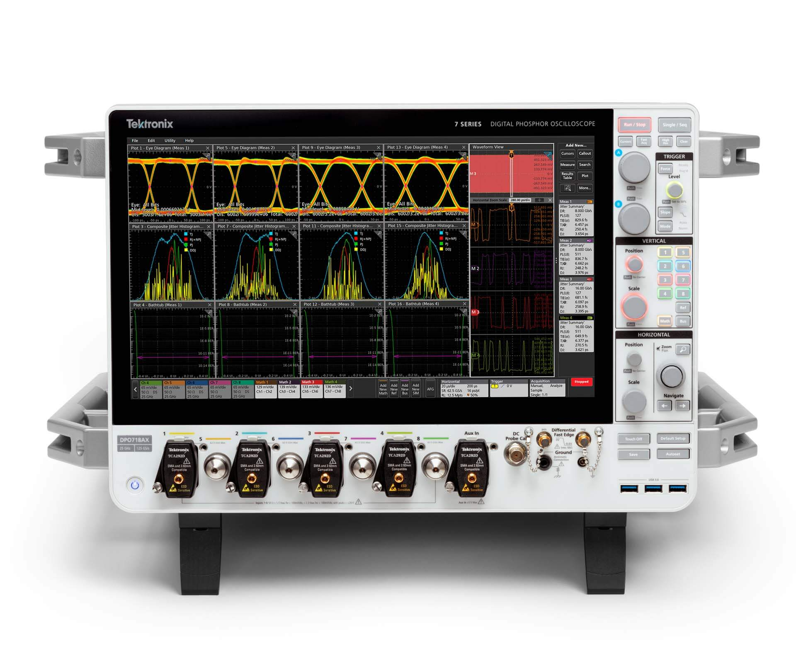

Tektronix ha ampliado su gama insignia de osciloscopios con un modelo que parece salido de dos mundos a la vez: el DPO718AX es un instrumento de medida de ocho canales de hasta 25 GHz que, en su interior, lleva un ordenador completo con procesador AMD EPYC de 12 núcleos, tarjeta gráfica Nvidia T1000, 96 GB de memoria y un SSD NVMe extraíble de 1,6 TB. Todo ello en un chasis de 38,1 kilos con pantalla táctil de 15,6 pulgadas a 1080p, según informó TechRadar.

## El DPO718AX: ocho canales de 25 GHz con un PC dentro

El DPO718AX, anunciado a mediados de septiembre, es el primer osciloscopio de ocho canales y 25 GHz del mundo dentro de la Serie 7 de Tektronix, la línea de osciloscopios de fósforo digital de la compañía. Además del hardware de medida, la configuración incluye una pantalla táctil Full HD de 15,6 pulgadas, salida de vídeo DisplayPort de hasta QHD a 60 Hz y una unidad secundaria extraíble con Windows 10 LTSC 2021, disponible como opción.

Ese Windows 10 no es un capricho: el sistema es necesario para ejecutar el software de análisis de conformidad y de radiofrecuencia compatible con el equipo. El instrumento no lo trae instalado de serie; el usuario lo añade mediante esa segunda unidad extraíble cuando lo necesita. La comparación con un PC de sobremesa no la inventó la prensa por casualidad: el medio especializado CNX Software describió el equipo como un PC de gama alta con Linux o Windows 10 LTSC que, de paso, mide señales.

## Hardware solvente, pero de otra generación

Ninguno de los componentes informáticos del DPO718AX es reciente. El procesador, un AMD EPYC Embedded 3351 con 12 núcleos y 24 hilos a hasta 3 GHz, usa núcleos Zen de primera generación y data de febrero de 2018. Eso condiciona el resto de la plataforma: al ofrecer solo conectividad PCIe 3.0 y memoria DDR4, el SSD NVMe queda limitado por esa interfaz y los 96 GB de RAM son necesariamente DDR4.

La tarjeta gráfica, una Nvidia T1000 de gama de entrada para estaciones de trabajo con arquitectura Turing, se lanzó en mayo de 2021. Es una GPU pensada para acelerar la visualización y las aplicaciones profesionales del propio instrumento, no para jugar ni para entrenar modelos, y queda muy lejos de la gama profesional actual de Nvidia, encabezada por modelos como la [RTX PRO 5500 Blackwell con 84 GB de GDDR7](/noticias/rtx-pro-5500-blackwell-84gb/). Y aunque el procesador integra TPM 2.0 —lo que en teoría permitiría instalar Windows 11—, con un hardware de esta edad y estas frecuencias sería un pésimo sustituto de un PC convencional, por mucho dinero que cueste el conjunto.

## Qué cambia para el lector

Para el público general, la noticia es una curiosidad: un aparato de laboratorio que pesa como una persona pequeña y cuesta desde 308.000 dólares en su configuración base, ampliable según las necesidades del cliente. Para ingenieros y laboratorios, en cambio, confirma una tendencia clara: los instrumentos de medida de gama alta ya son ordenadores completos, con sistema operativo, GPU dedicada y almacenamiento extraíble, porque el análisis de señales moderno exige tanta computación como el propio hardware de captura.

El contraste con el mercado actual de PC resulta llamativo: en plena escasez de memoria RAM, un osciloscopio sale de fábrica con 96 GB mientras muchos sobremesas nuevos se conforman con 16. Eso sí, a precio de instrumento científico, no de tienda de informática.
