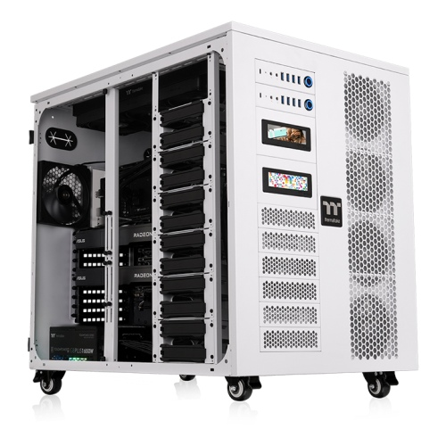
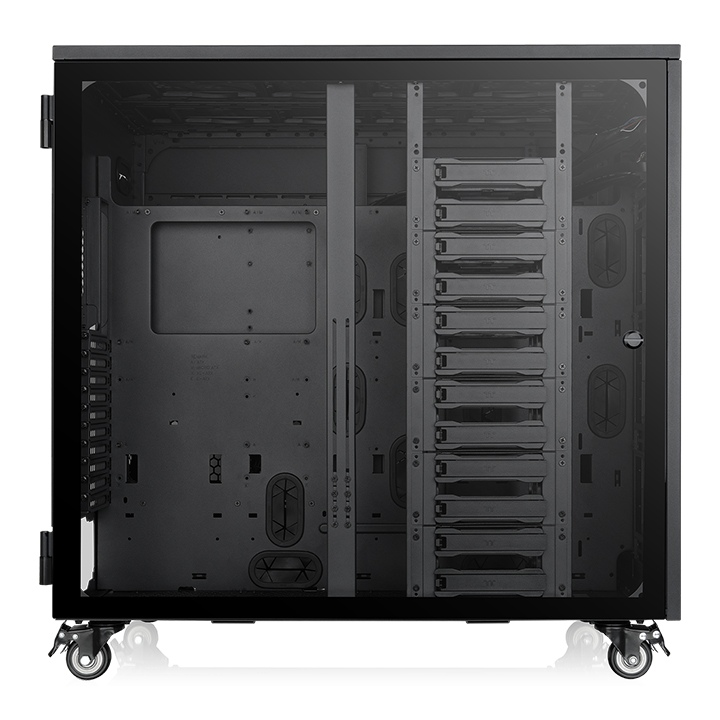
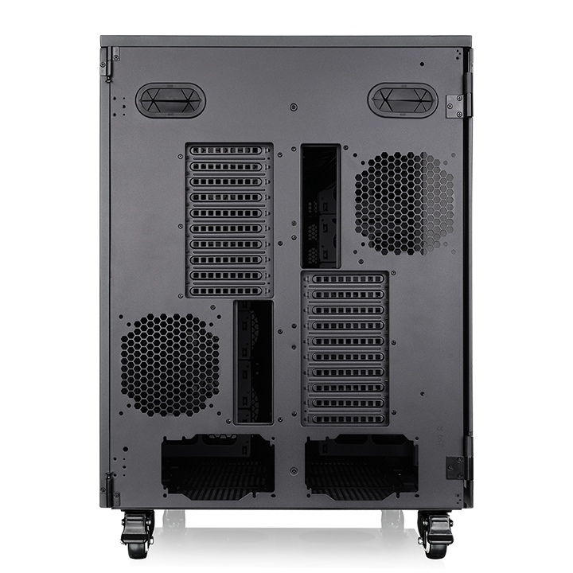
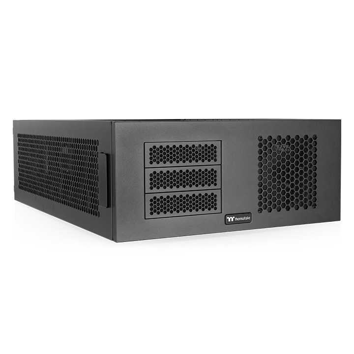
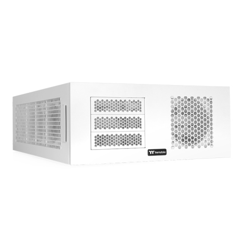
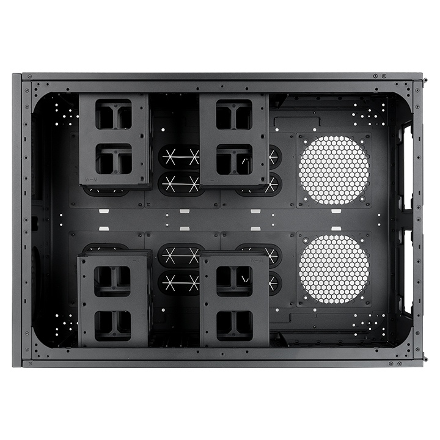
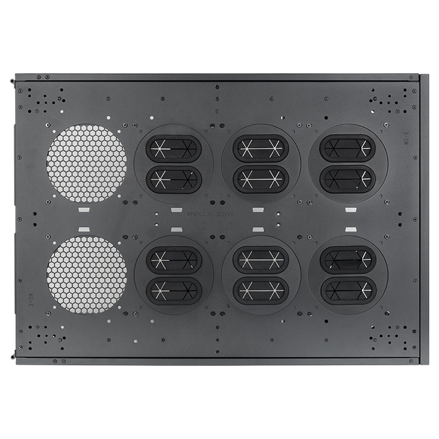

Thermaltake ha presentado su nueva caja **AX1000 TG AI Workstation**, un chasis pensado para cargas de trabajo intensivas en inteligencia artificial, creación de contenidos y tareas de nivel servidor. Su principal atractivo es el soporte para dos sistemas completos en una sola torre, junto con el pedestal de expansión **AX200**, un módulo apilable que amplía la capacidad de almacenamiento, refrigeración y alimentación.

## Una torre para dos sistemas completos

El AX1000 admite **dos placas base XL-ATX o SSI-EEB** de forma simultánea y ofrece hasta **20 ranuras PCIe** para configuraciones con varias tarjetas gráficas, con espacio para GPU de hasta **630 mm** de longitud. En cuanto a almacenamiento, incorpora puntos de montaje para **hasta 24 unidades**, y su capacidad de refrigeración es notable: espacio para **hasta 29 ventiladores** y soporte para **dos radiadores AIO de 420 mm** o **dos radiadores de 560 mm** para bucles personalizados.

El panel lateral de cristal templado con bisagra deja a la vista los componentes, mientras que el panel derecho perforado facilita el flujo de aire. Cada sistema cuenta con su propio panel de E/S frontal independiente, y los soportes integrados para GPU ayudan a estabilizar tarjetas gráficas más pesadas. Para el control de la máquina, Thermaltake ofrece un kit LCD opcional de **3,9 pulgadas** que se gestiona mediante el software **TT RGB PLUS 3.0**.

## El AX200: expansión modular de almacenamiento, refrigeración y potencia

Para quienes necesiten aún más capacidad, el pedestal **AX200** se acopla directamente al AX1000 y añade espacio para **16 unidades adicionales**, **9 ventiladores más** y soporte para **dos radiadores de 480 mm o 560 mm**, además de admitir **dos fuentes de alimentación PS2 estándar**.

## Un nicho para estaciones de trabajo de alto rendimiento

La propuesta de Thermaltake apunta claramente a un segmento reducido: ensambladores y creadores que necesitan dos máquinas potentes —por ejemplo, un equipo de trabajo y otro dedicado a entrenamiento o render— en un único mueble. La escalabilidad del AX200 refuerza esa idea, al permitir crecer en discos, refrigeración y fuentes sin cambiar de caja.

El anuncio recogido por KitGuru no detalla precios ni fecha de disponibilidad, un dato habitual en este tipo de lanzamientos dirigidos al canal profesional. Habrá que esperar a la confirmación oficial de Thermaltake para conocer cuánto costará configurar una estación de trabajo con esta base.
