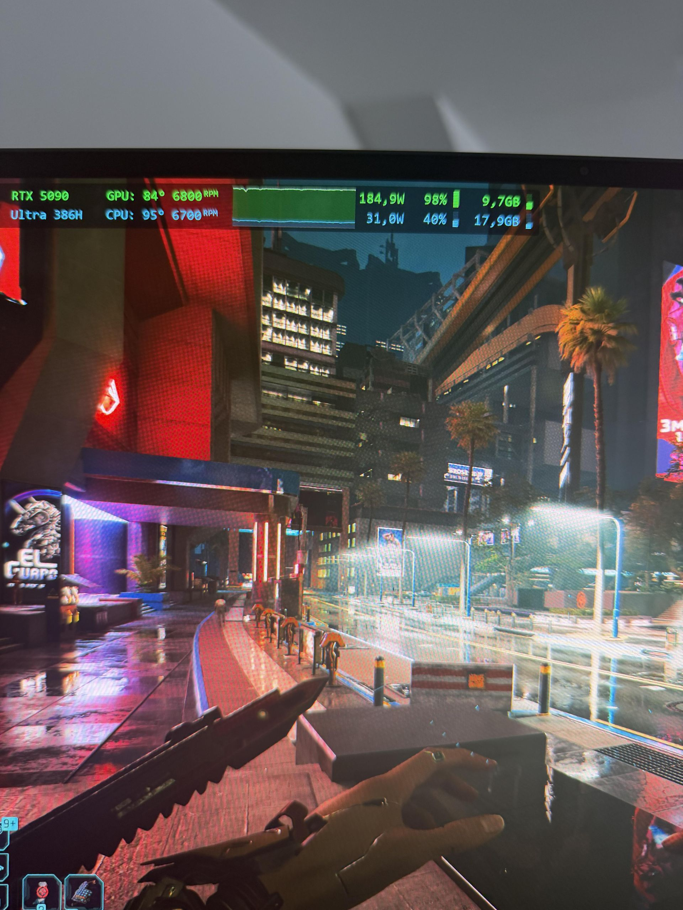

Los portátiles gaming delgados viven de un compromiso: para adelgazar el chasis hay que recortar la capacidad de refrigeración y, con ella, el presupuesto de energía. El ASUS ROG Zephyrus G16 es el ejemplo típico, con un límite combinado de **175 W** para CPU y GPU. Un usuario se cansó de ver a su procesador sin margen y recurrió a una utilidad experimental para saltarse esa barrera. El resultado fue un equipo capaz de sostener unos **215 W** en conjunto, pero también un experimento que deja al descubierto los límites físicos del diseño.

## De 175 W a 215 W: el experimento

El autor de la prueba es el usuario de Reddit **Firm-Age4730**, que documentó el proceso en el subforo r/GamingLaptops. Para elevar el techo de potencia utilizó **NvpwrControl**, una herramienta independiente que modifica en memoria las políticas de energía del controlador de NVIDIA y permite ir más allá de los límites de fábrica en portátiles con GPU RTX 40 y RTX 50.

Con el límite desbloqueado, el equipo ejecutó *Cyberpunk 2077* con la **RTX 5090 a 185 W** y el **Intel Core Ultra 386H a 31 W**, unas cifras que en conjunto rondan los 215 W que da título a la prueba. El juego se usó como referencia porque exige a la vez a la CPU y a la GPU, lo que lo convierte en un buen banco de pruebas para medir cómo se reparte el presupuesto energético cuando ambos componentes compiten por él.

Conviene subrayar desde el principio que esto **no es un modo de fábrica ni un perfil oficial de ASUS**. Es un ajuste hecho a medida con una herramienta de terceros, fuera de garantía y sin respaldo del fabricante ni de NVIDIA.

## El problema de fondo: la CPU se queda sin energía

La motivación del experimento apunta a un comportamiento que conocen bien los usuarios de portátiles delgados. Según relata el autor, en las cargas más exigentes y con los límites de serie, la GPU se quedaba con unos **160 W** y dejaba a la CPU con apenas **13 W**. En la práctica, eso puede producir un desequilibrio entre ambos componentes: la gráfica va sobrada mientras el procesador se convierte en el cuello de botella.

El motivo es que el límite combinado obliga a repartir un presupuesto energético fijo entre CPU y GPU. Cuando la gráfica tira con fuerza, el reparto se inclina hacia ella y la CPU se queda con las migajas. Al elevar el techo global, el usuario buscaba precisamente corregir ese desequilibrio y darle al procesador un margen que el diseño original no contempla.

## Temperaturas y ruido: el precio real

Desbloquear la potencia no elimina el calor: lo desplaza. Y ahí aparecen los números incómodos de la prueba. La **RTX 5090 alcanzó los 84 °C**, apenas 3 °C por debajo del umbral en el que el sistema empieza a estrangular el rendimiento por temperatura, mientras que el **Core Ultra 386H llegó a los 95 °C**, a solo 5 °C de su temperatura máxima de funcionamiento.

El sistema de refrigeración, además, trabajó al máximo de sus posibilidades. El ventilador de la CPU giró a **6.700 rpm** y el de la GPU a **6.800 rpm**, unos niveles que el propio autor describe como cercanos al ruido de un motor a reacción. Sin auriculares, la combinación de calor y estruendo hace que la experiencia deje de ser agradable.

Hay un factor adicional que no aparece en las cifras de temperatura pero condiciona todo el resultado: la temperatura ambiente. Si la habitación no está bien refrigerada, sostener ese techo de 215 W durante sesiones largas se vuelve inviable. La propia herramienta advierte de que elevar el límite aumenta la carga eléctrica sobre el die de la GPU, la entrega de energía de los VRM, la memoria de vídeo y el sistema de refrigeración. El artículo de Wccftech apunta también a que los VRM podrían no estar preparados para ese esfuerzo extra, por mucha calidad que atesoren los componentes de la gama alta.

## Qué es NvpwrControl y por qué conviene tratarlo con cautela

NvpwrControl se presenta como un proyecto de **investigación y prueba de concepto**, no como un producto acabado. Su repositorio, alojado en GitHub, lo describe como un ajustador de bajo nivel que interactúa directamente con el controlador del kernel de NVIDIA para elevar el límite de potencia por encima de los topes de fábrica. En sus tablas figura la RTX 5090 para portátiles con un rango de serie de **150 W a 175 W** y un objetivo de **175 W a 225 W**, en pasos de 5 W, lo que explica que los 185 W alcanzados entren dentro de lo que la herramienta permite configurar.

El procedimiento, sin embargo, no es apto para cualquiera. Requiere **desactivar el Secure Boot** en la UEFI y activar el modo de prueba de Windows para poder cargar un controlador de kernel propio, algo que choca con los sistemas antitrampas de juegos competitivos que exigen el arranque seguro activado. Además, el proyecto está validado para una versión concreta del controlador de NVIDIA, de modo que cualquier actualización puede dejarlo inoperativo. Y, en última instancia, todo se hace bajo responsabilidad del usuario.

## Qué cambia para el lector

La conclusión práctica es que el techo de 175 W del Zephyrus G16 no es una limitación caprichosa de ASUS, sino la consecuencia de meter hardware de gama alta en un chasis delgado. El experimento demuestra que el silicio puede tragar más energía, pero también que la refrigeración, el ruido y la entrega eléctrica no acompañan ese esfuerzo sin consecuencias.

Para quien tenga un portátil gaming delgado, la lección es la de siempre: antes de buscar más potencia por software, merece la pena comprobar si el sistema puede disiparla. Con temperaturas a 3 y 5 °C del estrangulamiento térmico y ventiladores casi al límite, el margen que aporta desbloquear vatios se consume casi por completo en gestionar el calor. El propio autor no ha aclarado si piensa mantener el equipo funcionando así o volver a los límites de serie; desde el punto de vista de la fiabilidad, lo prudente es lo segundo.
