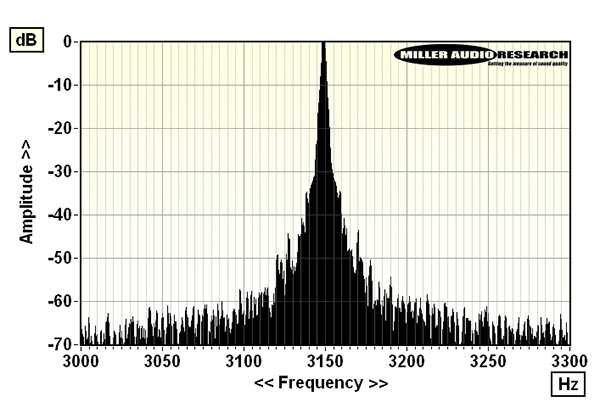
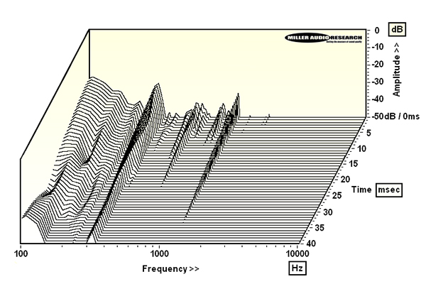

Thorens recuperó el accionamiento directo con el TD 124 DD, su primer tocadiscos de estas características en décadas, y ahora traslada esa base al Thorens TD 404 DD, que se apoya en una versión muy cercana del mismo motor. La revista estadounidense Stereophile ha publicado el análisis de banco de pruebas de este modelo y de su brazo TP 160, firmado por Paul Miller, con el objetivo de comprobar qué hay detrás de sus cifras sobre el papel.

## El Thorens TD 404 DD, un direct-drive desarrollado con Yahorng

El motor del TD 404 DD procede de Yahorng, uno de los dos grandes proveedores taiwaneses del sector, con quien Thorens ha trabajado codo con codo en detalles como el firmware que gestiona los sensores Hall de 12 polos y la elección de un eje de rodamiento de acero inoxidable autolubricado con cojinete de empuje de Delrin.

En la práctica, el motor de 12 polos y 24 V, junto al imán radial fijado a la cara inferior del plato de aleación de 3,8 kg, genera el par suficiente para que el plato alcance su régimen en uno o dos segundos. El freno electrónico de la marca logra además que se detenga casi de inmediato.

## Velocidad muy estable y rumble de rodamiento

La velocidad absoluta, ajustada con el estroboscopio integrado, resulta prácticamente exacta, con un error del –0,05 %. La estabilidad a baja frecuencia también es notable, con un wow ponderado de pico del 0,02 %. Donde aparecen matices es en las bandas laterales discretas de alta frecuencia, situadas en ±20 Hz, ±27 Hz y ±33 Hz, que suman un flutter ponderado de pico del 0,035 %.

Esos picos coinciden con modos visibles en el espectro de rumble sin ponderar y, con toda probabilidad, tienen su origen en el propio motor de accionamiento directo. Aun así, el rumble a través del eje se queda en –70,0 dB (ponderación DIN-B, referencia de 1 kHz a 5 cm/s), una cifra excelente y competitiva con los conjuntos de rodamiento de acero inoxidable y bronce fosforoso que emplean los mejores tocadiscos de correa, pese a que en la zona de 20 a 45 Hz se aprecia algo más de ruido.

El rumble a través del surco, que en la práctica es el dato más relevante, baja todavía más, hasta –72,5 dB, y puede reducirse a –73,0 dB —con mejor atenuación del ruido acústico incluida— si el vinilo se presiona con suavidad sobre las almohadillas de caucho de silicona del plato con una abrazadera o un puck ligero. El plato de aleación mecanizado por CNC incorpora además un anillo de amortiguación de 5 mm de grosor en su cara inferior que vuelve muy inerte toda la masa giratoria. El patrón de almohadillas, de aire Beogram, resulta atractivo a la vista, pero no sostiene el disco en toda su superficie y deja bolsas de aire por debajo.

## El brazo TP 160 y sus resonancias

El brazo TP 160 que acompaña al plato tiene una masa efectiva de 18 g, algo superior a la variante TP 150, y ofrece una resonancia brazo-cápsula de 7 a 8 Hz con la cápsula de bobina móvil TAS 1600, opcional de Thorens. Su tubo en forma de J se inspira en los anteriores modelos "TP" de la marca, igual que el mecanismo de elevación automática ya visto en giradiscos previos como el TD 1601; sin embargo, el rodamiento de cuchilla estabilizado magnéticamente y el antiskating con resorte precargado sí son nuevos en el TP 160.

Los brazos en forma de J presentan por diseño modos de flexión y torsión más complejos que los tubos rectos, y así lo refleja la cascada de decaimiento espectral. El modo principal de flexión se sitúa en torno a 120 Hz, con resonancias de Q más bajo en 170 Hz y 230 Hz y una ruptura más marcada en 310 Hz. El modo de Q alto y breve en 1,3 kHz ya se había detectado en otros giradiscos con el sistema de elevación automática de Thorens, aunque el patrón general de resonancias del TP 160 resulta menos enrevesado que el de otros diseños en J analizados.

## Qué significa para el comprador

Conviene recordar que este informe es un apéndice de mediciones: no incluye valoraciones de escucha, sino únicamente datos de laboratorio sobre velocidad, rumble y resonancias. Aun así, son precisamente esos números los que marcan los cimientos de un tocadiscos, porque una velocidad estable y un ruido de fondo bajo determinan cuánto detalle llega a la aguja.

Para quien valore la alta fidelidad analógica, el TD 404 DD deja dos ideas claras: un rumble de –70 dB es una cifra sólida incluso frente a tocadiscos de correa de gama alta, y el detalle de presionar el vinilo con una abrazadera ligera puede mejorar ligeramente el resultado. Del lado del brazo, una masa efectiva de 18 g y una resonancia de 7 a 8 Hz con la TAS 1600 sirven de guía a la hora de casar la cápsula correcta.
